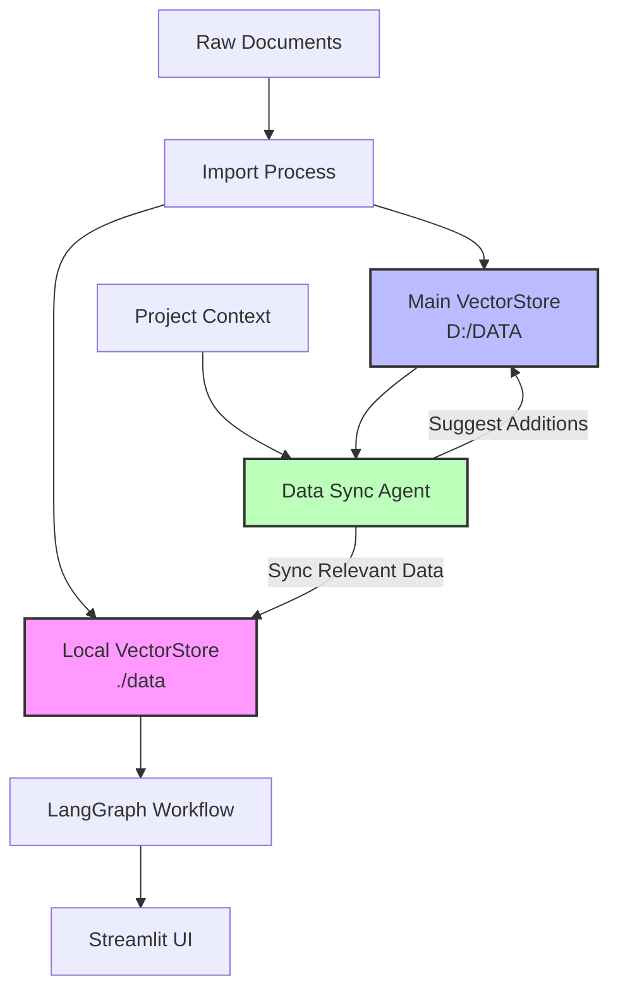
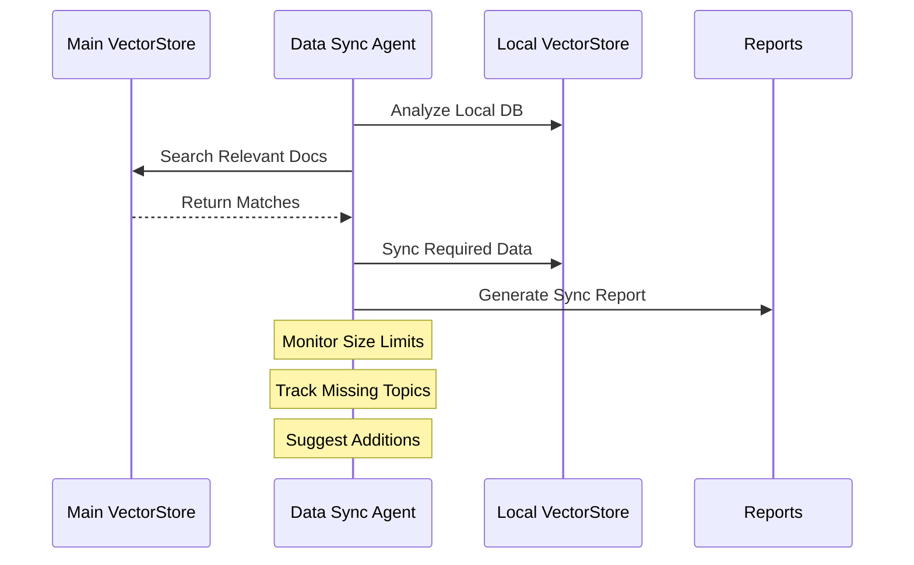

# Client Profile Builder

A smart assistant that helps sales teams and account managers automate client management workflows using LangGraph, LangSmith, and Streamlit.

## 🚀 Features

- Extract information from client communications (emails, PDFs, notes)
- Build and maintain structured client profiles
- Track sales journey stages
- Suggest next actions based on context
- Automatically generate personalized email drafts
- Real-time workflow observability with LangSmith
- **NEW**: Intelligent dual-database system with automatic synchronization
- **NEW**: Project-specific local vectorstore for faster access
- **NEW**: Smart data sync agent for optimal data management

## 📋 Requirements

- Python 3.8+
- OpenAI API key
- LangSmith API key (for observability)
- ChromaDB for vector storage
- Sentence Transformers for embeddings

## 🛠️ Installation

1. Clone the repository
2. Create a virtual environment:
   ```bash
   python -m venv venv
   ```
3. Activate the virtual environment:
   - Windows: `.\venv\Scripts\activate`
   - Unix/MacOS: `source venv/bin/activate`
4. Install dependencies:
   ```bash
   pip install -r requirements.txt
   ```
5. Copy `.env.example` to `.env` and fill in your API keys

## 🏃‍♂️ Running the Application

1. Ensure your virtual environment is activated
2. Initialize the vector stores:
   ```bash
   python scripts/import_data.py
   ```
3. Run the Streamlit app:
   ```bash
   streamlit run streamlit_app.py
   ```
4. Open your browser at `http://localhost:8501`

## 📁 Project Structure

```
.
├── data/              # Local project-specific vector store
├── D:/DATA/          # Main permanent vector store (configurable)
├── src/
│   ├── components/   # LangGraph nodes and state
│   └── utils/       # Helper functions and data sync agent
├── scripts/         # Data import and management scripts
├── reports/         # Sync and analysis reports
├── logs/           # Application logs
├── streamlit_app.py # Main Streamlit application
├── requirements.txt # Project dependencies
└── README.md       # This file
```

## 🔄 Data Flow Architecture



## 🧠 Data Sync Agent

The DataSyncAgent manages intelligent data flow between main and local vector stores:



### Sync Agent Features
- Intelligent document selection based on project context
- Automatic relevance scoring
- Size threshold management
- Missing topic detection
- Suggestions for main DB additions
- Comprehensive sync reports

## 🔄 Workflow

1. Upload client communications (emails, PDFs, text files)
2. Documents are processed through dual-database system:
   - Project files stored in local vectorstore
   - Relevant historical data synced from main store
3. The system processes each file through the LangGraph workflow:
   - Extracts and chunks content
   - Searches relevant history
   - Updates client profile
   - Tracks sales status
   - Suggests next steps
   - Generates email drafts
4. Results are displayed in the Streamlit UI
5. All operations are tracked in LangSmith for observability

## 🔍 Vector Store Configuration

The system uses two vector stores:

1. **Main Vector Store** (`D:/DATA`):
   - Permanent storage for all historical data
   - Never reset automatically
   - Optimized for comprehensive search
   - Stores complete document history

2. **Local Vector Store** (`./data`):
   - Project-specific storage
   - Automatically managed size
   - Contains only relevant documents
   - Optimized for fast access

## 📊 Monitoring and Reports

The system generates comprehensive reports in the `reports` directory:
- Sync status and statistics
- Missing topics analysis
- Data coverage metrics
- Suggestions for data management

## 🛠️ Development Roadmap

Future enhancements planned:
1. Implement document access tracking for better relevance scoring
2. Add automatic archiving of outdated documents
3. Develop cross-project data analysis
4. Add real-time sync monitoring dashboard
5. Implement automated testing for sync operations

## 🤝 Contributing

1. Fork the repository
2. Create a feature branch
3. Commit your changes
4. Push to the branch
5. Create a Pull Request

## 📄 License

This project is licensed under the MIT License - see the LICENSE file for details

Run tests: python -m pytest tests/run_tests.py -v