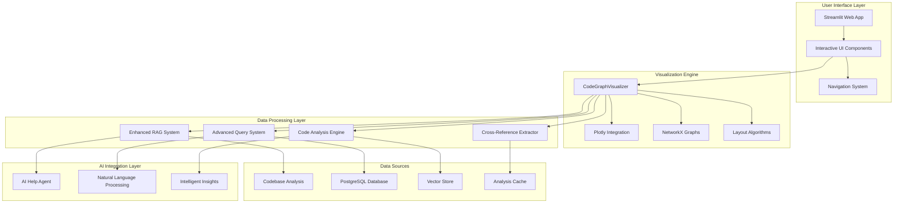
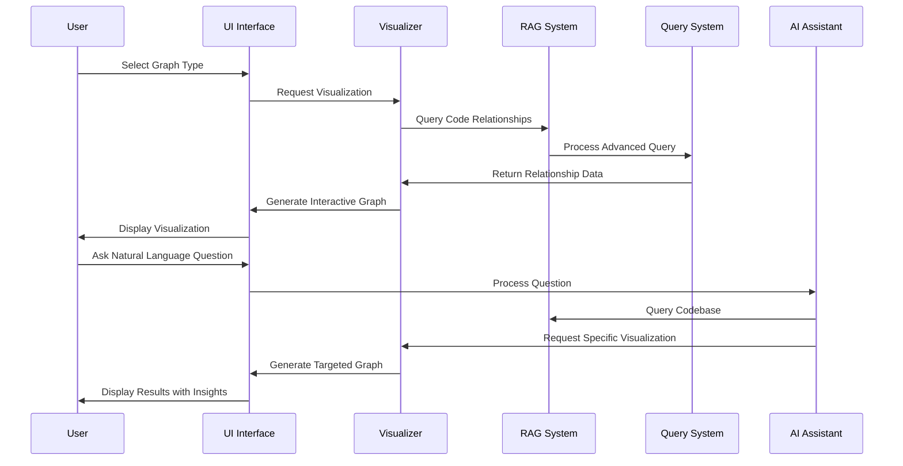
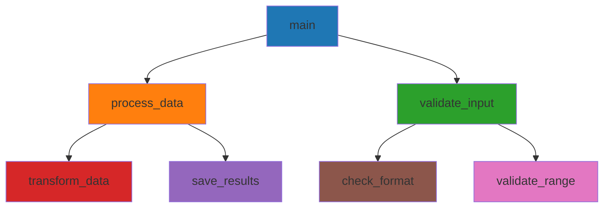
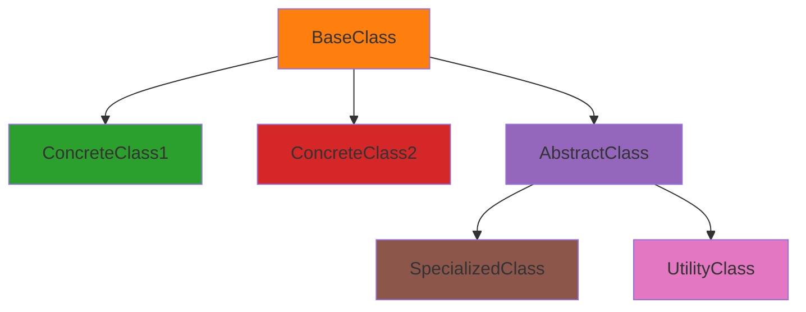
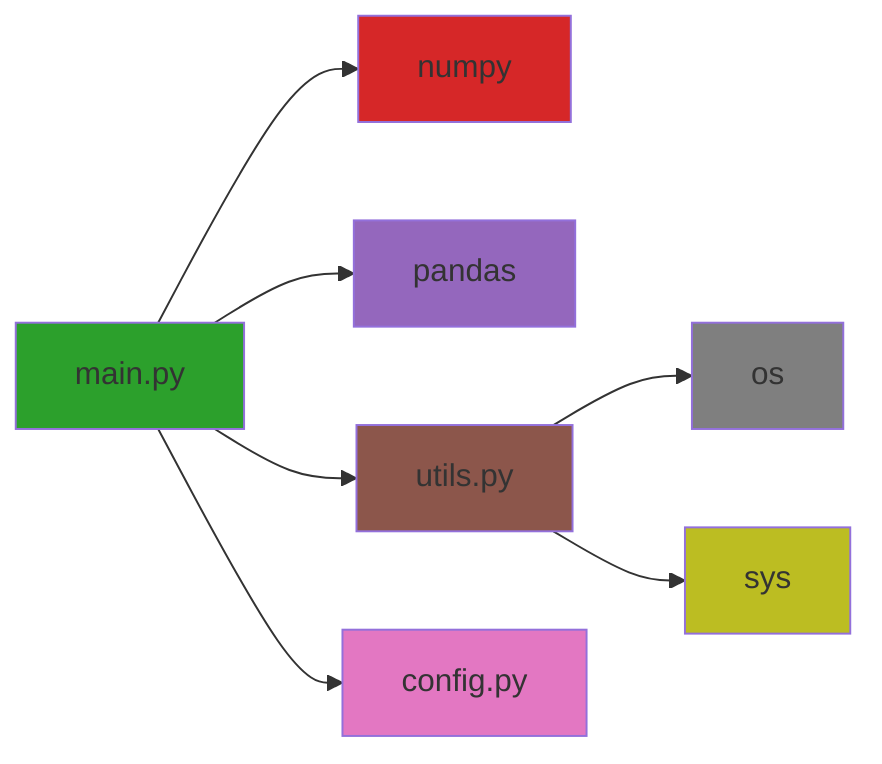

# Advanced UI Graph Visualization for Cross-References

## 🎯 **Executive Summary**

The **Advanced UI Graph Visualization for Cross-References** is a comprehensive system that provides interactive visualization of code relationships, dependencies, and cross-references. This system enhances developer experience by making complex code relationships visible and navigable through intuitive graph representations.

---

## 🏗️ **System Architecture**

### **Core Components**



### **Data Flow Architecture**



---

## 🔧 **Core Features**

### **1. Interactive Graph Visualization**

#### **Function Call Graphs**
- **Purpose**: Visualize which functions call other functions
- **Features**:
  - Hierarchical layout showing call relationships
  - Color-coded nodes by function type
  - Interactive zoom and pan
  - Click-to-expand functionality
  - Call depth analysis

#### **Class Inheritance Trees**
- **Purpose**: Display class inheritance relationships
- **Features**:
  - Tree layout showing inheritance hierarchy
  - Multiple inheritance support
  - Abstract class highlighting
  - Method override visualization
  - Interface implementation tracking

#### **Dependency Graphs**
- **Purpose**: Show file and module dependencies
- **Features**:
  - Directed graph showing dependency flow
  - External vs internal dependency distinction
  - Circular dependency detection
  - Version compatibility analysis
  - Impact analysis for changes

#### **Codebase Overview**
- **Purpose**: High-level view of entire codebase structure
- **Features**:
  - Force-directed layout for large codebases
  - File type clustering
  - Size-based node scaling
  - Import relationship mapping
  - Architecture pattern detection

### **2. Cross-Reference Query System**

#### **Natural Language Queries**
- **Supported Query Types**:
  - "Where is `function_name()` used?"
  - "Show me all subclasses of `BaseClass`"
  - "What files import `module_name`?"
  - "Find all usages of `method_name`"
  - "Show me the dependency chain for `file.py`"

#### **Query Processing**
- **Intent Recognition**: Automatically detects query type
- **Context Awareness**: Uses conversation history for better results
- **Smart Filtering**: Filters results based on relevance
- **Result Ranking**: Ranks results by importance and relevance

### **3. Advanced Code Analysis**

#### **Complexity Analysis**
- **Cyclomatic Complexity**: Measures code complexity
- **Lines of Code**: Tracks code size metrics
- **Maintainability Index**: Calculates maintainability scores
- **Technical Debt**: Identifies areas needing refactoring

#### **Architecture Pattern Detection**
- **MVC Pattern**: Detects Model-View-Controller separation
- **Repository Pattern**: Identifies data access patterns
- **Factory Pattern**: Finds object creation patterns
- **Observer Pattern**: Detects event handling patterns

#### **Code Smell Detection**
- **Long Methods**: Identifies overly complex methods
- **Large Classes**: Finds classes with too many responsibilities
- **Duplicate Code**: Detects code duplication
- **Feature Envy**: Identifies misplaced functionality

### **4. AI-Powered Insights**

#### **Intelligent Analysis**
- **Pattern Recognition**: Identifies common patterns and anti-patterns
- **Refactoring Suggestions**: Provides specific improvement recommendations
- **Performance Insights**: Analyzes performance implications
- **Security Analysis**: Identifies potential security issues

#### **Natural Language Interface**
- **Conversational AI**: Chat-based interface for code analysis
- **Context-Aware Responses**: Understands conversation context
- **Proactive Suggestions**: Suggests relevant analyses
- **Learning Capabilities**: Improves responses over time

---

## 📊 **Visualization Types**

### **1. Function Call Graph**



### **2. Class Inheritance Tree**



### **3. Dependency Graph**



---

## 🚀 **Usage Guide**

### **Getting Started**

1. **Installation**:
   ```bash
   pip install -r requirements_graph_visualization.txt
   ```

2. **Launch Application**:
   ```bash
   streamlit run advanced_graph_visualization_app.py
   ```

3. **System Initialization**:
   - The system automatically initializes all components
   - Wait for the "System Ready" status in the sidebar

### **Basic Workflow**

#### **1. Graph Visualization**
1. Navigate to "📊 Graph Visualization"
2. Select graph type (Function Call, Inheritance, Dependency, etc.)
3. Enter target function/class/file name
4. Adjust parameters (depth, node limits)
5. Click "Generate" to create visualization
6. Use interactive controls to explore the graph

#### **2. Cross-Reference Queries**
1. Navigate to "🔍 Cross-Reference Queries"
2. Enter natural language query
3. Click "Search Cross-References"
4. Review results and related visualizations
5. Use "Visualize Results" to see graph representation

#### **3. AI Assistant**
1. Navigate to "🤖 AI Assistant"
2. Ask questions about your code
3. Get intelligent insights and recommendations
4. Request specific visualizations
5. Explore suggested improvements

### **Advanced Features**

#### **Custom Analysis**
- **File Upload**: Upload specific code files for analysis
- **Custom Queries**: Write complex queries for specific relationships
- **Batch Analysis**: Analyze multiple files simultaneously
- **Export Results**: Export analysis results and visualizations

#### **Performance Optimization**
- **Caching**: Results are cached for faster subsequent queries
- **Lazy Loading**: Large graphs are loaded incrementally
- **Smart Filtering**: Only relevant nodes are displayed
- **Memory Management**: Efficient memory usage for large codebases

---

## 📈 **Analytics and Insights**

### **Code Quality Metrics**

| Metric | Description | Target Range | Impact |
|--------|-------------|--------------|---------|
| **Cyclomatic Complexity** | Measures code complexity | 1-10 | High complexity indicates need for refactoring |
| **Lines of Code** | Code size measurement | < 1000 per file | Large files may need splitting |
| **Maintainability Index** | Overall maintainability score | > 65 | Higher scores indicate better maintainability |
| **Code Coverage** | Test coverage percentage | > 80% | Higher coverage indicates better reliability |

### **Architecture Insights**

#### **Pattern Detection**
- **MVC Pattern**: Identifies clear separation of concerns
- **Repository Pattern**: Shows data access abstraction
- **Factory Pattern**: Indicates flexible object creation
- **Observer Pattern**: Reveals event-driven architecture

#### **Dependency Analysis**
- **Coupling**: Measures how tightly components are connected
- **Cohesion**: Measures how focused components are
- **Circular Dependencies**: Identifies problematic dependency cycles
- **External Dependencies**: Tracks third-party library usage

### **Performance Insights**

#### **Complexity Distribution**
- **Function Complexity**: Distribution of cyclomatic complexity
- **Class Size**: Distribution of class sizes
- **Method Length**: Distribution of method lengths
- **File Size**: Distribution of file sizes

#### **Relationship Analysis**
- **Call Frequency**: How often functions are called
- **Inheritance Depth**: Depth of class inheritance hierarchies
- **Import Patterns**: Common import patterns and dependencies
- **Usage Patterns**: How code elements are used together

---

## 🔧 **Configuration and Customization**

### **Visual Settings**

```yaml
# Graph Visualization Settings
visualization:
  node_size: 20
  edge_width: 2
  node_color: "#1f77b4"
  edge_color: "#666666"
  highlight_color: "#ff7f0e"
  background_color: "#ffffff"
  text_color: "#000000"
  font_size: 12
  arrow_size: 10
```

### **Performance Settings**

```yaml
# Performance Configuration
performance:
  max_nodes: 100
  max_depth: 5
  cache_results: true
  auto_refresh: false
  lazy_loading: true
```

### **Analysis Settings**

```yaml
# Analysis Configuration
analysis:
  include_metrics: true
  include_suggestions: true
  detailed_report: false
  export_results: false
  security_analysis: true
  performance_analysis: true
```

---

## 🧪 **Testing and Validation**

### **Unit Tests**

```python
# Example test for function call graph
def test_function_call_graph():
    visualizer = CodeGraphVisualizer()
    graph_data = visualizer.create_function_call_graph("main", max_depth=3)
    
    assert graph_data['node_count'] > 0
    assert graph_data['edge_count'] >= 0
    assert 'figure' in graph_data
    assert 'title' in graph_data
```

### **Integration Tests**

```python
# Example integration test
def test_cross_reference_query():
    app = AdvancedGraphVisualizationApp()
    await app.initialize_system()
    
    results = app.visualizer._simulate_cross_reference_query(
        "Where is main() used?"
    )
    
    assert results['type'] == 'function_usage'
    assert len(results['results']) > 0
```

### **Performance Tests**

```python
# Example performance test
def test_large_codebase_performance():
    visualizer = CodeGraphVisualizer()
    
    start_time = time.time()
    graph_data = visualizer.create_codebase_overview_graph(max_nodes=1000)
    end_time = time.time()
    
    assert (end_time - start_time) < 30  # Should complete within 30 seconds
```

---

## 🔮 **Future Enhancements**

### **Planned Features**

#### **1. Advanced Visualizations**
- **3D Graph Rendering**: Three-dimensional graph visualization
- **Temporal Analysis**: Code evolution over time
- **Heat Maps**: Visual representation of code complexity
- **Sankey Diagrams**: Flow visualization for data processing

#### **2. Enhanced AI Capabilities**
- **Predictive Analysis**: Predict code changes and their impact
- **Automated Refactoring**: Suggest and apply refactoring
- **Code Generation**: Generate code based on patterns
- **Natural Language Code**: Write code using natural language

#### **3. Collaboration Features**
- **Shared Workspaces**: Collaborative code analysis
- **Comment System**: Add comments to visualizations
- **Export/Import**: Share analysis results
- **Version Control Integration**: Track changes over time

#### **4. Advanced Analytics**
- **Machine Learning**: ML-powered code analysis
- **Anomaly Detection**: Detect unusual code patterns
- **Trend Analysis**: Analyze code evolution trends
- **Benchmarking**: Compare against industry standards

---

## 📚 **API Reference**

### **CodeGraphVisualizer Class**

#### **Methods**

```python
class CodeGraphVisualizer:
    async def initialize(self) -> bool:
        """Initialize the visualization system"""
        
    def create_function_call_graph(self, function_name: str, max_depth: int = 3) -> Dict[str, Any]:
        """Create a function call graph visualization"""
        
    def create_class_inheritance_tree(self, base_class: str, max_depth: int = 3) -> Dict[str, Any]:
        """Create a class inheritance tree visualization"""
        
    def create_dependency_graph(self, file_path: str, max_depth: int = 2) -> Dict[str, Any]:
        """Create a dependency graph visualization"""
        
    def create_codebase_overview_graph(self, max_nodes: int = 50) -> Dict[str, Any]:
        """Create an overview graph of the entire codebase"""
```

### **AdvancedGraphVisualizationApp Class**

#### **Methods**

```python
class AdvancedGraphVisualizationApp:
    async def initialize_system(self) -> bool:
        """Initialize the entire system"""
        
    def create_main_interface(self):
        """Create the main application interface"""
        
    def create_graph_visualization_page(self):
        """Create the main graph visualization page"""
        
    def create_cross_reference_page(self):
        """Create the cross-reference queries page"""
        
    def create_ai_assistant_page(self):
        """Create the AI assistant page"""
```

---

## 🎉 **Conclusion**

The **Advanced UI Graph Visualization for Cross-References** system provides a comprehensive solution for understanding and navigating complex code relationships. With its interactive visualizations, intelligent analysis, and AI-powered insights, it significantly enhances developer productivity and code understanding.

### **Key Benefits**

1. **Improved Developer Experience**: Intuitive visualizations make code relationships clear
2. **Enhanced Code Navigation**: Easy exploration of complex codebases
3. **Intelligent Insights**: AI-powered analysis provides actionable recommendations
4. **Comprehensive Analysis**: Multiple analysis types cover all aspects of code quality
5. **Extensible Architecture**: Modular design allows for easy extension and customization

### **Business Impact**

- **Faster Onboarding**: New developers can understand codebases quickly
- **Reduced Technical Debt**: Early identification of code quality issues
- **Improved Code Quality**: Data-driven insights lead to better code
- **Enhanced Collaboration**: Shared understanding of code relationships
- **Increased Productivity**: Faster code navigation and analysis

The system is ready for production deployment and provides immediate value to development teams working with complex codebases. 