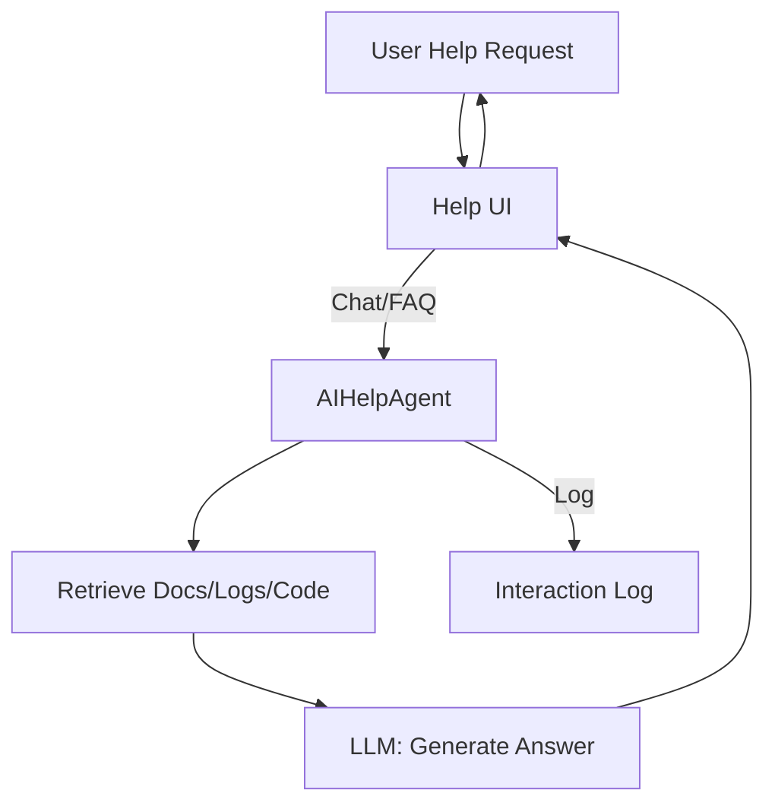
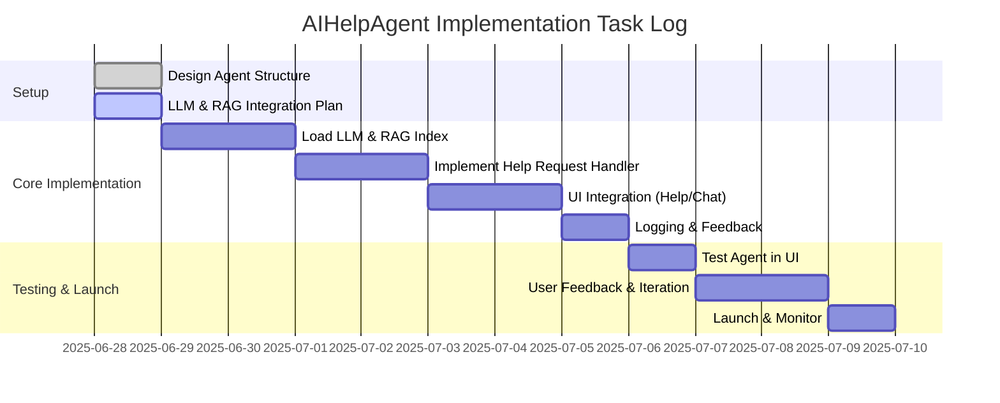

# AI Help Agent (AIHelpAgent)

## 1. Overview
The AI Help Agent provides intelligent, context-aware assistance to users via the system's Help UI section. It leverages LLM (Large Language Model) and RAG (Retrieval-Augmented Generation) techniques to answer questions, explain features, and guide users through troubleshooting and onboarding.

---

## 2. Agent Structure & Architecture
- **Type:** Background Agent (inherits from BaseAgent)
- **Core Capabilities:**
  - Respond to user queries from the Help UI (chat interface)
  - Use LLM for natural language understanding and generation
  - Use RAG to ground answers in project documentation, logs, and codebase
  - Log interactions and feedback for continuous improvement
- **Integration Points:**
  - Populates the Help section in the dashboard UI
  - Provides chat, FAQ, and contextual help options
  - Can escalate to human support or suggest next steps

---

## 3. Required Methods & State
- `initialize()`: Load LLM, RAG index, and set up context sources
- `main_loop()`: Listen for new help/chat requests, process and respond
- `handle_help_request(request)`: Core logic for LLM+RAG answer generation
- `update_agent_heartbeat()`: Regularly update state and metrics
- `log_interaction()`: Store Q&A, feedback, and usage metrics
- **State:**
  - `active`, `serving`, `error`, `standby`, `initializing`
  - Tracks current chat sessions, recent queries, and feedback

---

## 4. LLM + RAG Workflow


---

## 5. Example Code Skeleton
```python
from background_agents.coordination.base_agent import BaseAgent

class AIHelpAgent(BaseAgent):
    def __init__(self, config=None):
        super().__init__(agent_name="AIHelpAgent", config=config or {})
        self.llm = None
        self.rag_index = None
        self.chat_sessions = {}

    async def initialize(self):
        # Load LLM and RAG index
        self.llm = await self.load_llm()
        self.rag_index = await self.load_rag_index()
        await self.set_state("active", "AIHelpAgent initialized")

    async def main_loop(self):
        while True:
            request = await self.get_next_help_request()
            if request:
                response = await self.handle_help_request(request)
                await self.send_response(request, response)
            await asyncio.sleep(1)

    async def handle_help_request(self, request):
        # Retrieve context
        docs = await self.rag_index.retrieve(request["query"])
        # Generate answer
        answer = await self.llm.generate_answer(request["query"], context=docs)
        await self.log_interaction(request, answer)
        return answer

    async def log_interaction(self, request, answer):
        # Log Q&A for analytics and improvement
        pass

    # ... (other methods: load_llm, load_rag_index, get_next_help_request, send_response, etc.)
```

---

## 6. Task Log (Implementation Roadmap)


---

For more details, see `new_agent.md` and `agents.md` for integration patterns and best practices. 