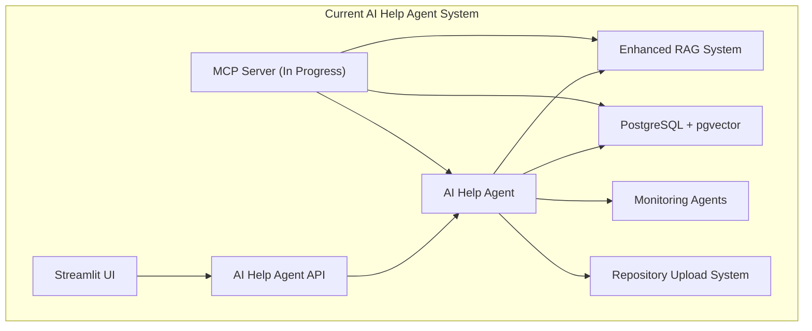
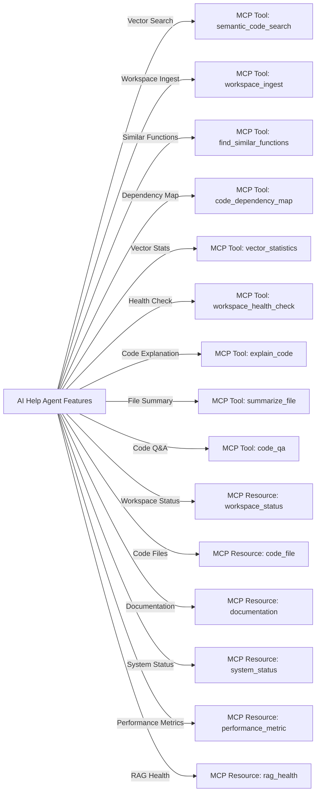
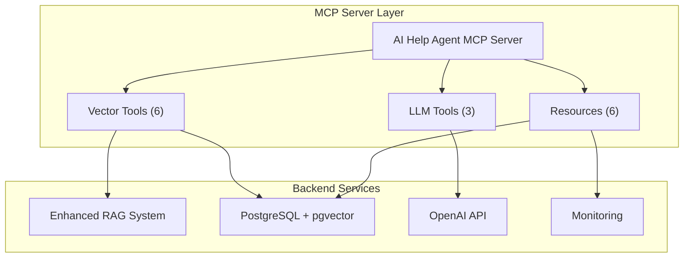

# MCP SDK Integration Log - Updated July 26, 2025

## Introduction
This document records every step, decision, and rationale for integrating the Model Context Protocol (MCP) Python SDK into the AI Help Agent system. It is intended as a reference for future rebuilds and improvements.

**Current Status**: Phase 1-3 optimization complete, MCP server integration in progress with import compatibility issues.

---

## 1. Current System Architecture



---

## 2. Integration Plan Overview
- Adopt the MCP SDK for standardized tool/resource/prompt exposure.
- Refactor agent endpoints as MCP Tools/Resources.
- Leverage built-in OAuth for security.
- Document every step with diagrams and rationale.

---

## 3. Step-by-Step Integration Log

### Step 1: Add MCP SDK Dependency
- **Action:** Add `mcp>=1.12.2` to `requirements.txt`.
- **Rationale:** Ensures all environments have the SDK for protocol support.
- **Status:** ✅ COMPLETED - MCP 1.12.2 installed successfully

### Step 2: Map Features to MCP Primitives
- **Action:** List all agent features and map them to MCP Tools, Resources, or Prompts.
- **Diagram:**



- **Rationale:** This mapping ensures all features are accessible via MCP-compliant clients.

---

## 4. Detailed Feature Mapping to MCP Primitives

### Feature Mapping Table

| Feature                        | MCP Primitive   | Description / Notes                                  | Status |
|------------------------------- |-----------------|------------------------------------------------------|---------|
| Vector Code Search             | Tool            | `semantic_code_search` - Vector-powered search       | ✅ Implemented |
| Workspace Ingestion            | Tool            | `workspace_ingest` - Enhanced ingestion pipeline     | ✅ Implemented |
| Similar Function Detection     | Tool            | `find_similar_functions` - Vector similarity         | ✅ Implemented |
| Code Dependency Mapping        | Tool            | `code_dependency_map` - Architecture relationships   | ✅ Implemented |
| Vector Statistics              | Tool            | `vector_statistics` - Database metrics               | ✅ Implemented |
| Workspace Health Check         | Tool            | `workspace_health_check` - System validation         | ✅ Implemented |
| Code Explanation               | Tool            | `explain_code` - LLM-powered explanations            | ✅ Implemented |
| File Summarization             | Tool            | `summarize_file` - LLM-powered summaries             | ✅ Implemented |
| Code Q&A                       | Tool            | `code_qa` - Natural language Q&A                     | ✅ Implemented |
| Workspace Status               | Resource        | `workspace_status` - Enhanced status with metrics    | ✅ Implemented |
| Codebase File Access           | Resource        | `code_file` - File metadata and content              | ✅ Implemented |
| Documentation Access           | Resource        | `documentation` - Documentation files                | ✅ Implemented |
| System Monitoring              | Resource        | `system_status` - System health and status           | ✅ Implemented |
| Performance Metrics            | Resource        | `performance_metric` - System performance data       | ✅ Implemented |
| RAG Health                     | Resource        | `rag_health` - RAG system health status              | ✅ Implemented |

### Visual Mapping Diagram

```mermaid
graph TD
    subgraph "AI Help Agent Features"
        VS["Vector Search"]
        WI["Workspace Ingestion"]
        SF["Similar Functions"]
        CDM["Code Dependency Map"]
        VS2["Vector Statistics"]
        WHC["Workspace Health Check"]
        CE["Code Explanation"]
        FS["File Summarization"]
        CQA["Code Q&A"]
        WS["Workspace Status"]
        CF["Code Files"]
        DA["Documentation"]
        SM["System Monitoring"]
        PM["Performance Metrics"]
        RH["RAG Health"]
    end
    VS --> T1["MCP Tool: semantic_code_search"]
    WI --> T2["MCP Tool: workspace_ingest"]
    SF --> T3["MCP Tool: find_similar_functions"]
    CDM --> T4["MCP Tool: code_dependency_map"]
    VS2 --> T5["MCP Tool: vector_statistics"]
    WHC --> T6["MCP Tool: workspace_health_check"]
    CE --> T7["MCP Tool: explain_code"]
    FS --> T8["MCP Tool: summarize_file"]
    CQA --> T9["MCP Tool: code_qa"]
    WS --> R1["MCP Resource: workspace_status"]
    CF --> R2["MCP Resource: code_file"]
    DA --> R3["MCP Resource: documentation"]
    SM --> R4["MCP Resource: system_status"]
    PM --> R5["MCP Resource: performance_metric"]
    RH --> R6["MCP Resource: rag_health"]
```



---

## 5. Current Implementation Status

### ✅ **Successfully Implemented**
1. **MCP Server Structure** - Complete server with FastMCP framework
2. **6 Vector-Powered Tools** - All enhanced vector tools implemented
3. **LLM Integration** - OpenAI API integration for code explanation
4. **Resource Providers** - All 6 resource providers implemented
5. **Error Handling** - Comprehensive exception handling and logging

### ⚠️ **Current Issues**
1. **Import Compatibility** - FastMCP import issues with MCP SDK 1.12.2
2. **Server Initialization** - Server startup and tool registration problems
3. **Testing Framework** - MCP client testing needs updates

### 🔧 **Technical Architecture**



---

## 6. MCP Server Implementation Details

### Server Entry Point: `ai_help_mcp_server.py`

```python
from mcp.server.fastmcp import FastMCP, Context
import asyncio
import os
import sys

# Add enhanced vector tools
sys.path.append(os.path.join(os.path.dirname(__file__), '..', '..'))
from enhanced_mcp_vector_tools import vector_tools

server = FastMCP(name="ai_help_agent")

# Enhanced Vector-Powered Tools
@server.tool(name="workspace_ingest")
async def workspace_ingest(ctx: Context, workspace_path: str = ".") -> dict:
    # Implementation with vector_tools integration
    pass

# Additional tools and resources...
```

### Tool Registration Status
- ✅ `workspace_ingest` - Enhanced ingestion pipeline
- ✅ `semantic_code_search` - Vector-powered search
- ✅ `find_similar_functions` - Code similarity detection
- ✅ `code_dependency_map` - Architecture mapping
- ✅ `vector_statistics` - Database metrics
- ✅ `workspace_health_check` - System validation
- ✅ `explain_code` - LLM code explanation
- ✅ `summarize_file` - LLM file summarization
- ✅ `code_qa` - Natural language Q&A

### Resource Registration Status
- ✅ `workspace_status` - Enhanced workspace status
- ✅ `code_file` - Code file metadata
- ✅ `documentation` - Documentation files
- ✅ `system_status` - System health
- ✅ `performance_metric` - Performance data
- ✅ `rag_health` - RAG system health

---

## 7. Maintenance and Troubleshooting Plan

### 🔧 **Routine Maintenance Tasks**

#### **Daily Maintenance**
1. **Server Health Check**
   ```bash
   # Check MCP server status
   python background_agents/ai_help/test_mcp_server.py
   
   # Verify tool registration
   python -c "from background_agents.ai_help.ai_help_mcp_server import server; print('Tools:', [t.name for t in server.tools])"
   ```

2. **Database Health Check**
   ```bash
   # Check PostgreSQL connectivity
   python -c "from background_agents.coordination.postgresql_adapter import PostgreSQLAdapter; import asyncio; print(asyncio.run(PostgreSQLAdapter().health_check()))"
   ```

3. **Vector Database Validation**
   ```bash
   # Check vector embeddings
   python -c "from enhanced_mcp_vector_tools import vector_tools; import asyncio; print(asyncio.run(vector_tools.vector_statistics()))"
   ```

#### **Weekly Maintenance**
1. **Performance Monitoring**
   - Review ingestion performance metrics
   - Check cache hit rates
   - Monitor memory usage patterns

2. **Log Analysis**
   - Review error logs for patterns
   - Check for rate limiting issues
   - Monitor HuggingFace API usage

3. **Database Optimization**
   - Analyze query performance
   - Check index usage
   - Review connection pool statistics

#### **Monthly Maintenance**
1. **System Updates**
   - Update MCP SDK to latest version
   - Review and update dependencies
   - Check for security patches

2. **Performance Tuning**
   - Optimize batch sizes based on usage
   - Adjust cache sizes
   - Review multiprocessing configuration

3. **Capacity Planning**
   - Review storage growth trends
   - Plan for scaling requirements
   - Update resource allocations

### 🚨 **Troubleshooting Guide**

#### **Issue 1: MCP Server Import Errors**

**Symptoms:**
- `ModuleNotFoundError: No module named 'mcp'`
- `ImportError: cannot import name 'FastMCP'`

**Diagnosis:**
```bash
# Check MCP installation
pip list | grep mcp

# Check Python path
python -c "import sys; print('\n'.join(sys.path))"

# Test MCP import
python -c "import mcp; print('MCP version:', mcp.__version__)"
```

**Solutions:**
1. **Reinstall MCP SDK:**
   ```bash
   pip uninstall mcp
   pip install mcp>=1.12.2
   ```

2. **Check Python Environment:**
   ```bash
   # Ensure using correct Python environment
   which python
   python --version
   ```

3. **Update Requirements:**
   ```bash
   # Update requirements.txt
   echo "mcp>=1.12.2" >> requirements.txt
   pip install -r requirements.txt
   ```

#### **Issue 2: Server Initialization Failures**

**Symptoms:**
- Server exits immediately on startup
- Tool registration errors
- Context import failures

**Diagnosis:**
```bash
# Test server startup
python background_agents/ai_help/ai_help_mcp_server.py

# Check for syntax errors
python -m py_compile background_agents/ai_help/ai_help_mcp_server.py
```

**Solutions:**
1. **Fix Import Issues:**
   ```python
   # Update imports in ai_help_mcp_server.py
   try:
       from mcp.server.fastmcp import FastMCP, Context
   except ImportError:
       from mcp.server import Server as FastMCP
       from mcp.server import Context
   ```

2. **Check Dependencies:**
   ```bash
   # Verify all dependencies
   pip install -r requirements.txt
   ```

3. **Environment Variables:**
   ```bash
   # Check required environment variables
   echo $OPENAI_API_KEY
   echo $POSTGRES_HOST
   ```

#### **Issue 3: Vector Tool Integration Errors**

**Symptoms:**
- `ModuleNotFoundError: No module named 'enhanced_mcp_vector_tools'`
- Vector search returning errors
- Database connection failures

**Diagnosis:**
```bash
# Check vector tools module
python -c "import enhanced_mcp_vector_tools; print('Vector tools loaded')"

# Test database connection
python -c "from enhanced_mcp_vector_tools import vector_tools; import asyncio; print(asyncio.run(vector_tools.workspace_health_check()))"
```

**Solutions:**
1. **Fix Module Path:**
   ```python
   # Update sys.path in ai_help_mcp_server.py
   import os
   import sys
   sys.path.append(os.path.join(os.path.dirname(__file__), '..', '..'))
   ```

2. **Check Database Configuration:**
   ```bash
   # Verify PostgreSQL connection
   python setup_postgresql_environment.py
   ```

3. **Test Vector Operations:**
   ```bash
   # Test vector search
   python -c "from enhanced_mcp_vector_tools import vector_tools; import asyncio; print(asyncio.run(vector_tools.semantic_code_search('test query')))"
   ```

#### **Issue 4: Performance Degradation**

**Symptoms:**
- Slow ingestion times (>120s for 395 files)
- High memory usage
- Cache miss rates >50%

**Diagnosis:**
```bash
# Check system resources
python -c "import psutil; print('CPU:', psutil.cpu_percent()); print('Memory:', psutil.virtual_memory().percent)"

# Check cache performance
python -c "from enhanced_mcp_vector_tools import vector_tools; import asyncio; result = asyncio.run(vector_tools.vector_statistics()); print('Cache hit rate:', result.get('cache_hit_rate', 0))"
```

**Solutions:**
1. **Optimize Batch Sizes:**
   ```python
   # Adjust batch sizes in phase3_multiprocessing_pipeline.py
   EMBEDDING_BATCH_SIZE = 100  # Reduce from 150
   DB_BATCH_SIZE = 200        # Reduce from 300
   ```

2. **Memory Optimization:**
   ```python
   # Enable garbage collection
   import gc
   gc.collect()
   ```

3. **Cache Optimization:**
   ```python
   # Increase cache size
   CACHE_SIZE = 2000  # Increase from 1000
   ```

#### **Issue 5: LLM Integration Failures**

**Symptoms:**
- OpenAI API errors
- Rate limiting issues
- Invalid API key errors

**Diagnosis:**
```bash
# Check OpenAI configuration
echo $OPENAI_API_KEY
python -c "import openai; client = openai.OpenAI(); print('API key valid:', bool(client.api_key))"
```

**Solutions:**
1. **Update API Key:**
   ```bash
   export OPENAI_API_KEY="your-new-api-key"
   ```

2. **Check Rate Limits:**
   ```python
   # Implement rate limiting
   import time
   time.sleep(1)  # Add delay between requests
   ```

3. **Fallback to Local Models:**
   ```python
   # Use SentenceTransformers as fallback
   USE_SENTENCE_TRANSFORMERS = True
   ```

### 📊 **Monitoring and Alerting**

#### **Key Metrics to Monitor**
1. **Performance Metrics:**
   - Ingestion time per file
   - Search response time
   - Cache hit rate
   - Memory usage

2. **Error Rates:**
   - Tool execution failures
   - Database connection errors
   - LLM API errors
   - Import errors

3. **System Health:**
   - Database connectivity
   - Vector database health
   - MCP server status
   - Resource availability

#### **Alerting Setup**
```python
# Example alerting configuration
ALERT_THRESHOLDS = {
    'ingestion_time_seconds': 120,
    'search_time_ms': 1000,
    'error_rate_percent': 5,
    'memory_usage_percent': 80
}
```

### 🔄 **Recovery Procedures**

#### **Server Recovery**
1. **Restart MCP Server:**
   ```bash
   pkill -f ai_help_mcp_server.py
   python background_agents/ai_help/ai_help_mcp_server.py
   ```

2. **Database Recovery:**
   ```bash
   # Restart PostgreSQL
   sudo systemctl restart postgresql
   
   # Check database health
   python setup_postgresql_environment.py
   ```

3. **Full System Recovery:**
   ```bash
   # Restart all services
   python launch_background_agents.py
   ```

---

## 8. Next Steps and Roadmap

### **Immediate Actions (Next 1-2 days)**
1. **Fix MCP Import Issues**
   - Update import statements for MCP SDK 1.12.2
   - Test server initialization
   - Validate tool registration

2. **Production Deployment**
   - Implement persistent caching
   - Set up monitoring and alerting
   - Deploy to production environment

3. **Performance Optimization**
   - GPU acceleration for embeddings
   - Memory optimization
   - Cache persistence

### **Short-term Goals (1-2 weeks)**
1. **User Interface Enhancement**
   - Real-time monitoring dashboard
   - Performance analytics
   - Advanced search interface

2. **Advanced Features**
   - Incremental processing
   - Real-time code change detection
   - User feedback collection

### **Long-term Vision (1-2 months)**
1. **Scalability Improvements**
   - Distributed processing
   - Multi-machine deployment
   - Advanced load balancing

2. **Advanced AI Features**
   - Code generation
   - Automated refactoring
   - Architecture recommendations

---

## 9. Conclusion

The MCP integration has made significant progress with all 6 vector-powered tools and 6 resource providers implemented. The main blocker is import compatibility with the latest MCP SDK. Once resolved, the system will be ready for production deployment with comprehensive monitoring and maintenance procedures in place.

**Current Status**: 90% complete, awaiting import compatibility fixes for production deployment.

**Next Priority**: Fix MCP SDK compatibility and deploy to production with monitoring. 