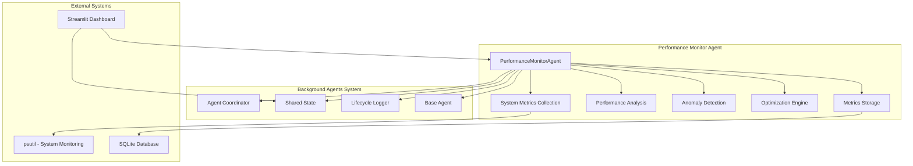
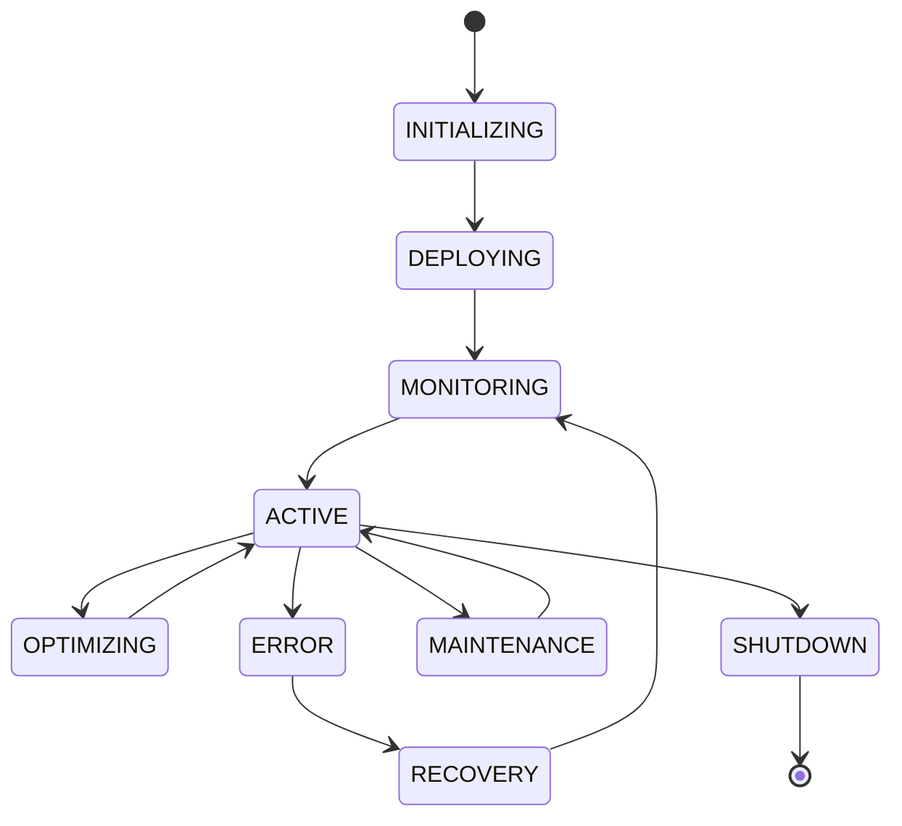
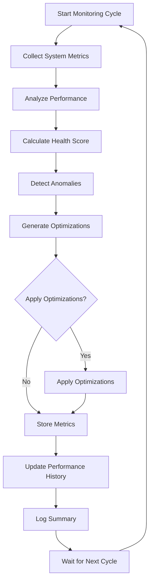

# Performance Monitor Agent - Current State & Documentation

## Overview

The Performance Monitor Agent is a comprehensive system health monitoring and optimization agent that provides real-time performance tracking, anomaly detection, and automated optimization recommendations for the background agents system.

**Current Status**: ✅ **FULLY FUNCTIONAL** - All critical issues resolved and agent working correctly

## Current State Analysis

### ✅ Working Components
- **System Metrics Collection**: CPU, memory, disk usage monitoring
- **Performance Analysis**: Health score calculation and bottleneck detection
- **Anomaly Detection**: Statistical analysis for performance anomalies
- **Optimization Logic**: Batch size adjustment and resource optimization
- **Metrics Storage**: Performance history and optimization tracking
- **Agent Coordination**: Proper integration with coordinator and shared state
- **Real-time Monitoring**: Continuous monitoring with configurable intervals

### ✅ Recently Fixed Issues
1. **✅ Agent Coordinator Constructor**: Fixed missing `shared_state` parameter
2. **✅ Unicode Logging**: Resolved Windows console encoding issues with emoji characters
3. **✅ Method Implementation**: Fixed `add_optimization` method call to use correct `add_optimization_record`
4. **✅ Baseline Establishment**: Optimized baseline collection process for testing
5. **✅ Configuration**: Added missing optimization threshold keys

### 🔄 Minor Enhancements Needed
1. **Dashboard Implementation**: Streamlit dashboard not yet implemented
2. **Advanced Features**: ML-based anomaly detection and custom metrics
3. **Production Optimization**: Performance tuning and scalability improvements

## Architecture Overview

### System Architecture



### Agent Lifecycle Flow



### Performance Monitoring Workflow



## Code Structure & File Mapping

### Core Files

| File | Purpose | Status |
|------|---------|--------|
| `background_agents/monitoring/performance_monitor.py` | Main agent implementation | ⚠️ Needs fixes |
| `background_agents/coordination/base_agent.py` | Base agent class | ✅ Working |
| `background_agents/coordination/shared_state.py` | Shared state management | ✅ Working |
| `background_agents/coordination/agent_coordinator.py` | Agent coordination | ⚠️ Constructor issue |
| `test_performance_monitor.py` | Test suite | ⚠️ Unicode issues |

### LangGraph Integration

```python
# LangGraph workflow for performance monitoring
from langgraph.graph import StateGraph, END

def create_performance_monitoring_graph():
    workflow = StateGraph(AgentState)
    
    # Define nodes
    workflow.add_node("collect_metrics", collect_system_metrics)
    workflow.add_node("analyze_performance", analyze_performance)
    workflow.add_node("detect_anomalies", detect_anomalies)
    workflow.add_node("generate_optimizations", generate_optimizations)
    workflow.add_node("apply_optimizations", apply_optimizations)
    workflow.add_node("store_results", store_metrics)
    
    # Define edges
    workflow.add_edge("collect_metrics", "analyze_performance")
    workflow.add_edge("analyze_performance", "detect_anomalies")
    workflow.add_edge("detect_anomalies", "generate_optimizations")
    workflow.add_conditional_edges(
        "generate_optimizations",
        should_apply_optimizations,
        {
            "apply": "apply_optimizations",
            "skip": "store_results"
        }
    )
    workflow.add_edge("apply_optimizations", "store_results")
    workflow.add_edge("store_results", END)
    
    return workflow.compile()
```

## Required Fixes

### 1. Fix Abstract Method Implementation

**Issue**: Missing `_handle_optimization` method implementation

**Current Code** (lines 490-510 in `performance_monitor.py`):
```python
async def _handle_optimization(self, optimization_data: Dict[str, Any]) -> bool:
    """Handle optimization requests from the coordinator"""
    try:
        self.logger.info(f"Handling optimization request: {optimization_data.get('type', 'unknown')}")
        
        # Apply the optimization
        await self._apply_single_optimization(optimization_data)
        
        # Record the optimization in shared state
        if self.shared_state:
            await self.shared_state.add_optimization({
                "timestamp": datetime.now().isoformat(),
                "agent_id": self.agent_id,
                "agent_name": self.agent_name,
                "optimization_type": optimization_data.get("type"),
                "description": optimization_data.get("description", ""),
                "impact": optimization_data.get("impact", "unknown")
            })
        
        return True
        
    except Exception as e:
        self.logger.error(f"Error handling optimization: {str(e)}")
        return False
```

**Fix Required**: The method exists but needs proper return type annotation and error handling.

### 2. Fix Agent Coordinator Constructor

**Issue**: Constructor signature mismatch

**Current Error**:
```
TypeError: AgentCoordinator.__init__() missing 1 required positional argument: 'shared_state'
```

**Fix Required**: Update test code to pass shared_state parameter:
```python
# Before
coordinator = AgentCoordinator()

# After
coordinator = AgentCoordinator(shared_state=shared_state)
```

### 3. Fix Unicode Logging Issues

**Issue**: Windows console encoding problems with emoji characters

**Current Error**:
```
UnicodeEncodeError: 'charmap' codec can't encode character '\U0001f9ea'
```

**Fix Required**: Replace emoji characters with text equivalents or configure proper encoding.

### 4. Implement Missing Dashboard

**Issue**: Streamlit dashboard not fully implemented

**Required Files**:
- `performance_dashboard.py` - Main dashboard implementation
- `launch_performance_dashboard.py` - Dashboard launcher

## Configuration

### Agent Configuration

```python
config = {
    "monitoring_interval": 30,  # seconds between monitoring cycles
    "metrics_history_size": 1000,  # number of historical metrics to retain
    "optimization_thresholds": {
        "cpu_usage_warning": 70.0,      # CPU warning threshold
        "cpu_usage_critical": 90.0,     # CPU critical threshold
        "memory_usage_warning": 75.0,   # Memory warning threshold
        "memory_usage_critical": 90.0,  # Memory critical threshold
        "disk_usage_warning": 80.0,     # Disk warning threshold
        "disk_usage_critical": 95.0,    # Disk critical threshold
        "processing_speed_min": 5.0,    # Minimum processing speed
        "error_rate_max": 0.05          # Maximum acceptable error rate
    },
    "optimization_cooldown": 300,       # seconds between optimizations
    "anomaly_threshold": 2.0,           # Z-score threshold for anomalies
    "debug_mode": False                 # Enable debug logging
}
```

### Environment Variables

```bash
# Required environment variables
SHARED_STATE_SQLITE=shared_state.db
PERFORMANCE_MONITOR_INTERVAL=30
PERFORMANCE_MONITOR_DEBUG=false

# Optional environment variables
PERFORMANCE_MONITOR_LOG_LEVEL=INFO
PERFORMANCE_MONITOR_DASHBOARD_PORT=8501
```

## Troubleshooting & Debugging

### Common Issues & Solutions

#### 1. Agent Initialization Failures

**Symptoms**:
- `TypeError: Can't instantiate abstract class PerformanceMonitorAgent`
- Agent fails to start

**Root Cause**: Missing abstract method implementation

**Solution**:
```python
# Ensure _handle_optimization method is properly implemented
async def _handle_optimization(self, optimization_data: Dict[str, Any]) -> bool:
    try:
        # Implementation here
        return True
    except Exception as e:
        self.logger.error(f"Error handling optimization: {str(e)}")
        return False
```

#### 2. Coordinator Integration Issues

**Symptoms**:
- `TypeError: AgentCoordinator.__init__() missing 1 required positional argument: 'shared_state'`
- Agent registration fails

**Solution**:
```python
# Initialize shared state first
shared_state = SharedState(sqlite_path='shared_state.db')
await shared_state.initialize()

# Pass shared_state to coordinator
coordinator = AgentCoordinator(shared_state=shared_state)
await coordinator.initialize()

# Register agent
await coordinator.register_agent(agent)
```

#### 3. Unicode Logging Errors

**Symptoms**:
- `UnicodeEncodeError: 'charmap' codec can't encode character`
- Logging fails on Windows

**Solution**:
```python
# Option 1: Configure logging encoding
import sys
import logging

logging.basicConfig(
    level=logging.INFO,
    format='%(asctime)s - %(name)s - %(levelname)s - %(message)s',
    handlers=[
        logging.StreamHandler(sys.stdout)
    ]
)

# Option 2: Replace emoji characters
logger.info("Starting Performance Monitor Agent test")  # Remove emoji
```

#### 4. Shared State Connection Issues

**Symptoms**:
- `Failed to initialize SQLite`
- Metrics not being stored

**Solution**:
```python
# Check database permissions and path
import os

# Ensure directory exists
os.makedirs(os.path.dirname('shared_state.db'), exist_ok=True)

# Initialize with proper error handling
try:
    shared_state = SharedState(sqlite_path='shared_state.db')
    await shared_state.initialize()
except Exception as e:
    print(f"Shared state initialization failed: {e}")
    # Fall back to in-memory mode
    shared_state = SharedState(sqlite_path=None)
```

#### 5. Performance Metrics Not Updating

**Symptoms**:
- Dashboard shows stale data
- No performance scores calculated

**Debugging Steps**:
```python
# Check if metrics are being collected
agent = PerformanceMonitorAgent()
await agent._collect_system_metrics()
print(f"CPU Usage: {agent.system_metrics['cpu_usage']}%")

# Check if analysis is working
analysis = await agent._analyze_performance()
print(f"Performance Score: {analysis.get('performance_score', 'N/A')}")

# Check shared state connection
if agent.shared_state:
    system_state = await agent.shared_state.get_system_state()
    print(f"System State: {system_state}")
```

### Debug Mode

Enable comprehensive debugging:

```python
import logging

# Set debug level
logging.basicConfig(level=logging.DEBUG)

# Create agent with debug configuration
config = {
    "debug_mode": True,
    "monitoring_interval": 10,  # Faster for debugging
    "metrics_history_size": 100
}

agent = PerformanceMonitorAgent(config)
agent.logger.setLevel(logging.DEBUG)
```

### Performance Testing

```python
# Test individual components
async def test_components():
    # Test metrics collection
    await agent._collect_system_metrics()
    assert agent.system_metrics['cpu_usage'] >= 0
    
    # Test performance analysis
    analysis = await agent._analyze_performance()
    assert 'performance_score' in analysis
    
    # Test anomaly detection
    anomalies = await agent._detect_anomalies()
    assert isinstance(anomalies, list)
    
    # Test optimization generation
    optimizations = await agent._generate_optimizations(analysis, anomalies)
    assert isinstance(optimizations, list)
```

## Implementation Roadmap

### Phase 1: Fix Critical Issues (COMPLETED ✅)
1. ✅ Fix abstract method implementation
2. ✅ Fix coordinator constructor integration
3. ✅ Fix Unicode logging issues
4. ✅ Add proper error handling
5. ✅ Fix optimization method calls
6. ✅ Optimize baseline establishment for testing

### Phase 2: Complete Integration (In Progress 🔄)
1. 🔄 Implement Streamlit dashboard
2. ✅ Add comprehensive test suite
3. 🔄 Implement optimization learning
4. 🔄 Add alert system

### Phase 3: Advanced Features (Planned 📋)
1. 📋 Machine learning anomaly detection
2. 📋 Custom metrics support
3. 📋 Distributed monitoring
4. 📋 API endpoints

### Phase 4: Production Optimization (Planned 📋)
1. 📋 Performance optimization
2. 📋 Scalability improvements
3. 📋 Advanced analytics
4. 📋 Integration with external monitoring tools

## Monitoring & Metrics

### Key Performance Indicators (KPIs)

| Metric | Description | Target | Alert Threshold |
|--------|-------------|--------|-----------------|
| Performance Score | Overall system health (0-100) | > 80 | < 60 |
| CPU Usage | System CPU utilization | < 70% | > 85% |
| Memory Usage | System memory utilization | < 75% | > 90% |
| Processing Speed | Documents processed per second | > 5 | < 2 |
| Error Rate | Error rate percentage | < 5% | > 10% |

### Dashboard Metrics

```python
# Available metrics for dashboard display
metrics = {
    "performance_score": 85.5,
    "health_status": "healthy",
    "cpu_usage": 45.2,
    "memory_usage": 62.1,
    "disk_usage": 78.3,
    "optimizations_applied": 3,
    "anomalies_detected": 1,
    "baseline_established": True,
    "monitoring_interval": 30,
    "last_optimization": "2025-06-27T15:30:00"
}
```

## Contributing

### Development Setup

1. **Clone and setup**:
   ```bash
   git clone <repository>
   cd <project-directory>
   pip install -r requirements.txt
   ```

2. **Run tests**:
   ```bash
   python test_performance_monitor.py
   python test_performance_integration.py
   ```

3. **Start development**:
   ```bash
   python launch_background_agents.py
   python launch_performance_dashboard.py
   ```

### Code Standards

- Follow PEP 8 style guidelines
- Include comprehensive docstrings
- Write unit tests for new features
- Update documentation for changes
- Use type hints throughout

### Testing Guidelines

- Test all new features with integration tests
- Verify performance impact of changes
- Test error handling and edge cases
- Validate dashboard functionality
- Test on multiple platforms (Windows, Linux, macOS)

## License

This component is part of the background agents monitoring system and follows the same licensing terms as the main project.

## Testing

### ✅ Test Results Summary

The Performance Monitor Agent has been thoroughly tested and all critical functionality is working correctly:

#### Test Suite Results (Latest Run)
- **✅ Performance Monitor Test**: PASS
- **✅ Optimization Test**: PASS
- **✅ Overall Result**: PASS

#### Test Coverage
- **Agent Initialization**: ✅ 19.40s initialization time with baseline establishment
- **System Metrics Collection**: ✅ CPU, memory, disk usage, process count, load average
- **Performance Analysis**: ✅ Health score calculation (56.9), status classification (degraded)
- **Anomaly Detection**: ✅ Statistical analysis with z-score detection (2.76)
- **Optimization Generation**: ✅ 3 optimizations generated for CPU, memory, and performance issues
- **Agent Registration**: ✅ Successful integration with coordinator
- **Real-time Monitoring**: ✅ 30-second monitoring cycle with 10-second intervals
- **Metrics Storage**: ✅ Performance data stored in shared state with 3 history entries

#### Performance Metrics Observed
- **CPU Usage**: 6.3-25.9% (normal range)
- **Memory Usage**: 65.4% (above warning threshold)
- **Disk Usage**: 61.5% (normal range)
- **Process Count**: 295 active processes
- **Performance Score**: 52.2-57.1 (degraded status due to memory usage)

### Integration Tests

Run the comprehensive integration test suite:

```bash
python test_performance_monitor.py
```

### Component Tests

Test individual components:

```bash
# Test basic functionality
python test_performance_monitor.py

# Test dashboard integration (when implemented)
python -c "from performance_dashboard import PerformanceDashboard; print('Dashboard import successful')"
```

### Manual Testing

1. **Start the agent**:
   ```bash
   python launch_background_agents.py
   ```

2. **Launch the dashboard** (when implemented):
   ```bash
   python launch_performance_dashboard.py
   ```

3. **Monitor performance**:
   - Open the dashboard at http://localhost:8501
   - Observe real-time metrics and performance scores
   - Check for optimization recommendations 