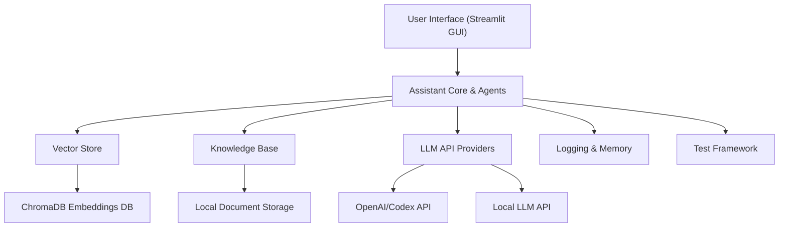

System Architecture Overview
The AI assistant is built on a modular, multi-layered architecture. At a high level, it consists of a User
Interface, a central Assistant Core that coordinates various Agents, and supporting modules for
knowledge storage, external AI models, logging, and testing. The diagram below illustrates the top-level
architecture, grouping components by functionality:

UI: The front-end is a Streamlit-based web interface that allows user interaction. It supports a real-time
chat, document uploads, system status displays, and checklist management . The UI captures user
inputs (queries, uploaded documents, etc.) and displays the assistant’s outputs.

Assistant Core: The core is the brain of the system. It receives input from the UI and delegates tasks to
specialized Agents for processing. It manages query analysis, context gathering, and orchestrating
responses. This is also where chain-of-thought reasoning and progress visualization are handled. The core
uses a BaseAgent class providing common utilities that many agents inherit .

Agents: Multiple specialized agents handle different domains and tasks. For example, BusinessCaseAgent,
CodeAnalysisAgent, DocumentAnalysisAgent (domain-specific analysis agents) and system-level agents
like DevOpsAgent, TestAgent, LLMAgent, CodexAgent, and GUIAgent. Each agent’s role is described in
detail in the next section.

Vector Store: A semantic vector database is used for embedding and retrieving documents or code
snippets relevant to queries . The implementation uses ChromaDB for storing embeddings, enabling
similarity search over documents. When a query comes in, the assistant can search this vector store for
relevant context to include in prompts.

Knowledge Base: A local knowledge base manages source documents and files . It handles file
indexing, content chunking, and metadata. New documents can be added (for example, via the UI), and the
content is chunked and embedded into the vector store for later retrieval. (In code, this might correspond
to a local_knowledge_base.py module and works in tandem with the vector store.)

LLM API Providers: These are external AI model endpoints used by the assistant. By default, the system
integrates with OpenAI’s GPT models (and Codex for code) . The design also allows using local or
alternative LLM providers – an LLMProvider abstraction supports multiple backends (e.g. OpenAI, local
models via Ollama, etc.) . This layer handles sending prompts to the model and obtaining completions.

Logging & Memory: The assistant includes logging, reasoning trace, and memory modules. A Reasoning
Logger records the chain-of-thought or intermediate steps for visualization and debugging . An Error
Handler captures errors/exceptions and logs them for review . The system also maintains Task Memory
to keep context of past actions – e.g. recent tasks, code changes, or conversational history . This
memory can be used to find related past tasks or to enrich the context for new queries.

Testing Framework: For development workflows, the assistant can generate and run tests on code. A Test
Generator module creates test cases and a Test Framework interface (supporting Pytest, Unittest, etc.)
executes them . Results are analyzed by a ResultAnalyzer to identify failures and suggest fixes . This
testing component is mainly utilized by the DevOps and Test agents to ensure code quality.

The overall data flow can be summarized as follows: When a user submits a query or task, the UI passes it
to the Assistant Core, which may use the Vector Store to fetch relevant context and then call an LLM API
to generate a response . The response is then returned to the UI for display. If the query involves
document analysis or code operations, specialized agents and tools (like the vector store, knowledge base,
or test runner) come into play as described below

Additional Advanced Features: LangGraph allows parallel branches too (though not needed in this
example, one could imagine parallel analysis). It also supports human-in-the-loop at certain nodes – e.g.,
after “Review Changes”, we could insert a special node that requires human approval before finishing (this
could be modeled as waiting for a user input event in the graph). We might also incorporate a node for
impact analysis after review, to inform the user what was affected.

In summary, basic pipelines involve straight-through sequences (often retrieval + LLM), whereas advanced
pipelines for this assistant involve branching logic, loops, and integration of multiple tool calls. Designing
the LangGraph involves deciding which functions become distinct nodes and how they pass information via
state. Aim to keep nodes focused (single responsibility, like “generate code” or “run tests”) for clarity. Use
memory in LangGraph by persisting state between iterations (the framework’s state object can carry info
like previous_failures or conversation_history ). Employ tool nodes when you need to step
outside the LLM to do real actions (file I/O, external API calls beyond LLM, system commands).

Next, we’ll look at some specific use-case scenarios and how they can be implemented in this system (and
via LangGraph), along with their relative difficulty and utility.

Example Use Cases and Pipelines

This section presents a few niche but illustrative use cases for the assistant, showing which agents/modules
would be involved and how a LangGraph implementation might be structured for each. Each example is
labeled with an estimated Implementation Difficulty and relevant Utility Tags indicating the category
(DevOps, LLM Workflow, Document Processing, Code QA, UX, etc.).

1. Document Reviewer
Scenario: The assistant is given a long text document (e.g., a policy document or research paper) and asked
to produce a summary and extract key insights or action items. This is a common Document Processing task.
How it works: The DocumentAnalysisAgent would lead this task. It uses the VectorStore to chunk and
index the document (if not already done). When the user requests a review, the agent might not even need
vector search if it's a single document – it can process it in chunks if it’s large. The pipeline would be: split
document -> for each chunk or relevant section, use LLM to summarize -> combine summaries -> derive
overall insights (possibly another LLM call to consolidate). The agent might also extract specific answers if
the user has particular questions about the document.
LangGraph design: A possible graph: Node1: Chunk Document (tool node to split into parts, store in state) ->
Node2: Summarize Chunk (LLM node, potentially looped for each chunk) -> Node3: Combine Summaries (LLM
node that takes all partial summaries and produces a final summary). Memory usage: if the user asks
follow-ups about the same document, the state can retain the summary or the embeddings for quick reuse.
This use case is relatively straightforward to implement with one or two LLM calls and no complex
branching.
Difficulty: Easy. (Single-agent focus, sequential processing)
Tags: Document Processing, LLM Workflow.
12

2. Code Auditor
Scenario: The assistant reviews a codebase or code snippet for potential improvements, bugs, or style issues
– essentially performing an automated code audit (Code QA task).
How it works: The CodeAnalysisAgent is central here. It would parse the code (using CodeInspector or
similar) and possibly retrieve relevant context (e.g., search for where a function is used via the code
knowledge base). Then it uses the LLM to analyze the code. It might generate output such as a list of issues
found, suggestions for refactoring, and compliance checks (security, style). This agent may also use the
SecurityChecker to run static tools and include those results.
LangGraph design: The workflow can be: Node1: Static Analysis (a tool node that runs linters or parses code
for quick wins, producing a preliminary report) -> Node2: LLM Audit (LLM node that takes the code and
possibly the static analysis results and asks the LLM for a deeper review and suggestions) -> Node3:
Consolidate Findings (could be done by LLM as well, or by simply merging results). This could be linear. If the
codebase is large, an initial node might chunk the code or iterate through modules (like analyzing each file
in a loop). Memory could store cumulative findings. No heavy branching is needed unless we decide to
handle different categories of issues separately.
Difficulty: Medium. (Parsing code and integrating tool results adds complexity, but still largely linear)
Tags: Code QA, LLM Workflow.

3. Prompt Optimizer
Scenario: The assistant helps improve a given prompt or query for better results. For example, a user might
ask, “How can I rephrase this question to get more accurate answers from GPT-4?” This is a meta-task
focusing on LLM Workflow and prompt engineering.
How it works: This might involve a specialized chain where the assistant evaluates a prompt and suggests
revisions. There isn't a single dedicated agent in the original system for this, but it would leverage the
LLMAgent (prompt engineering module). The assistant could use an LLM to critique the prompt and
propose an optimized version. Another approach: try multiple variations of the prompt on a small test
question and see which yields the best answer (though that could be costly).
LangGraph design: A simple implementation: Node1: Evaluate Prompt (LLM node where the prompt is given
to the model with instructions to act as a “prompt critic” and suggest improvements) -> Node2: Test
Improved Prompt (optional, have the LLM answer a sample question with the new prompt to illustrate the
difference) -> Node3: Return Optimized Prompt. Alternatively, one might loop: generate a few candidates and
evaluate each – that would require more complex graph logic (a loop over candidates and an evaluation
metric). Memory can store the original prompt and iterative changes. This use-case demonstrates using the
LLM in a reflective mode (LLM analyzing LLM input).
Difficulty: Medium. (Involves prompt engineering expertise and possibly multiple LLM calls to refine and test
prompts)
Tags: LLM Workflow, Prompt Engineering.
13

4. Context Enricher
Scenario: The assistant enhances a user’s question with additional context before answering. For example, if
a user asks a broad question, the assistant might automatically pull in relevant background info from its
knowledge base to give a more complete answer. This is about augmenting queries – a blend of Document
Processing and LLM Workflow.
How it works: This is essentially the retrieval-augmented generation pattern. Suppose a user asks, “Explain
the impact of GDPR on AI startups.” The assistant (via DocumentAnalysisAgent perhaps) would recognize
that it should include information about GDPR. It searches the Knowledge Base/VectorStore for
documents on GDPR and startups. It then feeds that context into the LLM to formulate a richer answer than
the LLM could from general training data alone.
LangGraph design: Node1: Identify Context Gaps (LLM node that looks at the question and decides what extra
info might be needed – this could be as simple as key term extraction like “GDPR” -> yes, search for it) ->
Node2: Search Knowledge Base (VectorStore node using those terms) -> Node3: Compose Answer with Context
(LLM node that takes both the question and the retrieved snippets to generate an answer). This could also
be done without an explicit “identify” step by always searching for top N relevant pieces. Memory ensures if
the same context was recently used, it isn’t re-fetched. The pipeline does not branch; it’s more about
inserting an extra retrieval step. It’s similar to the basic Q&A pipeline, but it emphasizes the enrichment part.
Difficulty: Easy. (Very similar to basic retrieval QA; mainly careful integration of search results into the
prompt)
Tags: Document Processing, LLM Workflow.

5. Interactive Checklist Validator
Scenario: The assistant works through a checklist interactively, verifying each item is completed and
prompting the user (or itself) to address incomplete items. Imagine a checklist like “1) Write function X, 2)
Add tests for X, 3) Update documentation.” The assistant can help ensure each step is done. This leans into

DevOps automation and UX assistance.

How it works: The GUIAgent already has UI support for checklists, and the checklist_recommender can
suggest tasks. In this use case, the assistant could actively take each checklist item and either verify it (if it’s
something verifiable, like “tests are passing”) or remind/assist the user in doing it. For example, if an item is
“Update documentation”, the assistant could check the docs in the repo (using the knowledge base or a
simple file search) to see if they contain references to the new feature; if not, it flags it as incomplete and
maybe even drafts some documentation text via LLM.

LangGraph design: We can model this as a loop that goes through checklist items: - Node1: Get Checklist
(from the user or predefined; perhaps already in state). - Node2: Verify Item (this could branch into different
verification methods depending on item type: e.g., if item is code-related, check the code or tests; if it’s
documentation, search docs, etc. – this might be implemented as a subgraph or a series of if/else nodes). -
Node3: Address Item (if an item is not done, either prompt user or use LLM to help complete it; for instance,
generate documentation text). - Node4: Loop back to verify the item is done, then move to next item. -
Finally, NodeN: Checklist Complete (once all items are validated or completed).
14

This involves conditional logic and possibly human-in-the-loop. For example, for each item not done, the
assistant might ask the user “Would you like me to handle this?” If yes, it uses the appropriate agent (like
CodexAgent for code tasks, or DocumentAnalysisAgent for docs) to do it; if no, it waits for user to do it and
mark it done.

Difficulty: Hard. (This use case requires complex control flow with loops, conditionals, and integration of
multiple different agents/tools depending on the checklist items. It also likely needs user interaction at
certain points, making it advanced to implement autonomously.)
Tags: DevOps, UX Assistant.

These examples demonstrate how versatile the system can be and how we can construct tailored workflows
for each scenario. They also highlight best practices like keeping the user in the loop for validation
(especially the checklist case) and using the right tool for each job (LLM for generative tasks, deterministic
checks for verifications, etc.).

Converting the System into a LangGraph Application

Now that we have mapped out the structure and use cases, the next step is to implement this as a running
application using LangGraph. The LangGraph framework will allow us to visualize and debug the agent
workflow graph in LangGraph Studio. Below are step-by-step instructions to convert the current assistant
architecture into a LangGraph app and run it locally:

Set Up LangGraph CLI: If you haven’t already, install the LangGraph command-line interface. This
provides the tools to scaffold and run graph-based apps. Use pip to install (Python 3.11+ is required):
pip install --upgrade "langgraph-cli[inmem]"

Ensure Docker is installed as well, since LangGraph can use Docker under the hood . Verify
installation by running langgraph --help .

Create a New LangGraph Project: Use the CLI to generate a new app from the template. LangChain
provides templates (for Python or Node); here we’ll use the Python template:
langgraph new path/to/your/app --template new-langgraph-project-python

This will scaffold a basic LangGraph project in the specified directory . It includes a sample node
and graph setup which we will modify to fit our agents. (If you omit --template , an interactive
menu will prompt you to choose one.)

Install Project Dependencies: Navigate into your new project directory and install it in editable
mode:
1.
42
2.
43
3.
15
cd path/to/your/app
pip install -e .
This will install any default requirements and make sure your local project code is used by the
LangGraph server . You can now start adding our assistant’s logic into this project.
Define the Agent Nodes in Code: Open the project in your IDE. You should see a Python module or
package (from the template). Identify where the graph is defined (often a file like app.py or similar
with a StateGraph definition). Here, plan how to integrate our agents:
Create Python functions or classes for each node corresponding to your agents/workflow. For
example, a function document_analysis_node(state: State) that implements the document
QA logic (retrieve context and call LLM). Or a devops_node(state) that implements the advanced
pipeline. You might break DevOps into multiple functions as discussed (plan_task, implement, test,
etc.) and connect them with conditional logic in the graph.
Define the State structure (LangGraph uses a TypedDict or dataclass for state). Include fields for
input (e.g. user message, current task), outputs (agent responses), and any memory you need (e.g.
accumulated context, intermediate results like test_results , checklist_items , etc.).
Use the LangGraph SDK/API to add nodes and edges. For example:
graph = StateGraph(StateType)
graph.add_node("PlanTask", plan_task_node_function)
graph.add_node("ImplementCode", implement_code_node_function)
graph.add_node("TestCode", test_code_node_function)
graph.add_conditional_edges(
source="TestCode",
condition=lambda st: "fail" in st["test_results"],
true_dest="FixIssues",
false_dest="ReviewChanges"
)
This is a pseudocode illustrating adding nodes and a conditional branch. Refer to LangGraph
documentation for exact syntax (the concept is to use add_edge for linear flows and
add_conditional_edges for branching conditions) .
Leverage the LangGraph built-in nodes if available. For instance, LangGraph might have built-in LLM
query nodes or memory nodes. However, it is often just as straightforward to call the LLM API within
your node function using the OpenAI SDK or your LLMProvider . Since our system already has an
LLMProvider, you could integrate that or simply call OpenAI API directly in the node for now (making
sure to handle API keys from env).
This step is where you translate the earlier logic (from sections above) into actual code. Keep things simple
at first: maybe implement a graph that just handles a single query (like the basic Q&A or a single document
44
4.
5.
6.
7.
41 39
8.
16
analysis) to ensure your setup works. You can expand the graph with more nodes incrementally (e.g., add
the DevOps loop once basics are confirmed).
Configure Environment Variables: LangGraph apps often use an .env file for configuration. The
template likely provided an .env.example . Create a file .env in your project root, copying the
example content . Then:
Set your LANGSMITH_API_KEY (LangSmith is LangChain’s monitoring service; you can sign up for a
free API key ).
Set any other keys your nodes need, such as OPENAI_API_KEY for LLM calls, etc. Also configure
model names or other settings as environment variables if your code uses them (for example, the
Config class in best practices suggests using env vars for model names).
Launch the LangGraph Server: Start the local LangGraph API server in development mode:
langgraph dev
This will build and run your app’s graph server (possibly inside a Docker container). On success, you’ll
get a message indicating that the server is ready, usually at http://localhost:2024 for the API
. It also prints a URL for LangGraph Studio, which is a web UI for interacting with your graph:
LangGraph Studio Web UI: https://smith.langchain.com/studio/?baseUrl=http://
127.0.0.1:2024 .
Leave this server running while you test the app.
Test in LangGraph Studio: Open the provided LangGraph Studio URL in your browser (it connects to
your local server via the baseUrl parameter) . In LangGraph Studio, you should see your app/
graph. You can input messages or trigger the start node. For example, if your graph expects a user
query, you’ll have an interface to enter the query and run the graph. The Studio will visualize the
nodes and the flow of data between them in real-time, which is extremely useful for debugging. You
should be able to watch the execution as it goes through nodes, see state changes, and identify any
issues or logic errors.
Iterate and Expand: Based on testing, refine your nodes. Implement additional functionality: for
instance, if you started with just document Q&A, try adding a new subgraph for code analysis and
route to it when the input is code. You can create an entrypoint node that examines the query and
chooses a path (similar to the “Determine Query Type” idea). Use LangGraph’s ability to maintain
state and even loop to handle multi-turn interactions or iterative tasks (like the DevOps loop). If you
encounter complex state requirements, LangGraph’s documentation and community examples (on
conditional branches, memory, tool integration) can provide patterns .
Use LangSmith for Monitoring (Optional): Since you provided your LangSmith API key, your
LangGraph runs can be tracked on LangSmith. This is useful if you want to log all LLM calls, user
interactions, and have a record of runs. It’s optional but highly recommended for best practices in
production (monitoring and evaluating your agent’s performance).
1.
45
2.
46
3.
4.
47
48
1.
48
2.
36 37
3.
17
Command-Line/Programmatic Testing: You can also test your LangGraph app via the API or SDK.
For example, using the Python SDK:
pip install langgraph-sdk
Then in a Python script or notebook:
from langgraph_sdk import get_client
client = get_client(url="http://localhost:2024")
result = client.run(input={"messages": [("user", "Your query here")]})
print(result)
This would send a query to the graph and retrieve the response (where the graph is designed to
handle an input in that format). Replace "Your query here" with an actual prompt to test. This is
akin to hitting the REST API endpoint the LangGraph server provides.
By following these steps, you effectively migrate the assistant into a LangGraph application. The
advantage is you get a clear, visual representation of the agent workflow and the ability to fine-tune the
orchestration (e.g., easily add new nodes or adjust connections without rewriting a lot of monolithic code).
Plus, LangGraph Studio will serve as a powerful UI for debugging your multi-agent interactions.
Implementation Tiers and Best Practices
Building an AI agent system can range from straightforward to extremely complex. Here we outline best
practices at three levels of complexity – Beginner, Intermediate, and Advanced – corresponding to how
one might gradually build and improve the assistant system (and its LangGraph implementation). At each
tier, we highlight recommended practices to ensure the system remains robust, maintainable, and effective.
Beginner Tier: Getting Started with Basic Agents
Scope: At this level, you have a simple setup – perhaps one or two agents handling basic tasks, without a lot
of automation or statefulness. For example, an assistant that can answer questions using a single
document or do a simple code review on demand.
Keep it Simple: Start with a single-step query processing. Ensure one agent can take an input and
produce a correct output consistently. This might just be a direct LLM call with maybe a retrieval
step. By limiting scope, you reduce potential errors and complexity.
Use Clear Prompt Templates: Even for basic tasks, define your prompts clearly (use the
prompt_engineering.py templates). A well-crafted prompt yields better results and sets a
foundation for consistency. For instance, a template for summarization or code critique can be
reused.
No Unnecessary Concurrency: Execute tasks sequentially. Avoid parallel or background operations
until you have a working linear flow. This makes it easier to debug. In LangGraph, this means a
straight line of nodes without any branches or loops initially.
4.
•
•
•
18
Basic Logging: Implement basic error logging and info logging. At minimum, catch exceptions
around LLM calls or file operations and log them (using the ErrorHandler or just Python’s logging)
. This will help diagnose issues early.
Manual Checks: At the beginner stage, it’s fine to require manual oversight. For example, after the
assistant produces an answer or code suggestion, have the user review it. This human check can
compensate for any lack of complexity in the agent’s reasoning at this stage.
Best Practices: Write clean, understandable code for your agent functions (follow the single-responsibility
principle as shown in the Best Practices doc – e.g., small, well-named methods) . Use configuration files
or environment vars for any API keys or model names – never hardcode them . This ensures security
and flexibility to change models or keys without code edits.
Intermediate Tier: Enhancing Functionality and Reliability
Scope: Here you expand capability – multiple agents working together, introduction of memory, and tool
usage. The assistant might handle multi-turn conversations, use knowledge base context, or perform multi-
step tasks (but perhaps not fully autonomous DevOps cycles yet).
Introduce Memory: If your use-case involves follow-up questions or iterative refinement, add
memory. For instance, maintain a conversation history so the user can ask, “Tell me more about
point 2,” and the assistant knows what point 2 was. In LangGraph, this means storing messages or
past results in the state. Ensure that memory is bounded (maybe summarize or limit to last N
interactions) to avoid excessive context growth.
Modularize Agents: As you add more agents (e.g., a CodeAnalysisAgent alongside a
DocumentAgent), keep their code modular. Each should ideally use common interfaces – for
example, they could both use a common method in BaseAgent for retrieving relevant data, just with
different sources. This avoids code duplication and makes the system easier to extend.
Tool Integration: At this stage, integrate non-LLM tools. For instance, allow the assistant to call the
filesystem or run a shell command safely (for things like running tests or fetching a file). Use
sandboxing or safe wrappers for any system calls – e.g., run tests in a temp directory, use timeouts,
etc., to avoid hangs or security issues.
Error Handling & Recovery: Implement more robust error handling. If an LLM call fails due to an
API error or returns nonsense, have a fallback. This could be a retry mechanism or a default
response. Use the ErrorHandler’s retry logic for transient errors . For expected issues (like “file not
found” when searching the knowledge base), handle them gracefully (maybe return a message like “I
need that document to proceed.”).
Logging & Tracing: Expand your logging to trace agent decisions. The ReasoningLogger can log
each decision point (e.g., “No relevant docs found, proceeding without additional context”). These
traces are invaluable for debugging more complex flows.
Intermediate LangGraph Techniques: Use conditional nodes in LangGraph if needed. For example,
implement a node that decides which agent to use based on query type (simple classifier or keyword
check). This is a good introduction to branching without going fully into loops. Also, consider using
LangGraph’s memory utility classes if available (like a built-in conversational memory integration)
.
Test Each Component: Now that you have multiple agents and tools, test them individually. Write
unit tests for the functions if possible (especially for deterministic parts like vector store search,
checklist parsing, etc.). Also test in integration via LangGraph Studio or scripts each multi-step
scenario.
•
49 50
•
51
52 53
•
•
•
•
35
•
•
36
•
19
Best Practices: Focus on configuration management – as the system grows, manage settings in a centralized
way (a config class or YAML) to avoid magic numbers or strings scattered in code . Continue to avoid
hardcoding any sensitive info. Optimize performance where possible: cache embeddings so you don’t re-
compute if the same document is uploaded twice, for example (caching is mentioned as a future
enhancement in the docs) . Monitor resource usage – with more agents, you may hit rate limits or
memory issues, so employ rate limiting and batching if needed .
Advanced Tier: Autonomous and Scalable Agent Workflows
Scope: At this highest level, the assistant becomes a sophisticated system capable of handling long projects
or complex tasks with minimal human intervention. All agents can work in concert (potentially an
autonomous coding agent that plans, codes, tests, iterates). The focus is on reliability, scalability, and
maintainability for production use.
Robust Autonomy with Safeguards: If implementing something like an autonomous DevOpsAgent
(that could potentially modify code on its own), put safety checks in place. For example, require
certain critical actions to get confirmation (which can be done via a checkpoint in LangGraph that
waits for user input). Use the PermissionManager to gate any destructive operations – for
instance, ask permission before deleting a file or making a major change.
Advanced Memory and Persistence: For long-running processes or multi-session continuity,
implement persistent memory. This could mean writing to a database or file (the TaskMemory
currently stores to a file or JSON locally ). In LangGraph, you might integrate a database or use
LangSmith’s logging to reconstruct state. Ensure that if the system restarts, it can pick up important
context.
Parallelism and Optimization: Advanced workflows might benefit from parallel execution. For
instance, if generating tests and checking security can happen independently, do them in parallel
and then join results. LangGraph could allow parallel branches. But use parallelism judiciously –
concurrency can introduce nondeterminism and harder debugging. Only parallelize tasks that are
truly independent and heavy (to save time).
Scaling Considerations: If this were to be deployed to multiple users or large tasks, consider scaling
the LangGraph server or the underlying models. At this tier, you might use the LangGraph Platform
with persistent storage and possibly distribute tasks across workers. The CLI’s langgraph up or
Docker deployment options could be relevant for scaling out.
Monitoring and Evaluation: In a production-grade system, continuously monitor performance and
quality. Use LangSmith or custom analytics to track how often the agent succeeds vs fails, where it
spends time, etc. Implement feedback loops: e.g., log when the agent’s suggestion was not accepted
by the user and try to learn from that (perhaps retrain prompts or add rules to avoid such
suggestions).
Maintainability (Refactoring): With a large system, keep the codebase clean. Refactor common
patterns into utility functions (the codebase already did this with BaseAgent and various helpers).
Write documentation for your modules (like the one you’re reading!). New developers or future you
should be able to understand the flow without reading every line – diagrams and docs are crucial.
Security & Privacy: At this stage, if dealing with real user data or executing code, enforce security
best practices. Isolate the execution environment (running code in a sandbox or container), scrub
sensitive data from logs, and ensure any API keys or secrets are properly secured. The system should
be resilient to malicious inputs as well (for example, if someone gives a prompt trying to get the
agent to reveal a secret or do something harmful, you should have guardrails).
54
55
56 57
•
58
•
59
•
•
•
•
•
20
Best Practices: Keep improving prompts and instructions to the AI. You might incorporate prompt
optimizations (maybe even using the Prompt Optimizer agent on itself!). Also, implement fallback logic for
the AI – e.g., if the LLM’s answer seems off (perhaps use a moderate reliability model to double-check
critical outputs). Use validation tests for the agent: just as we test code, test the agent flows. For example,
have a suite of scenarios (like a dummy feature request) and ensure the DevOpsAgent can go from start to
end successfully in a test environment. Monitoring and continuous improvement are key: treat the AI
behavior as something that can be versioned and improved (LangSmith can help track versions of chains/
graphs and their performance over time).
Finally, remember that an advanced AI assistant is as much a human system as a technical one. Always
consider the user experience: provide clear explanations for decisions, allow the user to intervene or give
feedback, and ensure the system’s actions are transparent. This builds trust and makes the assistant more
effective as a collaborator.
By following this structured approach from basic building blocks to complex orchestrations, you can
develop a powerful AI assistant system. Each agent, tool, and module plays a defined role, and using
LangGraph to tie them together provides clarity and control over the workflow. With the visual
documentation, modeling suggestions, and best practices provided here, you have a roadmap to
implement and continuously improve the assistant, from a simple Q&A bot to an autonomous multi-agent
system. Good luck, and happy building!
