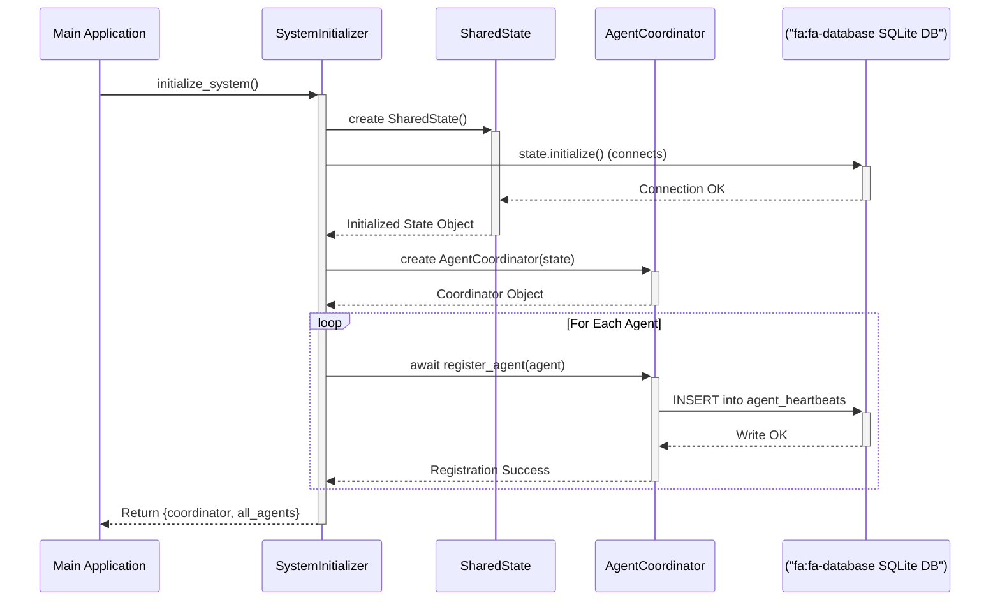

# Agent Initiation Protocol

This document defines the official protocol for initializing the agent system, creating the shared state, and registering agents. Its purpose is to ensure a stable, predictable, and deadlock-free startup sequence.

## Core Principles

1.  **Single Source of Truth**: There must be only **one** instance of the `SharedState` object for the entire application.
2.  **Centralized Control**: There must be only **one** instance of the `AgentCoordinator`.
3.  **Explicit Initialization**: The `SharedState` database connection must be explicitly initialized **once** before any other component attempts to use it.
4.  **Sequential Registration**: Agent registration must occur **sequentially**, not concurrently. Each agent must be fully registered with the coordinator before the next registration begins. This is the most critical rule for preventing database lock errors.

## The `SystemInitializer`

To enforce these principles, all system startup logic must be handled by a dedicated `SystemInitializer`. This component is the sole authority on system initialization.

### Responsibilities

-   **Create `SharedState`**: It instantiates the `SharedState` object.
-   **Initialize `SharedState`**: It immediately calls the `.initialize()` method on the new `SharedState` object to open and prepare the database connection.
-   **Create `AgentCoordinator`**: It instantiates the `AgentCoordinator`, passing the already-initialized `SharedState` object to it.
-   **Create Agents**: It instantiates each individual agent class.
-   **Register Agents Sequentially**: It iterates through the agent instances one by one, calling `await coordinator.register_agent(agent)` for each. This ensures that only one registration process is attempting to write to the database at any given time.
-   **Return Core Components**: After successful initialization, it returns the fully configured `coordinator` and the list of `all_agents` to the main application.
-   **Robust Logging**: It provides detailed logs for each step, clearly indicating success or failure, especially for the registration of each agent.

### Example Workflow

## What Works vs. What Doesn't (Current State)

-   **What Works**:
    -   The concept of using `st.session_state` to hold a single instance of the coordinator and shared state is architecturally sound.
    -   The `BaseAgent` and `AgentCoordinator` classes are fundamentally well-designed.

-   **What Does NOT Work**:
    -   The current `background_agents_dashboard.py` acts as its own initializer.
    -   It attempts to register all agents concurrently (within an `asyncio` context), which directly causes the `database is locked` race condition.
    -   Error handling is distributed, making it hard to pinpoint exactly where the startup sequence fails.

By implementing a dedicated `SystemInitializer`, we can fix these flaws and create a reliable startup process that adheres to the documented protocol. 