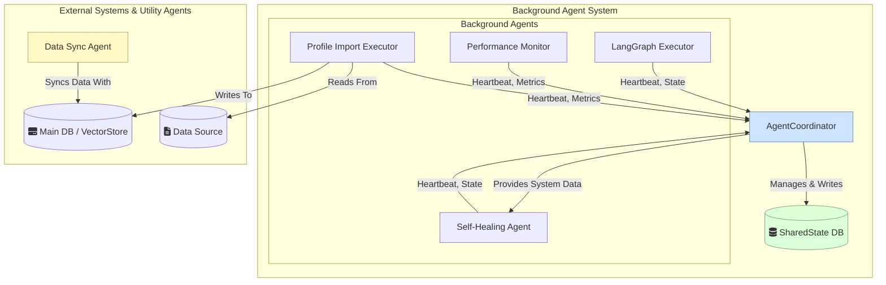

# Agent Documentation

This document provides a comprehensive overview of all agents operating within the workspace. It details their types, functions, and interaction protocols with shared state and databases.

## System Overview and Agent Synergy

The agent ecosystem is designed to create a robust, self-regulating, and efficient data processing and system management platform. The agents work in concert, each fulfilling a specialized role to achieve the application's overall goals.

**Described Agents:**
- **Profile Import Executor Agent**: The primary data ingestion engine.
- **Performance Monitor Agent**: The system's central nervous system, tracking health and efficiency.
- **Self-Healing Agent**: The system's immune system, proactively fixing issues identified by the monitor.
- **LangGraph Executor Agent**: The advanced workflow engine for complex, multi-step tasks.
- **Data Sync Agent**: A specialized utility for maintaining data consistency between vector stores.

**Collective Interaction:**

The process typically begins with the **Profile Import Executor Agent**, which reliably brings new data into the system. As this and other processes run, the **Performance Monitor Agent** continuously gathers metrics, providing a real-time view of system health and performance stored in the `SharedState`.

This data-rich environment enables the **Self-Healing Agent** to act. It analyzes the metrics from the `SharedState` to detect anomalies, identify error patterns, and apply automated fixes, thereby ensuring system stability.

When more complex operations are required—perhaps triggered by newly imported data or a specific system state—the **LangGraph Executor Agent** is invoked to manage sophisticated, stateful workflows. Finally, the **Data Sync Agent** can be used in any of these workflows to ensure that specialized data stores are consistent and up-to-date for high-quality results.

Together, these agents create a virtuous cycle: data is ingested, performance is monitored, the system heals itself, and complex tasks are reliably executed, all with clear visibility and coordination managed through the `SharedState`.

### System Architecture Diagram



## Core System Components

Beyond the agents themselves, the `AgentCoordinator` is the central pillar of the background processing system.

### Agent Coordinator
- **File**: `background_agents/coordination/agent_coordinator.py`
- **Type**: System Orchestrator
- **Function**: The `AgentCoordinator` is the master controller for all background agents. Its primary responsibilities are:
    - **Lifecycle Management**: It handles the registration, startup, and shutdown of all background agents.
    - **State Aggregation**: It is the sole component authorized to write to the `SharedState` database. It receives heartbeats, metrics, and state change notifications from all agents and persists this information.
    - **Health Monitoring**: It runs a monitoring loop to check for silent agents (those that have missed heartbeats) and can trigger recovery or alert mechanisms.
    - **Optimization Orchestration**: It initiates system-wide optimization cycles, collecting insights from agents and coordinating actions based on a generated plan.
- **State/Database Interaction**:
    - **Receives** a `SharedState` instance upon initialization from the main launcher script.
    - **Receives** data from all background agents.
    - **Writes** all agent-related data to `SharedState`. It acts as the gatekeeper, ensuring data consistency and preventing race conditions.
- **Functional Diagram**:
    ```mermaid
    graph TD
        subgraph "Agent Inputs"
            direction LR
            A1[Agent 1: Heartbeat]
            A2[Agent 2: State Change]
            A3[Agent 3: PerformanceMetric]
        end

        subgraph "Coordinator Logic"
            A1 --> C{Receive & Process};
            A2 --> C;
            A3 --> C;
            C -- Formatted Data --> D[Update SharedState DB];
            M[Monitoring Loop] -.-> C;
            O[Optimization Loop] -.-> C;
        end

        subgraph "System Outputs"
            D -- "Write" --> SharedState[("fa:fa-database SharedState")];
            C -- "Read" --> SharedState;
        end

        style C fill:#cde4ff
    ```

### Shared State
- **File**: `background_agents/coordination/shared_state.py`
- **Type**: Centralized State Repository
- **Function**: The `SharedState` object is the single source of truth for the entire background agent system. It provides a durable, thread-safe, and asynchronous interface for persisting and retrieving state information. It uses a local SQLite database (`shared_state.db`) as its backend to ensure data survives restarts and can be accessed by multiple processes, such as a running dashboard.
- **Key Data Structures**:
    - **Agent Heartbeats**: A table containing the last known status, state, and metrics for every registered agent.
    - **Performance Metrics**: A time-series log of all performance data reported by agents.
    - **System State**: A key-value store for system-wide configuration and aggregated health metrics.
    - *(In-memory)*: It also holds non-persistent data like error patterns and optimization history for real-time analysis.
- **State/Database Interaction**:
    - It is instantiated and initialized by the main launcher script (`launch_background_agents.py`).
    - It **only accepts write operations from the `AgentCoordinator`**. This is the most critical aspect of the protocol, ensuring that all state changes are centrally managed.
    - It can be read by any component, including the dashboard, which connects in a special `read_only` mode.
- **Conceptual Schema**:
    ```mermaid
    graph BT
        subgraph "SharedState DB (shared_state.db)"
            direction LR
            
            T1[("
                **agent_heartbeats**<br/>
                - agent_id (PK)<br/>
                - agent_name<br/>
                - state<br/>
                - last_heartbeat<br/>
                - metrics
            ")]

            T2[("
                **performance_metrics**<br/>
                - id (PK)<br/>
                - timestamp<br/>
                - metric_name<br/>
                - value<br/>
                - source_agent
            ")]

            T3[("
                **system_state**<br/>
                - key (PK)<br/>
                - value
            ")]
        end

        Coordinator[AgentCoordinator] -- "Writes To" --> T1
        Coordinator -- "Writes To" --> T2
        Coordinator -- "Writes To" --> T3
        
        Dashboard[Dashboard] -- "Reads From" --> T1
        Dashboard -- "Reads From" --> T2
        Dashboard -- "Reads From" --> T3

        style Coordinator fill:#cde4ff
        style Dashboard fill:#d4edda
    ```

## Agent Interaction Protocol

There are two primary types of agents in this system, each with a distinct interaction protocol:

### 1. Background Agents

Background agents are long-running services that perform ongoing monitoring, optimization, and maintenance tasks. They all inherit from the `BaseAgent` class and are managed by the `AgentCoordinator`.

- **State Management**: Indirect via the `AgentCoordinator`.
- **Interaction Flow**:
    1. The main launcher script (`launch_background_agents.py`) instantiates and initializes the `SharedState` object (`shared_state.db`).
    2. The launcher then creates the `AgentCoordinator`, passing it the `SharedState` instance.
    3. When a background agent is registered, the `AgentCoordinator` provides it with a reference to itself.
    4. The agent sends regular heartbeats and state change notifications to the `AgentCoordinator`.
    5. The `AgentCoordinator` is solely responsible for writing all updates to the `SharedState`. Agents **do not** write to the `SharedState` directly.

This model decouples the agents from the state persistence logic, centralizing control and ensuring data consistency.

### 2. Standard / Utility Agents

Utility agents are designed for specific, often synchronous, tasks. They are instantiated on-demand and do not run continuously in the background.

- **State Management**: Direct interaction with specific data sources as needed.
- **Interaction Flow**:
    - These agents **do not** inherit from `BaseAgent` and **do not** interact with the `AgentCoordinator` or the main `SharedState` database.
    - They are provided with direct references to the databases they need to perform their tasks (e.g., `VectorStore` instances).

---

## Agent Directory

### Background Agents

#### Self-Healing Agent
- **File**: `background_agents/monitoring/self_healing_agent.py`
- **Type**: Background Agent
- **Function**: This agent is responsible for proactively monitoring the health of the system and other agents. It identifies common error patterns, analyzes performance bottlenecks, and attempts to apply automated solutions or "patches" to resolve issues without manual intervention.
- **State/Database Interaction**:
    - Follows the standard background agent protocol, reporting its state and metrics (e.g., number of patches applied, errors detected) to the `AgentCoordinator`.
    - Reads error patterns, performance metrics, and system health data from the `SharedState` (via the coordinator) to identify issues.
    - May write new solutions or updated configurations back to the `SharedState` as part of its healing process.
- **Functional Diagram**:
    ```mermaid
    graph TD
        subgraph "Self-Healing Agent Logic"
            A[Start Cycle] --> B{Fetch System Data};
            B -- Metrics, Errors --> C[Analyze for Patterns];
            C -- Pattern Found --> D{Find Known Solution};
            C -- No Pattern --> E[Log & Wait];
            D -- Solution Exists --> F[Apply Automated Patch];
            D -- No Solution --> G[Log for Manual Review];
            F --> H{Record Optimization};
            G & E --> I[End Cycle];
            H --> I;
        end
        subgraph "System Interaction"
            SharedStateIn[("fa:fa-database SharedState (Read)")] --> B;
            F -- Apply Changes --> CoordinatorOut[AgentCoordinator];
            H -- OptimizationRecord --> CoordinatorOut;
        end
        style B fill:#e3f2fd
        style H fill:#dcedc8
    ```

#### LangGraph Executor Agent
- **File**: `background_agents/monitoring/langgraph_executor.py`
- **Type**: Background Agent
- **Function**: Manages the execution of complex, stateful multi-agent workflows defined using LangGraph. It processes tasks from a queue, orchestrates the flow through various graph nodes (e.g., LLM calls, tool execution), and ensures the state is persisted across steps.
- **State/Database Interaction**:
    - Reports its status (e.g., active, idle, error), task throughput, and processing latency to the `AgentCoordinator`.
    - Manages its own internal state for the graphs it executes, often using a dedicated persistence layer or by serializing state into the `SharedState` via the coordinator.
    - Interacts with external services and tools as defined by the LangGraph nodes it executes.
- **Conceptual Workflow Example**:
    The diagram below illustrates a sample document processing pipeline that this agent could execute. It shows how a complex task is broken down into a series of conditional steps, with state being managed throughout the process.
    ```mermaid
    graph TD
        A[Start: Document Received] --> B{Validate Document};
        B -- Valid --> C[Extract Content];
        B -- Invalid --> D[Log Error & Archive];
        C --> E[Enrich with Metadata];
        E --> F{Needs Summarization?};
        F -- Yes --> G[Summarize Content];
        F -- No --> H[Generate Embeddings];
        G --> H;
        H --> I[Save to VectorStore];
        I --> J[End: Process Complete];
        style A fill:#d4edda,stroke:#28a745
        style J fill:#d4edda,stroke:#28a745
        style D fill:#f8d7da,stroke:#dc3545
    ```

#### Performance Monitor Agent
- **File**: `background_agents/monitoring/performance_monitor.py`
- **Type**: Background Agent
- **Function**: Continuously collects, aggregates, and analyzes performance metrics from across the entire system. It monitors key indicators like API latency, database query times, message queue lengths, and resource utilization.
- **State/Database Interaction**:
    - Reports its own health and metrics to the `AgentCoordinator`.
    - It is the primary producer of `PerformanceMetric` records, which it sends to the `AgentCoordinator` to be stored in the `SharedState`.
    - Reads historical performance data from `SharedState` to identify trends, predict future bottlenecks, and generate optimization recommendations.
- **Functional Diagram**:
    ```mermaid
    graph TD
        subgraph "Data Sources"
            SysMetrics[("fa:fa-cogs System Metrics")]
            ApiLogs[("fa:fa-file-code API Logs")]
            DbStats[("fa:fa-database DB Stats")]
        end
        subgraph "Performance Monitor Logic"
            A[Collect Raw Data] --> B[Aggregate & Process];
            B --> C[Calculate KPIs e.g., Latency, Error Rate];
            C --> D{Format as PerformanceMetric};
        end
        subgraph "System Interaction"
            D -- PerformanceMetric Object --> Coordinator[AgentCoordinator];
        end
        SysMetrics & ApiLogs & DbStats --> A;
    ```

#### Profile Import Executor Agent
- **File**: `background_agents/monitoring/profile_import_executor.py`
- **Type**: Background Agent
- **Function**: Handles the asynchronous and robust importation of large volumes of user or system profiles into the main database. It manages batching, validation, error handling, and retries to ensure data is imported reliably without impacting system performance.
- **State/Database Interaction**:
    - Reports its operational metrics (e.g., profiles imported, error rate, batch processing time) to the `AgentCoordinator`.
    - Interacts directly with a source data location (e.g., a file system, S3 bucket) and the target database (e.g., the primary application database or vector store).
    - It logs the status of import jobs to the `SharedState` via the `AgentCoordinator` for monitoring and visibility.
- **Functional Diagram**:
    ```mermaid
    graph TD
        DataSource[("fa:fa-folder-open Data Source")] --> A[Read Batch of Profiles];
        A --> B{Validate & Transform};
        B -- Valid Data --> C[Write to Main DB];
        B -- Invalid Data --> D[Log Errors];
        C --> E{Update Metrics};
        D --> E;
        E -- "Success/Error Count, etc." --> Coordinator[AgentCoordinator];
        C -- "Profile Data" --> MainDB[("fa:fa-database Main DB")];
    ```

### Standard / Utility Agents

#### Data Sync Agent
- **File**: `src/utils/data_sync_agent.py`
- **Type**: Utility Agent
- **Function**: This agent is used to synchronize data between two different vector stores: a primary "main" vector store and a specialized "local" vector store. It can identify and transfer missing documents to ensure the local store is up-to-date with relevant information based on a defined project context.
- **State/Database Interaction**:
    - Does not interact with the `SharedState` or `AgentCoordinator`.
    - It is instantiated with direct references to two `VectorStore` objects (`main_vectorstore` and `local_vectorstore`).
    - It reads from both vector stores to compare their contents and writes to the `local_vectorstore` to sync data.
- **Functional Diagram**:
    ```mermaid
    graph TD
        subgraph "Inputs"
            MainVS[("fa:fa-database Main VectorStore")]
            LocalVSIn[("fa:fa-database Local VectorStore (Read)")]
            Context[("fa:fa-file-text Project Context")]
        end
        subgraph "Data Sync Logic"
            A[Find Missing Topics in LocalVS based on Context] --> B{Query MainVS for Topics};
            B -- Found Documents --> C[Add Documents to LocalVS];
            B -- No Documents --> D[End];
            C --> D;
        end
        subgraph "Outputs"
            LocalVSOut[("fa:fa-database Local VectorStore (Write)")]
        end
        MainVS & LocalVSIn & Context --> A;
        C --> LocalVSOut;
    ```
