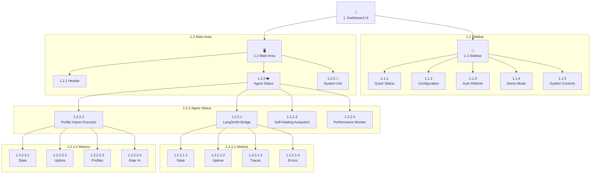

# Background Agents Dashboard - UI Schema (ID: 1)

This document outlines the user interface components and layout for the `background_agents_dashboard.py` Streamlit application.

---

## 1.1 Sidebar (Control Panel)

The sidebar is organized into several sections.

### 1.1.1 Quick Status

- **Component**: `st.empty()` placeholder.
- **Description**: Displays the overall status of the agent system.

### 1.1.2 Configuration

- **1.1.2.1 LangSmith API Key**: `st.text_input` (type="password")
- **1.1.2.2 Project Name**: `st.text_input`

### 1.1.3 Auto Refresh

- **1.1.3.1 Enable auto-refresh**: `st.checkbox`
- **1.1.3.2 Refresh interval (s)**: `st.selectbox`

### 1.1.4 Demo Mode

- **1.1.4.1 Enable demo mode**: `st.checkbox`
  - **Behavior**: This control is disabled after the system has been initialized.

### 1.1.5 System Controls

- **1.1.5.1 Initialize/Stop Button**: `st.button`

---

## 1.2 Main Dashboard Area

### 1.2.1 Header

- **Title**: `st.title("🤖 Background Agents Monitor")`
- **Status Banner**: `st.info()`

### 1.2.2 Agent Status Section

This section dynamically creates a container for each registered agent.

#### 1.2.2.1 LangSmith Bridge Agent
- **Title**: `st.subheader("LangSmith Bridge Agent")`
- **Metrics**:
    - **State**: Current `AgentState` (e.g., "ACTIVE").
    - **Uptime**: `agent.get_uptime()`.
    - **Traces Collected**: A running count of traces successfully sent to LangSmith.
    - **Errors**: A count of communication or data processing errors.
    - **Heartbeat**: ✅ / ❌ icon.

#### 1.2.2.2 Profile Import Executor Agent
- **Title**: `st.subheader("Profile Import Executor Agent")`
- **Metrics**:
    - **State**: Current `AgentState`.
    - **Uptime**: `agent.get_uptime()`.
    - **Profiles Created**: A count of profiles successfully imported in the current session.
    - **Success Rate**: The percentage of successful imports.
    - **Errors**: A count of import failures.
    - **Heartbeat**: ✅ / ❌ icon.

#### 1.2.2.3 Self-Healing Autopatch Agent
- **Title**: `st.subheader("Self-Healing Autopatch Agent")`
- **Metrics**:
    - **State**: Current `AgentState`.
    - **Uptime**: `agent.get_uptime()`.
    - **Patches Applied**: A count of successful autopatches.
    - **Errors**: A count of patching failures.
    - **Heartbeat**: ✅ / ❌ icon.

#### 1.2.2.4 Performance Monitor Agent
- **Title**: `st.subheader("Performance Monitor Agent")`
- **Metrics**:
    - **State**: Current `AgentState`.
    - **Uptime**: `agent.get_uptime()`.
    - **Optimizations Suggested**: A count of performance optimizations identified.
    - **Anomalies Detected**: A count of detected performance anomalies.
    - **Heartbeat**: ✅ / ❌ icon.

### 1.2.3 System Information Expander

- **Component**: `st.expander("🔧 System Information")`
- **Content**: Organized into three columns:
    - **Configuration**: Coordinator status, total/active agents.
    - **Environment**: API key status, project name, OS, Python version.
    - **System Stats**: CPU and Memory usage.

---

## 2. UI Visualization

The following diagram illustrates the component hierarchy, including agent-specific details.

