# Background Agents Dashboard - UI Schema (ID: 1)

This document outlines the user interface components and layout for the `background_agents_dashboard.py` Streamlit application. The dashboard is a **read-only monitor** for an externally running agent system.

---

## 1.1 Sidebar (Control Panel)

The sidebar provides configuration details and refresh controls.

### 1.1.1 Informational Message
- **Component**: `st.info`
- **Description**: A message box clearly stating that this is a read-only dashboard and directing the user to use the appropriate scripts (`launch_background_agents.py`) to control the system.

### 1.1.2 Configuration (Read-Only)
- **Component**: `st.expander`
- **Description**: Displays the current LangSmith configuration. These fields are disabled to reinforce the read-only nature of the dashboard.
- **1.1.2.1 LangSmith API Key**: `st.text_input` (type="password", disabled=True)
- **1.1.2.2 Project Name**: `st.text_input` (disabled=True)

### 1.1.3 Auto Refresh
- **Component**: `st.checkbox` and `st.selectbox`
- **Description**: Allows the user to enable or disable automatic refreshing of the dashboard and to select the refresh interval.

---

## 1.2 Main Dashboard Area

### 1.2.1 Header
- **Component**: `st.markdown("<h1>...</h1>")`
- **Title**: "🤖 Background Agents Monitor"

### 1.2.2 Status Banner
- **Component**: `st.info()`
- **Description**: Displays the last time the dashboard data was updated.

### 1.2.3 Agent Status Section
- **Component**: `st.warning` or dynamically created agent cards.
- **Description**: If no active agents are detected, it displays a warning message. Otherwise, it renders a card for each active agent, showing key metrics.
- **Agent Card Metrics**:
    - **Agent Name**: `st.subheader`
    - **State**: The current `AgentState` (e.g., "active").
    - **Uptime**: The agent's reported uptime.
    - **Errors**: The number of errors reported by the agent.

### 1.2.4 System Information Expander
- **Component**: `st.expander`
- **Description**: An expandable section showing high-level system information.
- **Content**: Organized into three columns:
    - **Configuration**: Total agents found in the database and the number of currently active agents.
    - **Environment**: API key status, project name, OS, and Python version.
    - **Dashboard Stats**: The dashboard's own memory and CPU usage, and the last update time.

---

## 2. UI Visualization

The following diagram illustrates the updated, simplified component hierarchy.

```mermaid
graph TD
    A1["<br/>🤖<br/>1. Dashboard UI<br/>"] --> B1["<br/>🔩<br/>1.1 Sidebar<br/>"];
    A1 --> C1["<br/>🖥️<br/>1.2 Main Area<br/>"];

    subgraph "1.1 Sidebar"
        B1 --> B1.1["1.1.1<br/>Info Message"];
        B1 --> B1.2["1.1.2<br/>Configuration (Read-Only)"];
        B1 --> B1.3["1.1.3<br/>Auto Refresh"];
    end

    subgraph "1.2 Main Area"
        C1 --> C1.1["1.2.1 Header"];
        C1 --> C1.2["1.2.2 Status Banner"];
        C1 --> C1.3["1.2.3 Agent Status"];
        C1 --> C1.4["1.2.4 System Info"];
    end
``` 

