# Background Agents Dashboard - UI Schema (ID: 1)

This document outlines the user interface components and layout for the `background_agents_dashboard.py` Streamlit application.

---

## 1.1 Sidebar (Control Panel)

The sidebar is organized into several sections.

### 1.1.1 Quick Status

- **Component**: `st.empty()` placeholder.
- **States**:
    - **"Agent Modules Missing"**: `st.error`
    - **"Agents Not Running"**: `st.warning`
    - **"Agents Running"**: `st.success`

### 1.1.2 Configuration

- **LangSmith API Key**: `st.text_input` (type="password")
- **Project Name**: `st.text_input`

### 1.1.3 Auto Refresh

- **Enable auto-refresh**: `st.checkbox`
- **Refresh interval (s)**: `st.selectbox`

### 1.1.4 Demo Mode

- **Enable demo mode**: `st.checkbox`
  - **Behavior**: This control is disabled after the system has been initialized.

### 1.1.5 System Controls

- **Initialize System / Emergency Stop**: `st.button`

---

## 1.2 Main Dashboard Area

### 1.2.1 Header

- **Title**: `st.title("🤖 Background Agents Monitor")`
- **Status Banner**: `st.info()`

### 1.2.2 Agent Status Section

- **Header**: `st.header("❤️ Agent Status")`
- **Container**: A container for each agent, displaying its live data.
- **Agent Subheader**: `st.subheader(agent_name)`
- **Metrics Display**: `st.columns` are used to show key metrics for each agent:
    - **State**: The current `AgentState`.
    - **Uptime**: The agent's uptime.
    - **Errors**: A count of errors.
    - **Heartbeat**: A ✅ or ❌ icon.

### 1.2.3 System Information Expander

- **Component**: `st.expander("🔧 System Information")`
- **Content**: Organized into three columns:
    - **Configuration**: Coordinator status, total/active agents.
    - **Environment**: API key status, project name, OS, Python version.
    - **System Stats**: CPU and Memory usage.

---

## 2. UI Visualization

The following diagram illustrates the component hierarchy of the dashboard UI, with numerical identifiers and mappings to actual system components.

```mermaid
graph TD
    A1["<br/>🤖<br/>1. Dashboard UI<br/>"] --> B1["<br/>🔩<br/>1.1 Sidebar<br/>(Control Panel)<br/>"];
    A1 --> C1["<br/>🖥️<br/>1.2 Main Area<br/>"];

    subgraph "1.1 Sidebar"
        B1 --> B1.1["1.1.1 Quick Status"];
        B1 --> B1.2["1.1.2 Configuration"];
        B1 --> B1.3["1.1.3 Auto Refresh"];
        B1 --> B1.4["1.1.4 Demo Mode"];
        B1 --> B1.5["1.1.5 System Controls"];
    end

    subgraph "1.2 Main Display Area"
        C1 --> C1.1["1.2.1 Header Banner"];
        C1 --> C1.2["1.2.2 ❤️ Agent Status Section"];
        C1 --> C1.3["1.2.3 🔧 System Information"];
    end

    subgraph "1.2.2 Agent Status Section"
        C1.2 --> D1["LangSmith Bridge"];
        C1.2 --> D2["Profile Import Executor"];
        C1.2 --> D3["Self-Healing Autopatch"];
        C1.2 --> D4["Performance Monitor"];
    end
    
    D1 --> D1.1["State"];
    D1 --> D1.2["Uptime"];
    D1 --> D1.3["Errors"];
    D1 --> D1.4["Heartbeat"];

    D2 --> D2.1["State"];
    D2 --> D2.2["Uptime"];
    D2 --> D2.3["Errors"];
    D2 --> D2.4["Heartbeat"];
``` 

