# Background Agents Dashboard - UI Schema

This document outlines the user interface components and layout for the `background_agents_dashboard.py` Streamlit application.

## 1. Overall Layout

The dashboard uses a wide layout with a persistent sidebar for controls and a main area for displaying information.

- **Sidebar (Control Panel)**: Contains controls for configuration, starting/stopping the system, and other interactions.
- **Main Area**: Displays the live status and metrics of the agent system.

---

## 2. Sidebar (Control Panel)

The sidebar is organized into several sections.

### 2.1. Quick Status

- **Component**: `st.empty()` placeholder.
- **States**:
    - **"Agent Modules Missing"**: `st.error` - Displayed if agent classes cannot be imported.
    - **"Agents Not Running"**: `st.warning` - The initial state before the system is initialized.
    - **"Agents Running"**: `st.success` - Displayed when the system is initialized and running.

### 2.2. Configuration

- **LangSmith API Key**: `st.text_input` (type="password")
  - Displays the `LANGCHAIN_API_KEY` environment variable.
- **Project Name**: `st.text_input`
  - Displays the `LANGCHAIN_PROJECT` environment variable.

### 2.3. Auto Refresh

- **Enable auto-refresh**: `st.checkbox`
  - A checkbox to toggle the automatic refresh of the UI. Default: On.
- **Refresh interval (s)**: `st.selectbox`
  - A dropdown to select the refresh interval (e.g., 10, 30, 60 seconds). Only visible if auto-refresh is enabled.

### 2.4. Demo Mode

- **Enable demo mode**: `st.checkbox`
  - A checkbox to enable or disable demo mode.
  - **Behavior**: This control is **disabled** after the system has been initialized to prevent changing the mode of a running system.

### 2.5. System Controls

- **Initialize System / Emergency Stop**: `st.button`
  - **"🚀 Initialize System"**: Displayed when the system is not running. Clicking this starts the coordinator and all agents.
  - **"🚨 Emergency Stop"**: Displayed when the system is running. Clicking this shuts down all agents and the coordinator.

---

## 3. Main Dashboard Area

### 3.1. Header

- **Title**: `st.title("🤖 Background Agents Monitor")`
  - The main title of the dashboard.
- **Status Banner**: `st.info()`
  - A banner that shows the overall system status (e.g., "Agents are running...") and the timestamp of the last UI update.

### 3.2. Agent Status Section

- **Header**: `st.header("❤️ Agent Status")`
- **Container**: A container for each agent, displaying its live data. If no heartbeats are detected, a warning message is shown.
- **Agent Subheader**: `st.subheader(agent_name)`
- **Metrics Display**: `st.columns` are used to show key metrics for each agent:
    - **State**: The current `AgentState` (e.g., "ACTIVE", "INITIALIZING").
    - **Uptime**: The total time the agent has been running (`HH:MM:SS`).
    - **Errors**: A count of errors logged by the agent.
    - **Heartbeat**: An icon indicating if a recent heartbeat has been received (e.g., ✅ or ❌).

### 3.3. System Information Expander

- **Component**: `st.expander("🔧 System Information")`
- **Content**: Organized into three columns:
    - **Configuration**:
        - Coordinator Running: ✅/❌
        - Total Agents: Count of registered agents.
        - Active Agents: Count of agents that have sent a recent heartbeat.
    - **Environment**:
        - API Key Set: ✅/❌
        - Project: The LangSmith project name.
        - Platform: The operating system (`sys.platform`).
        - Python: The Python version (`sys.version`).
    - **System Stats**:
        - CPU Usage: Real-time system CPU usage percentage.
        - Memory Usage: Real-time system memory usage percentage.

---

## 4. UI Visualization

The following diagram illustrates the component hierarchy of the dashboard UI, with numerical identifiers and mappings to actual system components.

```mermaid
graph TD
    A1["<br/>🤖<br/>1. Dashboard UI<br/>"] --> B1["<br/>🔩<br/>1.1 Sidebar<br/>(Control Panel)<br/>"];
    A1 --> C1["<br/>🖥️<br/>1.2 Main Area<br/>"];

    subgraph "1.1 Sidebar"
        B1 --> B1.1["1.1.1 Quick Status"];
        B1 --> B1.2["1.1.2 Configuration"];
        B1 --> B1.3["1.1.3 Auto Refresh"];
        B1 --> B1.4["1.1.4 Demo Mode"];
        B1 --> B1.5["1.1.5 System Controls"];
    end

    subgraph "1.2 Main Display Area"
        C1 --> C1.1["1.2.1 Header Banner"];
        C1 --> C1.2["1.2.2 ❤️ Agent Status Section"];
        C1 --> C1.3["1.2.3 🔧 System Information"];
    end

    subgraph "1.2.2 Agent Status Section"
        C1.2 --> D1["LangSmith Bridge"];
        C1.2 --> D2["Profile Import Executor"];
        C1.2 --> D3["Self-Healing Autopatch"];
        C1.2 --> D4["Performance Monitor"];
    end
    
    D1 --> D1.1["State"];
    D1 --> D1.2["Uptime"];
    D1 --> D1.3["Errors"];
    D1 --> D1.4["Heartbeat"];

    D2 --> D2.1["State"];
    D2 --> D2.2["Uptime"];
    D2 --> D2.3["Errors"];
    D2 --> D2.4["Heartbeat"];
``` 

