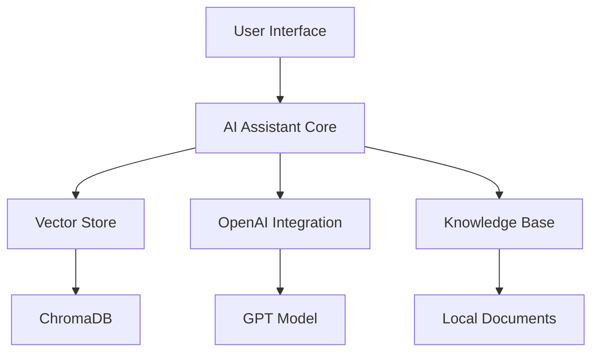
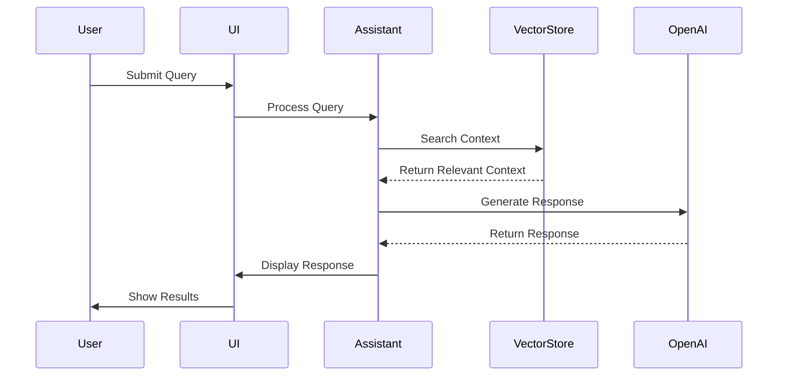
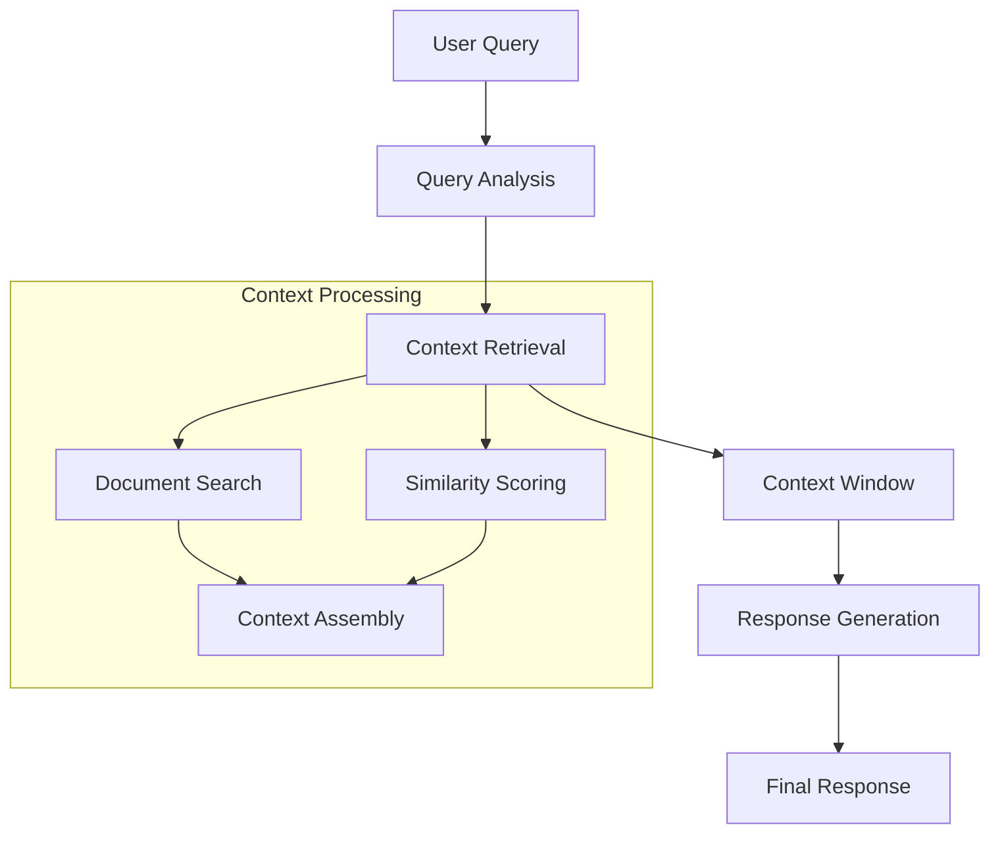
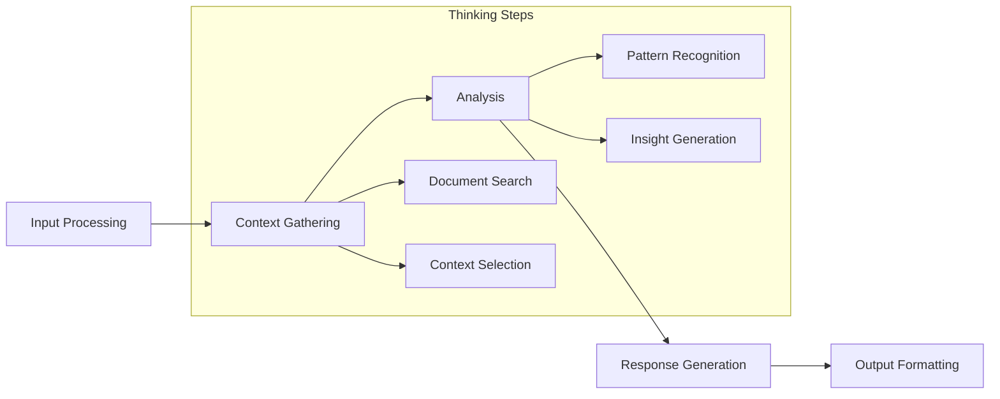

# AI Assistant Architecture

This document provides a detailed overview of the AI Assistant's architecture, focusing on its core components and data flow.

## System Overview

The AI Assistant is built on a modular architecture that combines several key components:



## Core Components

### 1. AI Assistant Core
- **Purpose**: Main processing and coordination
- **Key Features**:
  - Query processing
  - Context management
  - Response generation
  - Thinking process visualization

### 2. Vector Store Integration
- **Purpose**: Semantic search and context retrieval
- **Features**:
  - Document embeddings
  - Similarity search
  - Context window management

### 3. OpenAI Integration
- **Purpose**: Natural language processing and response generation
- **Features**:
  - Context-aware responses
  - Chain-of-thought reasoning
  - Response formatting

## Detailed Process Flow

### 1. Query Processing Pipeline


### 2. Context Management


### 3. Thinking Process Visualization


## Component Details

### AI Assistant Core

#### Query Processing
```python
class AIAssistant:
    def process_query(self, query: str):
        # 1. Analyze query intent
        # 2. Gather relevant context
        # 3. Generate response
        # 4. Format output
```

#### Context Management
```python
class ContextManager:
    def gather_context(self, query: str):
        # 1. Search vector store
        # 2. Score relevance
        # 3. Assemble context window
        # 4. Return context
```

### Vector Store Integration

#### Search Operations
```python
class VectorStore:
    def semantic_search(self, query: str):
        # 1. Generate query embedding
        # 2. Search ChromaDB
        # 3. Score results
        # 4. Return top matches
```

### Response Generation

#### OpenAI Integration
```python
class ResponseGenerator:
    def generate_response(self, query: str, context: List[str]):
        # 1. Format prompt
        # 2. Call OpenAI API
        # 3. Process response
        # 4. Return formatted result
```

## Configuration

### Model Settings
```python
ASSISTANT_CONFIG = {
    "max_context_length": 2000,
    "temperature": 0.7,
    "top_k": 5,
    "thinking_steps": True
}
```

### Vector Store Settings
```python
VECTOR_STORE_CONFIG = {
    "chunk_size": 1000,
    "overlap": 200,
    "similarity_threshold": 0.7
}
```

## Performance Considerations

### 1. Response Time Optimization
- Context window size management
- Batch processing for multiple queries
- Caching of frequent queries

### 2. Resource Management
- Memory usage optimization
- Connection pooling
- Async operations

### 3. Scalability
- Horizontal scaling of vector store
- Load balancing for API calls
- Distributed processing

## Error Handling

### 1. Query Processing
- Invalid input handling
- Timeout management
- Retry mechanisms

### 2. Context Retrieval
- Fallback strategies
- Partial context handling
- Error recovery

### 3. Response Generation
- API error handling
- Response validation
- Fallback responses

## Monitoring and Logging

### 1. Performance Metrics
- Response time tracking
- Context retrieval time
- API call latency

### 2. Error Tracking
- Query processing errors
- Context retrieval failures
- API errors

### 3. Usage Analytics
- Query patterns
- Context usage
- Response quality 