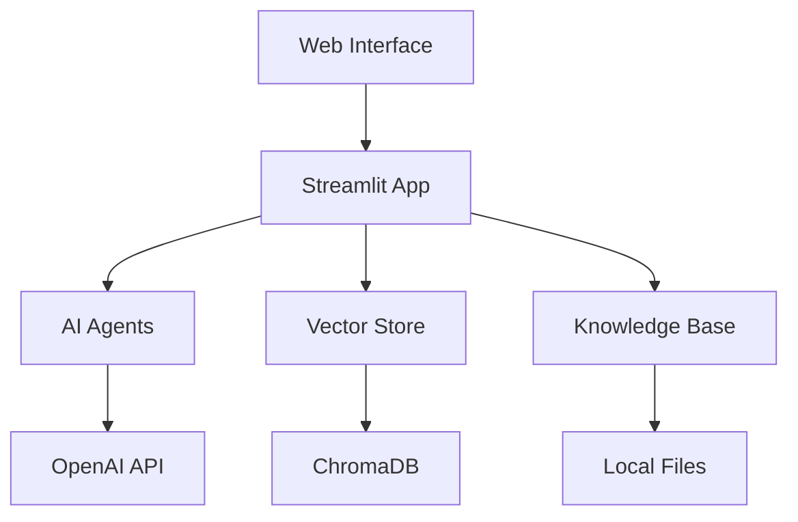
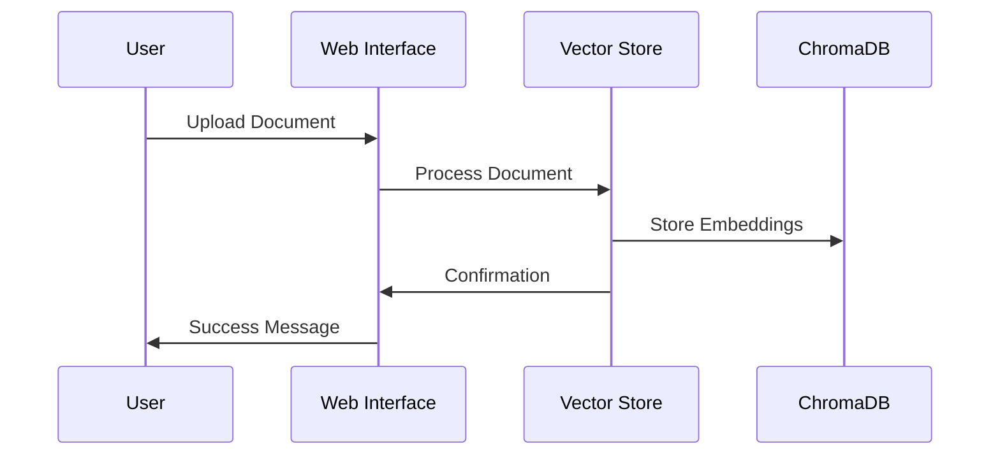
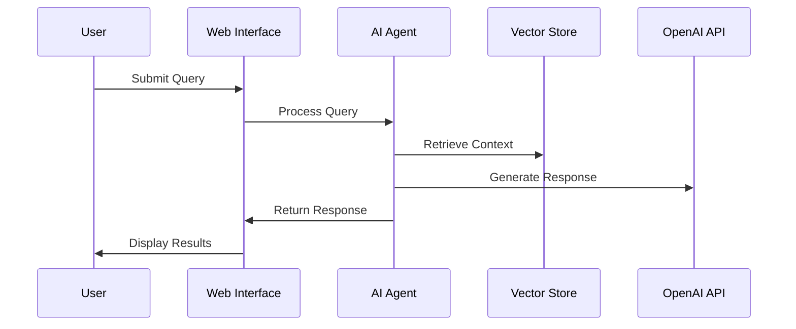

# AI Assistant GUI Architecture

This document provides a comprehensive overview of the AI Assistant GUI's architecture, components, and their interactions.

## System Overview

The AI Assistant GUI is built on a modular architecture that combines several key components:



## Core Components

### 1. Web Interface (`app.py`)
- **Purpose**: Main application entry point
- **Key Features**:
  - Streamlit-based UI
  - Real-time chat interface
  - Document upload and management
  - System monitoring
  - Checklist management

### 2. AI Agents (`agents/`)
- **BusinessCaseAgent**: Business analysis and recommendations
- **CodeAnalysisAgent**: Code review and optimization
- **DocumentAnalysisAgent**: Document processing and insights
- **BaseAgent**: Common functionality and utilities

### 3. Vector Store (`vector_store.py`)
- **Purpose**: Document embedding and retrieval
- **Features**:
  - ChromaDB integration
  - Document chunking
  - Semantic search
  - Context management

### 4. Knowledge Base (`local_knowledge_base.py`)
- **Purpose**: Local document management
- **Features**:
  - File indexing
  - Content chunking
  - Metadata management
  - Search functionality

## Data Flow

1. **Document Processing**:


2. **Query Processing**:


## Component Details

### AI Agents

#### BusinessCaseAgent
- **Input**: Business documents, requirements
- **Output**: Analysis, recommendations, metrics
- **Key Methods**:
  - `analyze_document()`
  - `generate_recommendations()`
  - `calculate_metrics()`

#### CodeAnalysisAgent
- **Input**: Source code, requirements
- **Output**: Code review, optimization suggestions
- **Key Methods**:
  - `analyze_code()`
  - `suggest_improvements()`
  - `check_compliance()`

#### DocumentAnalysisAgent
- **Input**: Documents, queries
- **Output**: Insights, summaries, key points
- **Key Methods**:
  - `process_document()`
  - `extract_key_points()`
  - `generate_summary()`

### Vector Store

#### Document Processing
```python
class VectorStore:
    def add_document(self, content, metadata):
        # 1. Split content into chunks
        # 2. Generate embeddings
        # 3. Store in ChromaDB
        # 4. Return document ID
```

#### Search Operations
```python
class VectorStore:
    def search(self, query, n_results=5):
        # 1. Generate query embedding
        # 2. Search ChromaDB
        # 3. Return relevant chunks
```

### Knowledge Base

#### File Management
```python
class LocalKnowledgeBase:
    def index_file(self, file_path):
        # 1. Read file content
        # 2. Process content
        # 3. Store in vector store
        # 4. Update metadata
```

#### Search Operations
```python
class LocalKnowledgeBase:
    def search(self, query):
        # 1. Search vector store
        # 2. Retrieve relevant documents
        # 3. Return results
```

## Configuration

### Environment Variables
```env
# API Configuration
OPENAI_API_KEY=your-key-here

# Database Paths
VECTOR_DB_PATH=path/to/vectorstore
LOCAL_VECTOR_DB_PATH=path/to/local/vectorstore

# Application Settings
CHUNK_SIZE=1000
MAX_TOKENS=2000
```

### Model Configuration
```python
MODEL_CONFIG = {
    "embedding_model": "all-MiniLM-L6-v2",
    "chunk_size": 1000,
    "max_tokens": 2000
}
```

## Security Considerations

1. **API Key Management**:
   - Secure storage in environment variables
   - No hardcoding in source code
   - Regular rotation

2. **Data Protection**:
   - Local storage encryption
   - Secure file handling
   - Access control

3. **Input Validation**:
   - File type verification
   - Content sanitization
   - Size limits

## Performance Optimization

1. **Caching**:
   - Document embeddings
   - Search results
   - Model responses

2. **Resource Management**:
   - Memory usage optimization
   - Batch processing
   - Async operations

3. **Scaling**:
   - Horizontal scaling support
   - Load balancing
   - Resource monitoring

## Monitoring and Logging

1. **System Metrics**:
   - CPU usage
   - Memory consumption
   - Response times

2. **Application Logs**:
   - Error tracking
   - User actions
   - Performance metrics

3. **Alerts**:
   - Resource thresholds
   - Error conditions
   - System status

## Future Enhancements

1. **Planned Features**:
   - Multi-language support
   - Advanced analytics
   - Custom model integration

2. **Architecture Improvements**:
   - Microservices architecture
   - Containerization
   - Cloud deployment

3. **Integration Capabilities**:
   - API endpoints
   - Webhook support
   - Third-party integrations 