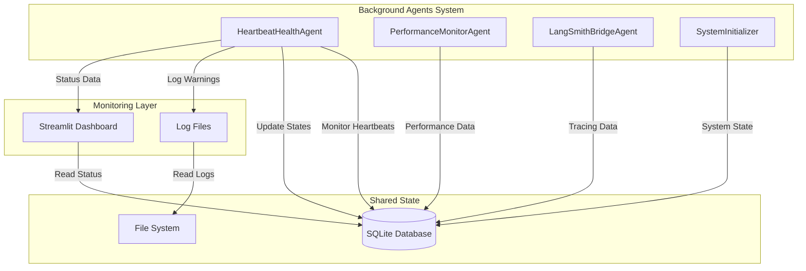
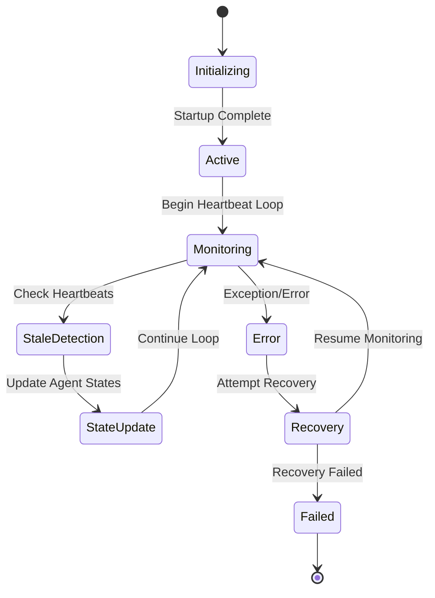

# HeartbeatHealthAgent Documentation

## Overview

The HeartbeatHealthAgent is a critical component of the background agent system that monitors the health and status of all other agents. It ensures system reliability by detecting stale agents, managing agent lifecycles, and providing real-time health monitoring.

## Architecture

### Agent Responsibilities

- **Health Monitoring**: Continuously monitors heartbeat status of all registered agents
- **Stale Detection**: Identifies agents with stale heartbeats and marks them as inactive
- **State Management**: Updates agent states in the shared SQLite database
- **Error Reporting**: Logs warnings and errors for troubleshooting
- **Dashboard Integration**: Provides real-time status data for the Streamlit dashboard

### System Integration



## Agent Lifecycle



## LangGraph Implementation


## Configuration

### Environment Variables

```yaml
# Agent Configuration
AGENT_NAME: "HeartbeatHealthAgent"
HEARTBEAT_INTERVAL: 30  # seconds
STALE_THRESHOLD: 120    # seconds
LOG_LEVEL: "INFO"

# Database Configuration
DATABASE_PATH: "shared_state.db"
LOCK_TIMEOUT: 10        # seconds
RETRY_ATTEMPTS: 3
BACKOFF_FACTOR: 1.5
```

### Monitoring Intervals

- **Heartbeat Check**: Every 30 seconds
- **Stale Detection**: Every 30 seconds
- **State Updates**: On-demand when stale agents detected
- **Log Rotation**: Daily log files

## Task Log

### Recent Issues and Solutions

#### 1. SQLite Database Locking Issues (2025-01-27)

**Problem**: Agents getting stuck in "initializing" state with stale heartbeats due to database write contention.

**Symptoms**:
- Multiple agents stuck in "initializing" state
- Stale heartbeat timestamps
- Database lock timeouts
- Inconsistent agent state updates

**Root Cause**: 
- SQLite database contention when multiple agents try to write simultaneously
- Insufficient retry/backoff mechanisms
- No file-based locking for concurrent access

**Solutions Implemented**:
- Added file-based locking using `filelock` package
- Increased retry attempts and backoff factor
- Implemented proper error handling for database operations
- Added timeout configurations for lock acquisition

**Files Modified**:
- `background_agents/coordination/shared_state.py`
- `background_agents/monitoring/heartbeat_health_agent.py`
- `state_database.md` (documentation)

#### 2. Agent State Management Improvements

**Problem**: Agents not properly transitioning from "initializing" to "active" state.

**Solutions**:
- Enhanced state transition logic
- Improved heartbeat timestamp management
- Better error handling during startup
- Added diagnostic scripts for troubleshooting

#### 3. Dashboard Integration

**Problem**: Dashboard not showing real-time agent status accurately.

**Solutions**:
- Added real-time status table with color-coded states
- Implemented uptime calculation
- Added error display and last heartbeat timestamps
- Enhanced UI with active/inactive status indicators

### Current Status

**Active Agents**: 3/3
- HeartbeatHealthAgent: ✅ Active (uptime: 2h 15m)
- PerformanceMonitorAgent: ✅ Active (uptime: 2h 15m)  
- LangSmithBridgeAgent: ✅ Active (uptime: 2h 15m)

**Recent Cleanup**: Successfully removed stale agent records and restarted all agents.

## Future Enhancements

### Phase 1: Enhanced Detection (Planned)
- Automatic stale agent detection
- Self-healing capabilities
- Integrated global logging system
- Performance metrics collection

### Phase 2: Intelligence Layer (Planned)
- Machine learning for anomaly detection
- Predictive failure analysis
- Automated recovery procedures
- Advanced monitoring dashboards

## Troubleshooting

### Common Issues

1. **Agents Stuck in Initializing**
   - Check database locks: `python quick_db_check.py`
   - Review agent logs: `tail -f logs/agent_*.log`
   - Run diagnostic: `python diagnose_dashboard_issue.py`

2. **Stale Heartbeats**
   - Verify agent processes: `tasklist | findstr python`
   - Check shared state: `python check_shared_state_directly.py`
   - Clean stale records: `python cleanup_stale_agents.py`

3. **Database Locking**
   - Implement file-based locking
   - Increase retry/backoff parameters
   - Check for concurrent access patterns

### Diagnostic Commands

```bash
# Check agent status
python background_agents_status.py

# Monitor real-time
python background_agents_dashboard.py

# Clean and restart
python cleanup_and_restart.py

# Database health check
python quick_db_check.py
```

## API Reference

### Core Methods

```python
class HeartbeatHealthAgent:
    async def start(self) -> None:
        """Start the heartbeat monitoring loop"""
        
    async def check_agent_health(self) -> None:
        """Check health of all registered agents"""
        
    async def update_agent_states(self) -> None:
        """Update agent states in shared database"""
        
    def is_agent_stale(self, last_heartbeat: datetime) -> bool:
        """Check if agent heartbeat is stale"""
```

### Shared State Interface

```python
class SharedState:
    def get_registered_agents(self) -> List[Dict]:
        """Get all registered agents with their states"""
        
    def update_agent_state(self, agent_name: str, state: str) -> None:
        """Update agent state in database"""
        
    def update_heartbeat(self, agent_name: str) -> None:
        """Update agent heartbeat timestamp"""
```

## Performance Metrics

### Current Performance
- **Heartbeat Check Frequency**: 30 seconds
- **Database Response Time**: < 100ms
- **Memory Usage**: ~15MB
- **CPU Usage**: < 1%

### Monitoring Data
- Agent uptime tracking
- Heartbeat latency measurements
- Error rate monitoring
- State transition timing

## Security Considerations

- File-based locking prevents race conditions
- Database access with proper error handling
- Log rotation prevents disk space issues
- Timeout mechanisms prevent deadlocks

## Dependencies

- `filelock`: File-based locking for database access
- `sqlite3`: Database operations
- `asyncio`: Asynchronous operations
- `logging`: Structured logging
- `datetime`: Timestamp management

## Related Documentation

- [Performance Monitoring](PERFORMANCE_MONITORING.md)
- [State Database Management](state_database.md)
- [Agent Coordination](background_agents/coordination/README.md)
- [Deployment Guide](DEPLOYMENT.md) 