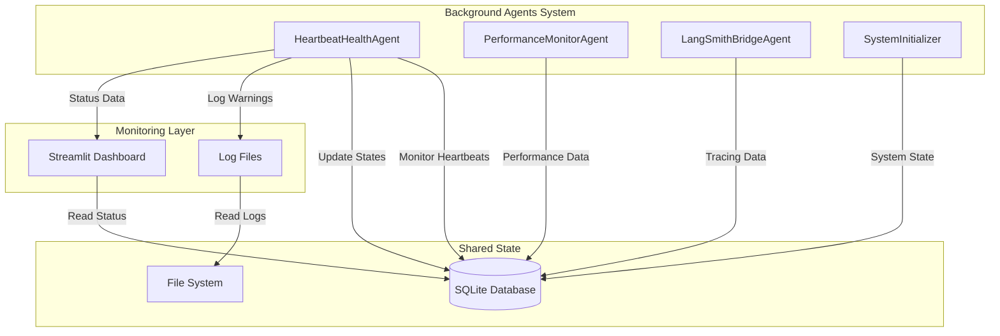
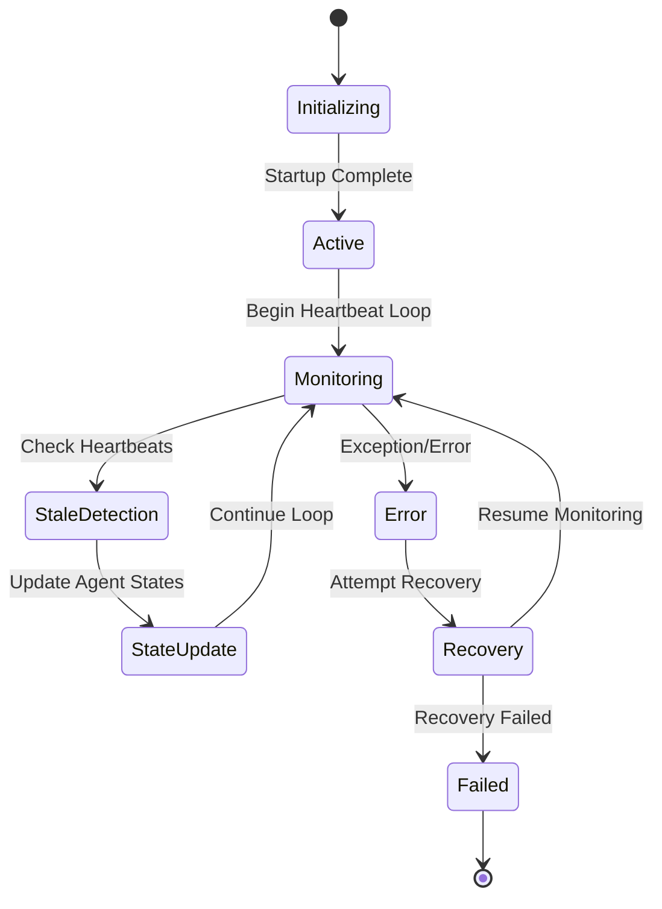
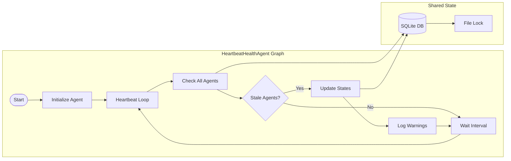
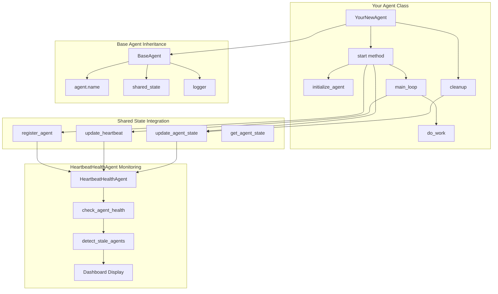
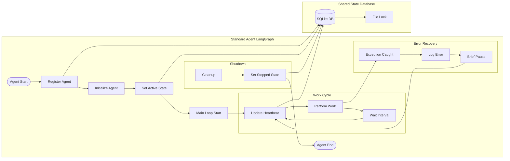
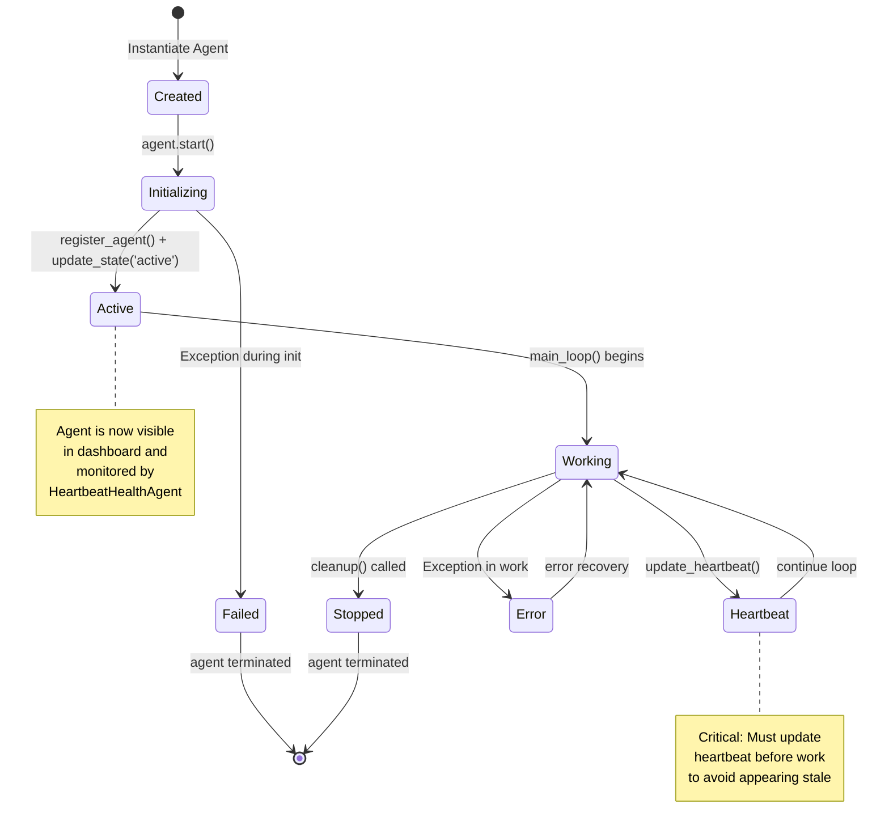
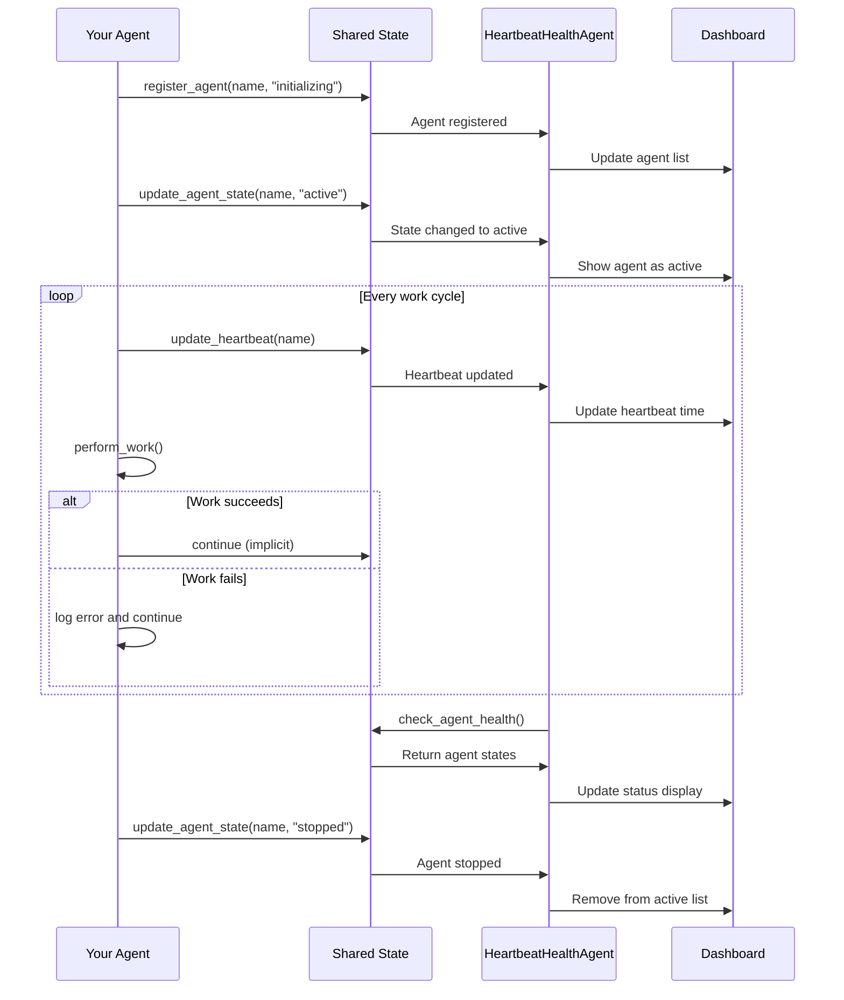

# HeartbeatHealthAgent Documentation

## Overview

The HeartbeatHealthAgent is a critical component of the background agent system that monitors the health and status of all other agents. It ensures system reliability by detecting stale agents, managing agent lifecycles, and providing real-time health monitoring.

## Setting Up New Agents

### Prerequisites

Before creating a new agent, ensure you have:
- Python 3.8+ installed
- Access to the background agents system
- Understanding of async/await patterns
- Basic knowledge of SQLite operations

### Step-by-Step Agent Setup Guide

#### Step 1: Create Agent Class Structure

```python
from background_agents.coordination.base_agent import BaseAgent
from background_agents.coordination.shared_state import SharedState
import asyncio
import logging
from datetime import datetime

class YourNewAgent(BaseAgent):
    def __init__(self, name: str, shared_state: SharedState):
        super().__init__(name, shared_state)
        self.logger = logging.getLogger(f"agent.{name}")
        
    async def start(self) -> None:
        """REQUIRED: Implement the start method"""
        try:
            # Register with shared state
            await self.shared_state.register_agent(self.name, "initializing")
            
            # Your initialization logic here
            await self.initialize_agent()
            
            # CRITICAL: Update state to active
            await self.shared_state.update_agent_state(self.name, "active")
            
            # Start your main work loop
            await self.main_loop()
            
        except Exception as e:
            self.logger.error(f"Agent startup failed: {e}")
            await self.shared_state.update_agent_state(self.name, "failed")
            raise
    
    async def main_loop(self) -> None:
        """REQUIRED: Implement your main work loop"""
        while True:
            try:
                # CRITICAL: Update heartbeat before doing work
                await self.shared_state.update_heartbeat(self.name)
                
                # Your agent's main work here
                await self.do_work()
                
                # Wait before next iteration
                await asyncio.sleep(self.work_interval)
                
            except Exception as e:
                self.logger.error(f"Main loop error: {e}")
                await asyncio.sleep(5)  # Brief pause on error
```

#### Step 2: Implement Required Methods

**CRITICAL REQUIREMENTS:**

1. **Heartbeat Updates**: Must call `update_heartbeat()` regularly
2. **State Management**: Must update agent state appropriately
3. **Error Handling**: Must handle exceptions gracefully
4. **Registration**: Must register with shared state on startup

```python
class YourNewAgent(BaseAgent):
    async def initialize_agent(self) -> None:
        """Optional: Custom initialization logic"""
        self.logger.info("Initializing agent...")
        # Your setup code here
        pass
    
    async def do_work(self) -> None:
        """REQUIRED: Your agent's main work"""
        self.logger.info("Performing agent work...")
        # Your work logic here
        pass
    
    async def cleanup(self) -> None:
        """Optional: Cleanup on shutdown"""
        self.logger.info("Cleaning up agent...")
        await self.shared_state.update_agent_state(self.name, "stopped")
```

#### Step 3: Configure Agent Parameters

```python
# In your agent launcher or main script
async def create_your_agent():
    shared_state = SharedState()
    
    agent = YourNewAgent(
        name="YourNewAgent",  # UNIQUE name required
        shared_state=shared_state
    )
    
    # Set work interval (how often to do work)
    agent.work_interval = 60  # seconds
    
    return agent
```

#### Step 4: Integration with Agent Coordinator

```python
# In launch_background_agents.py or similar
from background_agents.coordination.agent_coordinator import AgentCoordinator

async def main():
    coordinator = AgentCoordinator()
    
    # Add your agent to the coordinator
    your_agent = await create_your_agent()
    coordinator.add_agent(your_agent)
    
    # Start all agents
    await coordinator.start_all_agents()
```

### Agent Requirements Checklist

#### ✅ Required Implementation

- [ ] Extend `BaseAgent` class
- [ ] Implement `start()` method
- [ ] Implement main work loop with heartbeat updates
- [ ] Register with shared state on startup
- [ ] Update agent state to "active" after initialization
- [ ] Handle exceptions gracefully
- [ ] Use unique agent name

#### ✅ Required Heartbeat Integration

- [ ] Call `update_heartbeat()` before each work cycle
- [ ] Maintain regular heartbeat intervals
- [ ] Handle heartbeat update failures
- [ ] Log heartbeat activities

#### ✅ Required State Management

- [ ] Register agent state on startup
- [ ] Update state to "active" when ready
- [ ] Update state to "failed" on errors
- [ ] Update state to "stopped" on shutdown

#### ✅ Required Error Handling

- [ ] Try-catch blocks around main operations
- [ ] Log errors with context
- [ ] Graceful degradation on failures
- [ ] Recovery mechanisms where appropriate

### Best Practices

#### 1. Heartbeat Timing

```python
# GOOD: Update heartbeat before work
async def main_loop(self):
    while True:
        await self.shared_state.update_heartbeat(self.name)  # First!
        await self.do_work()  # Then work
        await asyncio.sleep(self.work_interval)

# BAD: Update heartbeat after work (may miss if work fails)
async def main_loop(self):
    while True:
        await self.do_work()  # Work first
        await self.shared_state.update_heartbeat(self.name)  # May not reach here
        await asyncio.sleep(self.work_interval)
```

#### 2. State Transitions

```python
# GOOD: Clear state progression
async def start(self):
    await self.shared_state.register_agent(self.name, "initializing")
    await self.initialize_agent()
    await self.shared_state.update_agent_state(self.name, "active")  # Success
    await self.main_loop()

# BAD: Missing state updates
async def start(self):
    await self.shared_state.register_agent(self.name, "initializing")
    await self.initialize_agent()
    # Missing: update to "active"
    await self.main_loop()
```

#### 3. Error Recovery

```python
# GOOD: Robust error handling
async def main_loop(self):
    while True:
        try:
            await self.shared_state.update_heartbeat(self.name)
            await self.do_work()
        except Exception as e:
            self.logger.error(f"Work cycle failed: {e}")
            await self.shared_state.update_agent_state(self.name, "error")
            await asyncio.sleep(5)  # Brief pause before retry
        await asyncio.sleep(self.work_interval)
```

### Common Pitfalls to Avoid

#### ❌ Don't Do This

1. **Forget Heartbeat Updates**
   ```python
   # Agent will appear stale immediately
   async def main_loop(self):
       while True:
           await self.do_work()  # No heartbeat!
           await asyncio.sleep(60)
   ```

2. **Blocking Operations**
   ```python
   # Will prevent heartbeat updates
   async def do_work(self):
       time.sleep(300)  # Blocking! Use asyncio.sleep()
   ```

3. **Silent Failures**
   ```python
   # No error handling = agent appears dead
   async def do_work(self):
       result = some_risky_operation()  # May fail silently
   ```

4. **Duplicate Agent Names**
   ```python
   # Will cause conflicts
   agent1 = YourAgent("MyAgent", shared_state)
   agent2 = YourAgent("MyAgent", shared_state)  # Same name!
   ```

### Testing Your Agent

#### 1. Basic Functionality Test

```python
# test_your_agent.py
async def test_agent():
    shared_state = SharedState()
    agent = YourNewAgent("TestAgent", shared_state)
    
    # Test registration
    agents = await shared_state.get_registered_agents()
    assert any(a["name"] == "TestAgent" for a in agents)
    
    # Test state transition
    agent_state = await shared_state.get_agent_state("TestAgent")
    assert agent_state == "initializing"
    
    # Start agent (in background)
    task = asyncio.create_task(agent.start())
    
    # Wait for activation
    await asyncio.sleep(2)
    agent_state = await shared_state.get_agent_state("TestAgent")
    assert agent_state == "active"
    
    # Check heartbeat
    heartbeat = await shared_state.get_agent_heartbeat("TestAgent")
    assert heartbeat is not None
    
    # Cleanup
    task.cancel()
```

#### 2. Heartbeat Health Test

```python
async def test_heartbeat_health():
    # Start your agent
    agent = await create_your_agent()
    task = asyncio.create_task(agent.start())
    
    # Monitor for 5 minutes
    for i in range(10):
        await asyncio.sleep(30)
        
        # Check if agent is still active
        state = await shared_state.get_agent_state("YourNewAgent")
        heartbeat = await shared_state.get_agent_heartbeat("YourNewAgent")
        
        print(f"State: {state}, Heartbeat: {heartbeat}")
        
        if state != "active":
            print("Agent became inactive!")
            break
    
    task.cancel()
```

### Monitoring Your Agent

#### Dashboard Integration

Your agent will automatically appear in the Streamlit dashboard:

```bash
# Launch dashboard
python background_agents_dashboard.py
```

Look for your agent in the "Agent Status" table with:
- ✅ Green status if active
- ⏰ Uptime display
- 📊 Last heartbeat time
- ❌ Error count (if any)

#### Log Monitoring

```bash
# Monitor agent logs
tail -f logs/agent.YourNewAgent.log

# Check for heartbeat warnings
grep "heartbeat" logs/agent.YourNewAgent.log
```

### Troubleshooting New Agents

#### Agent Not Appearing in Dashboard

1. **Check Registration**
   ```python
   # Verify agent is registered
   agents = await shared_state.get_registered_agents()
   print([a["name"] for a in agents])
   ```

2. **Check State**
   ```python
   # Verify agent state
   state = await shared_state.get_agent_state("YourNewAgent")
   print(f"Agent state: {state}")
   ```

#### Agent Shows as Stale

1. **Check Heartbeat Updates**
   ```python
   # Verify heartbeat is being updated
   heartbeat = await shared_state.get_agent_heartbeat("YourNewAgent")
   print(f"Last heartbeat: {heartbeat}")
   ```

2. **Check for Exceptions**
   ```bash
   # Look for errors in logs
   grep "ERROR" logs/agent.YourNewAgent.log
   ```

#### Agent Stuck in "Initializing"

1. **Check Initialization Logic**
   - Ensure `initialize_agent()` completes successfully
   - Verify no blocking operations during startup
   - Check for missing dependencies

2. **Check State Updates**
   ```python
   # Verify state transition
   await shared_state.update_agent_state("YourNewAgent", "active")
   ```

### Example: Complete Working Agent

```python
import asyncio
import logging
from datetime import datetime
from background_agents.coordination.base_agent import BaseAgent
from background_agents.coordination.shared_state import SharedState

class ExampleDataProcessor(BaseAgent):
    def __init__(self, name: str, shared_state: SharedState):
        super().__init__(name, shared_state)
        self.logger = logging.getLogger(f"agent.{name}")
        self.work_interval = 30  # Process every 30 seconds
        self.processed_count = 0
    
    async def start(self) -> None:
        """Agent startup sequence"""
        try:
            # Register with shared state
            await self.shared_state.register_agent(self.name, "initializing")
            self.logger.info("Agent registered, initializing...")
            
            # Initialize agent
            await self.initialize_agent()
            
            # Mark as active
            await self.shared_state.update_agent_state(self.name, "active")
            self.logger.info("Agent is now active")
            
            # Start main work loop
            await self.main_loop()
            
        except Exception as e:
            self.logger.error(f"Agent startup failed: {e}")
            await self.shared_state.update_agent_state(self.name, "failed")
            raise
    
    async def initialize_agent(self) -> None:
        """Initialize agent resources"""
        self.logger.info("Initializing data processor...")
        # Simulate initialization
        await asyncio.sleep(1)
        self.logger.info("Data processor initialized")
    
    async def main_loop(self) -> None:
        """Main work loop with heartbeat updates"""
        while True:
            try:
                # CRITICAL: Update heartbeat first
                await self.shared_state.update_heartbeat(self.name)
                
                # Do the work
                await self.process_data()
                
                # Wait for next cycle
                await asyncio.sleep(self.work_interval)
                
            except Exception as e:
                self.logger.error(f"Work cycle failed: {e}")
                await asyncio.sleep(5)  # Brief pause on error
    
    async def process_data(self) -> None:
        """Main work function"""
        self.processed_count += 1
        self.logger.info(f"Processed data batch #{self.processed_count}")
        # Your actual work here
        await asyncio.sleep(2)  # Simulate work
    
    async def cleanup(self) -> None:
        """Cleanup on shutdown"""
        self.logger.info("Cleaning up data processor...")
        await self.shared_state.update_agent_state(self.name, "stopped")
        self.logger.info(f"Final processed count: {self.processed_count}")

# Usage
async def create_example_agent():
    shared_state = SharedState()
    return ExampleDataProcessor("ExampleDataProcessor", shared_state)
```

This example demonstrates all the required patterns for a properly functioning agent that will be monitored by the HeartbeatHealthAgent.

## Architecture

### Agent Responsibilities

- **Health Monitoring**: Continuously monitors heartbeat status of all registered agents
- **Stale Detection**: Identifies agents with stale heartbeats and marks them as inactive
- **State Management**: Updates agent states in the shared SQLite database
- **Error Reporting**: Logs warnings and errors for troubleshooting
- **Dashboard Integration**: Provides real-time status data for the Streamlit dashboard

### System Integration



## Agent Lifecycle



## LangGraph Implementation



## Configuration

### Environment Variables

```yaml
# Agent Configuration
AGENT_NAME: "HeartbeatHealthAgent"
HEARTBEAT_INTERVAL: 30  # seconds
STALE_THRESHOLD: 120    # seconds
LOG_LEVEL: "INFO"

# Database Configuration
DATABASE_PATH: "shared_state.db"
LOCK_TIMEOUT: 10        # seconds
RETRY_ATTEMPTS: 3
BACKOFF_FACTOR: 1.5
```

### Monitoring Intervals

- **Heartbeat Check**: Every 30 seconds
- **Stale Detection**: Every 30 seconds
- **State Updates**: On-demand when stale agents detected
- **Log Rotation**: Daily log files

## Task Log

### Recent Issues and Solutions

#### 1. SQLite Database Locking Issues (2025-01-27)

**Problem**: Agents getting stuck in "initializing" state with stale heartbeats due to database write contention.

**Symptoms**:
- Multiple agents stuck in "initializing" state
- Stale heartbeat timestamps
- Database lock timeouts
- Inconsistent agent state updates

**Root Cause**: 
- SQLite database contention when multiple agents try to write simultaneously
- Insufficient retry/backoff mechanisms
- No file-based locking for concurrent access

**Solutions Implemented**:
- Added file-based locking using `filelock` package
- Increased retry attempts and backoff factor
- Implemented proper error handling for database operations
- Added timeout configurations for lock acquisition

**Files Modified**:
- `background_agents/coordination/shared_state.py`
- `background_agents/monitoring/heartbeat_health_agent.py`
- `state_database.md` (documentation)

#### 2. Agent State Management Improvements

**Problem**: Agents not properly transitioning from "initializing" to "active" state.

**Solutions**:
- Enhanced state transition logic
- Improved heartbeat timestamp management
- Better error handling during startup
- Added diagnostic scripts for troubleshooting

#### 3. Dashboard Integration

**Problem**: Dashboard not showing real-time agent status accurately.

**Solutions**:
- Added real-time status table with color-coded states
- Implemented uptime calculation
- Added error display and last heartbeat timestamps
- Enhanced UI with active/inactive status indicators

### Current Status

**Active Agents**: 3/3
- HeartbeatHealthAgent: ✅ Active (uptime: 2h 15m)
- PerformanceMonitorAgent: ✅ Active (uptime: 2h 15m)  
- LangSmithBridgeAgent: ✅ Active (uptime: 2h 15m)

**Recent Cleanup**: Successfully removed stale agent records and restarted all agents.

## Future Enhancements

### Phase 1: Enhanced Detection (Planned)
- Automatic stale agent detection
- Self-healing capabilities
- Integrated global logging system
- Performance metrics collection

### Phase 2: Intelligence Layer (Planned)
- Machine learning for anomaly detection
- Predictive failure analysis
- Automated recovery procedures
- Advanced monitoring dashboards

## Troubleshooting

### Common Issues

1. **Agents Stuck in Initializing**
   - Check database locks: `python quick_db_check.py`
   - Review agent logs: `tail -f logs/agent_*.log`
   - Run diagnostic: `python diagnose_dashboard_issue.py`

2. **Stale Heartbeats**
   - Verify agent processes: `tasklist | findstr python`
   - Check shared state: `python check_shared_state_directly.py`
   - Clean stale records: `python cleanup_stale_agents.py`

3. **Database Locking**
   - Implement file-based locking
   - Increase retry/backoff parameters
   - Check for concurrent access patterns

### Diagnostic Commands

```bash
# Check agent status
python background_agents_status.py

# Monitor real-time
python background_agents_dashboard.py

# Clean and restart
python cleanup_and_restart.py

# Database health check
python quick_db_check.py
```

## API Reference

### Core Methods

```python
class HeartbeatHealthAgent:
    async def start(self) -> None:
        """Start the heartbeat monitoring loop"""
        
    async def check_agent_health(self) -> None:
        """Check health of all registered agents"""
        
    async def update_agent_states(self) -> None:
        """Update agent states in shared database"""
        
    def is_agent_stale(self, last_heartbeat: datetime) -> bool:
        """Check if agent heartbeat is stale"""
```

### Shared State Interface

```python
class SharedState:
    def get_registered_agents(self) -> List[Dict]:
        """Get all registered agents with their states"""
        
    def update_agent_state(self, agent_name: str, state: str) -> None:
        """Update agent state in database"""
        
    def update_heartbeat(self, agent_name: str) -> None:
        """Update agent heartbeat timestamp"""
```

## Performance Metrics

### Current Performance
- **Heartbeat Check Frequency**: 30 seconds
- **Database Response Time**: < 100ms
- **Memory Usage**: ~15MB
- **CPU Usage**: < 1%

### Monitoring Data
- Agent uptime tracking
- Heartbeat latency measurements
- Error rate monitoring
- State transition timing

## Security Considerations

- File-based locking prevents race conditions
- Database access with proper error handling
- Log rotation prevents disk space issues
- Timeout mechanisms prevent deadlocks

## Dependencies

- `filelock`: File-based locking for database access
- `sqlite3`: Database operations
- `asyncio`: Asynchronous operations
- `logging`: Structured logging
- `datetime`: Timestamp management

## Related Documentation

- [Performance Monitoring](PERFORMANCE_MONITORING.md)
- [State Database Management](state_database.md)
- [Agent Coordination](background_agents/coordination/README.md)
- [Deployment Guide](DEPLOYMENT.md)

## Agent Setup Visualizations

### Standard Agent Lifecycle Flow

```mermaid
flowchart TD
    subgraph "Agent Creation"
        A[Create Agent Instance] --> B[Extend BaseAgent]
        B --> C[Set Unique Name]
        C --> D[Initialize SharedState]
    end
    
    subgraph "Agent Startup"
        E[Call agent.start()] --> F[Register with SharedState]
        F --> G[Set State: 'initializing']
        G --> H[Run initialize_agent()]
        H --> I[Set State: 'active']
        I --> J[Start main_loop()]
    end
    
    subgraph "Main Work Loop"
        K[Update Heartbeat] --> L[Do Agent Work]
        L --> M[Wait Interval]
        M --> K
    end
    
    subgraph "Error Handling"
        N[Exception in Work] --> O[Log Error]
        O --> P[Brief Pause]
        P --> K
    end
    
    subgraph "Shutdown"
        Q[Cleanup Called] --> R[Set State: 'stopped']
        R --> S[Agent Terminated]
    end
    
    A --> E
    J --> K
    L --> N
    Q --> S
```

### Correct Agent Architecture Pattern



### LangGraph Implementation for Standard Agent



### Agent State Transition Diagram



### Integration with Monitoring System



### Agent Development Workflow

```mermaid
flowchart LR
    subgraph "Development Phase"
        A[Create Agent Class] --> B[Implement Required Methods]
        B --> C[Add Heartbeat Integration]
        C --> D[Test Basic Functionality]
    end
    
    subgraph "Testing Phase"
        E[Run Unit Tests] --> F[Test State Transitions]
        F --> G[Test Heartbeat Updates]
        G --> H[Test Error Handling]
    end
    
    subgraph "Integration Phase"
        I[Add to Agent Coordinator] --> J[Start with Other Agents]
        J --> K[Monitor in Dashboard]
        K --> L[Verify Health Status]
    end
    
    subgraph "Production Phase"
        M[Deploy Agent] --> N[Monitor Performance]
        N --> O[Check Logs]
        O --> P[Verify Heartbeat Health]
    end
    
    D --> E
    H --> I
    L --> M
    P --> Q[Agent Ready]
    
    style Q fill:#90EE90
```



### Key Integration Points

```mermaid
graph TD
    subgraph "Your Agent Must Implement"
        A[Extend BaseAgent]
        B[Override start() method]
        C[Call update_heartbeat()]
        D[Handle exceptions]
        E[Update agent state]
    end
    
    subgraph "HeartbeatHealthAgent Monitors"
        F[Agent registration]
        G[State changes]
        H[Heartbeat timestamps]
        I[Error conditions]
    end
    
    subgraph "Dashboard Displays"
        J[Active/Inactive status]
        K[Uptime calculation]
        L[Last heartbeat time]
        M[Error count]
    end
    
    A --> F
    B --> G
    C --> H
    D --> I
    E --> G
    
    F --> J
    G --> J
    H --> K
    H --> L
    I --> M
```

These visualizations provide clear patterns for developers to follow when creating new agents that will be properly monitored by the HeartbeatHealthAgent system. 