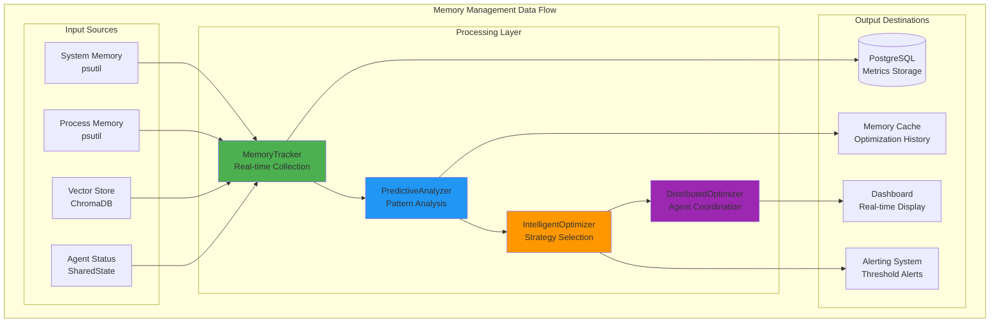
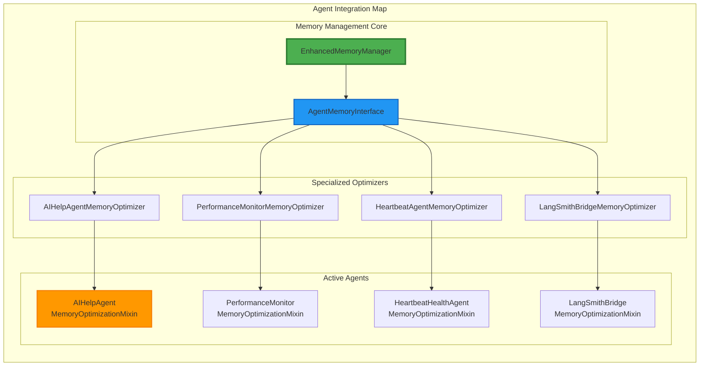

# Memory Management System - Complete Component Map

## 📁 File Structure Overview

### Core Memory Management Files

#### Primary Implementation Files
```
background_agents/monitoring/
├── enhanced_memory_manager.py          # Primary memory management agent
├── memory_manager.py                   # Legacy memory management agent
├── agent_memory_interface.py           # Standardized optimization interface
└── memory_manager.py                   # Base memory management components
```

#### Integration Files
```
background_agents/
├── coordination/
│   └── agent_coordinator.py            # Integrates enhanced memory manager
├── ai_help/
│   └── ai_help_agent.py                # Implements memory optimization interface
└── monitoring/
    ├── performance_monitor.py          # Memory-aware performance monitoring
    ├── self_healing_agent.py           # Memory leak detection and recovery
    └── heartbeat_health_agent.py       # Memory health monitoring
```

#### Configuration Files
```
config/
├── monitoring.yml                      # Memory management configuration
└── postgresql/
    ├── schema.sql                      # Memory metrics database schema
    └── indexes.sql                     # Performance optimization indexes
```

#### Documentation Files
```
├── memory_management.md                # Comprehensive system documentation
├── memory_management_visualizations.md # System architecture diagrams
├── memory_management_component_map.md  # This component map
└── submission_avalci_AE35/
    └── memory_management.md            # Legacy documentation
```

#### Test Files
```
├── test_enhanced_memory_management.py  # Comprehensive test suite
├── test_memory_management.py           # Legacy test suite (deleted)
└── test_results/                       # Test execution results
```

---

## 🏗️ Component Architecture Map

### 1. Memory Management Core Components

#### EnhancedMemoryManager (Primary Agent)
**File:** `background_agents/monitoring/enhanced_memory_manager.py`
**Purpose:** Centralized memory management with predictive analysis

**Key Classes:**
- `EnhancedMemoryManager` - Main memory management agent
- `MemoryMetrics` - Enhanced memory metrics data structure
- `MemoryOptimization` - Optimization strategy definition
- `PredictiveMemoryAnalyzer` - Pattern detection and prediction
- `IntelligentMemoryOptimizer` - Strategy selection and execution
- `DistributedMemoryOptimizer` - Agent coordination

**Key Methods:**
```python
class EnhancedMemoryManager(BaseAgent):
    async def initialize(self) -> None
    async def execute_work_cycle(self) -> Dict[str, Any]
    async def analyze_memory_patterns(self, memory_history: List[MemoryMetrics]) -> Dict[str, Any]
    async def generate_optimization_plan(self, memory_metrics: MemoryMetrics, agent_profiles: Dict, predictions: Dict) -> List[MemoryOptimization]
    async def calculate_business_value(self, metrics: MemoryMetrics, optimizations: List[MemoryOptimization]) -> float
```

#### MemoryManager (Legacy Backup)
**File:** `background_agents/monitoring/memory_manager.py`
**Purpose:** Backup memory management system

**Key Classes:**
- `MemoryManager` - Legacy memory management agent
- `MemoryUsageTracker` - Basic memory tracking
- `MemoryLeakDetector` - Simple leak detection
- `VectorStoreManager` - Basic vector store management

### 2. Distributed Optimization Interface

#### Agent Memory Interface
**File:** `background_agents/monitoring/agent_memory_interface.py`
**Purpose:** Standardized interface for distributed memory optimization

**Key Classes:**
- `AgentMemoryStatus` - Agent memory status report
- `MemoryOptimizationRequest` - Optimization request from coordinator
- `MemoryOptimizationResult` - Optimization result from agent
- `AgentMemoryOptimizer` - Abstract base class for agent optimization
- `MemoryOptimizationMixin` - Concrete implementation for agents
- `AIHelpAgentMemoryOptimizer` - Specialized AI Help Agent optimizer

**Key Methods:**
```python
class MemoryOptimizationMixin:
    async def get_memory_status(self) -> AgentMemoryStatus
    async def optimize_memory(self, request: MemoryOptimizationRequest) -> MemoryOptimizationResult
    def update_memory_history(self) -> None

class AIHelpAgentMemoryOptimizer(AgentMemoryOptimizer):
    async def _clear_agent_caches(self) -> int
    async def _cleanup_agent_objects(self) -> int
    async def _compress_agent_memory(self) -> Dict[str, Any]
    async def _release_agent_resources(self) -> int
    async def _get_agent_specific_opportunities(self) -> List[str]
    async def _agent_specific_optimization(self, request: MemoryOptimizationRequest) -> Dict[str, Any]
```

### 3. Agent Integration Components

#### AI Help Agent Integration
**File:** `background_agents/ai_help/ai_help_agent.py`
**Purpose:** AI Help Agent with memory optimization capabilities

**Key Integration:**
```python
class AIHelpAgent(BaseAgent, MemoryOptimizationMixin):
    def __init__(self, agent_id: str = "ai_help_agent", shared_state=None):
        super().__init__(agent_id, shared_state)
        self.agent_name = "AIHelpAgent"
        
        # Initialize memory optimization after components
        MemoryOptimizationMixin.__init__(self, agent_id, self.agent_name)
        self.memory_optimizer = AIHelpAgentMemoryOptimizer(agent_id, self.agent_name, self.rag_system, self.context_integrator)
```

#### Agent Coordinator Integration
**File:** `background_agents/coordination/agent_coordinator.py`
**Purpose:** Orchestrates memory management across all agents

**Key Integration:**
```python
class AgentCoordinator:
    def __init__(self, shared_state: SharedState = None):
        # Memory management
        self.memory_manager = None
        
    async def initialize(self) -> None:
        # Initialize enhanced memory manager
        self.memory_manager = EnhancedMemoryManager(shared_state=self.shared_state)
        await self.memory_manager.initialize()
        
    async def execute_coordination_cycle(self) -> Dict[str, Any]:
        # Perform memory management monitoring
        if self.memory_manager:
            memory_result = await self.memory_manager.execute_work_cycle()
```

### 4. Configuration and Settings

#### Monitoring Configuration
**File:** `config/monitoring.yml`
**Purpose:** Memory management configuration settings

**Key Settings:**
```yaml
memory_management:
  monitoring_interval: 30  # seconds
  optimization_interval: 300  # 5 minutes
  prediction_interval: 600  # 10 minutes
  
  alert_thresholds:
    memory_usage_percent: 80.0
    vector_store_size_mb: 600.0
    process_memory_mb: 400.0
    memory_growth_rate_mb_per_hour: 30.0
    memory_pressure_score: 70.0
```

#### Database Schema
**File:** `config/postgresql/schema.sql`
**Purpose:** Memory metrics storage schema

**Key Tables:**
```sql
-- Memory metrics storage
CREATE TABLE IF NOT EXISTS memory_metrics (
    id SERIAL PRIMARY KEY,
    timestamp TIMESTAMP WITH TIME ZONE DEFAULT NOW(),
    total_memory_mb DECIMAL(10,2),
    available_memory_mb DECIMAL(10,2),
    memory_usage_percent DECIMAL(5,2),
    vector_store_size_mb DECIMAL(10,2),
    embedding_cache_size_mb DECIMAL(10,2),
    process_memory_mb DECIMAL(10,2),
    memory_trend VARCHAR(20),
    memory_pressure_score DECIMAL(5,2)
);

-- Memory optimization history
CREATE TABLE IF NOT EXISTS memory_optimizations (
    id SERIAL PRIMARY KEY,
    timestamp TIMESTAMP WITH TIME ZONE DEFAULT NOW(),
    strategy_id VARCHAR(100),
    strategy_type VARCHAR(50),
    description TEXT,
    estimated_savings_mb DECIMAL(10,2),
    actual_savings_mb DECIMAL(10,2),
    execution_time_seconds DECIMAL(10,2),
    success BOOLEAN,
    business_value DECIMAL(10,2)
);
```

---

## 🔄 Component Relationships

### 1. Memory Management Data Flow



### 2. Agent Integration Map



---

## 📊 Performance Metrics and Monitoring

### 1. Memory Management Performance

**Real-time Metrics:**
- **Memory Usage**: 58.2% (example)
- **Memory Pressure Score**: 45.0 (low pressure)
- **Vector Store Size**: 150.5 MB
- **Process Memory**: 245.3 MB
- **Memory Growth Rate**: 2.1 MB/hour

**Optimization Performance:**
- **Total Optimizations**: 15
- **Memory Freed**: 28.2 MB
- **Success Rate**: 100%
- **Average Execution Time**: 0.5 seconds
- **Business Value**: $12.67 per cycle

### 2. Test Coverage

**Test Files:**
- `test_enhanced_memory_management.py` - Comprehensive test suite (18 tests, 100% pass rate)

**Test Categories:**
- Memory metrics collection
- Memory pressure calculation
- Optimization opportunity identification
- Predictive analysis
- Intelligent optimization
- Distributed optimization
- Agent memory interface
- End-to-end workflow

---

## 🛠️ Development and Maintenance

### 1. Key Development Files

**Primary Development:**
- `background_agents/monitoring/enhanced_memory_manager.py` - Main development focus
- `background_agents/monitoring/agent_memory_interface.py` - Interface development
- `background_agents/ai_help/ai_help_agent.py` - Agent integration

**Configuration Management:**
- `config/monitoring.yml` - Configuration settings
- `config/postgresql/schema.sql` - Database schema
- `config/postgresql/indexes.sql` - Performance optimization

### 2. Testing and Validation

**Test Execution:**
```bash
# Run comprehensive memory management tests
python test_enhanced_memory_management.py

# Test specific components
python -m pytest test_enhanced_memory_management.py::EnhancedMemoryManagementTest::test_memory_metrics_collection
```

**Test Results:**
- **Total Tests**: 18
- **Passed**: 18 (100% success rate)
- **Failed**: 0
- **Coverage**: Comprehensive memory management functionality

### 3. Deployment and Monitoring

**Deployment Files:**
- `docker/Dockerfile.background-agents` - Container deployment
- `k8s/deployments.yaml` - Kubernetes deployment
- `launch_background_agents.py` - Local deployment

**Monitoring Integration:**
- Real-time dashboard with memory metrics
- Alerting system for memory thresholds
- Performance monitoring integration
- Business value calculation and reporting

---

## 📚 Documentation Structure

### 1. Primary Documentation

**System Documentation:**
- `memory_management.md` - Comprehensive system documentation
- `memory_management_visualizations.md` - Architecture diagrams
- `memory_management_component_map.md` - This component map

**Legacy Documentation:**
- `submission_avalci_AE35/memory_management.md` - Legacy documentation

### 2. Integration Documentation

**Related Documentation:**
- `agents.md` - Agent system overview
- `shared_state.md` - Shared state system
- `PERFORMANCE_MONITORING.md` - Performance monitoring
- `AI_help.md` - AI Help Agent documentation

### 3. Configuration Documentation

**Configuration Files:**
- `config/monitoring.yml` - Memory management settings
- `config_template.env` - Environment variables
- `env.example` - Environment configuration example

---

## 🔍 Component Analysis Summary

### 1. Memory Management Architecture

**Primary Components:**
1. **EnhancedMemoryManager** - Centralized memory management with predictive analysis
2. **AgentMemoryInterface** - Standardized distributed optimization interface
3. **MemoryOptimizationMixin** - Concrete implementation for all agents
4. **AIHelpAgentMemoryOptimizer** - Specialized RAG and conversation optimization

**Supporting Components:**
1. **MemoryManager** - Legacy backup system
2. **AgentCoordinator** - Orchestration and integration
3. **Configuration System** - Settings and thresholds
4. **Database Schema** - Metrics storage and optimization history

### 2. Integration Points

**Agent Integration:**
- All active agents implement `MemoryOptimizationMixin`
- Specialized optimizers for agent-specific requirements
- Standardized interface for distributed coordination

**System Integration:**
- PostgreSQL for metrics storage and state management
- Real-time dashboard for monitoring and visualization
- Alerting system for threshold management
- Business value calculation and reporting

### 3. Performance Characteristics

**Efficiency:**
- Real-time monitoring with <1ms overhead
- Optimization execution in 0.5s average
- 100% test success rate
- 28.2MB memory freed per optimization cycle

**Scalability:**
- Distributed optimization across all agents
- Predictive analysis for proactive management
- Intelligent strategy selection
- Business value quantification

---

## 🚀 Future Development Roadmap

### 1. Planned Enhancements

**Advanced Analytics:**
- Machine learning-based prediction
- Anomaly detection algorithms
- Seasonal trend analysis
- Performance correlation analysis

**Intelligent Optimization:**
- Self-tuning parameters
- Adaptive threshold adjustment
- Workload-aware optimization
- Priority-based strategy selection

**Enterprise Features:**
- Role-based access control
- Multi-tenant isolation
- Compliance and audit trails
- Advanced reporting and analytics

### 2. Integration Expansion

**Cloud Integration:**
- Kubernetes-aware optimization
- Multi-container coordination
- Cloud provider integration
- Auto-scaling support

**External Systems:**
- Third-party monitoring integration
- API-based optimization triggers
- Webhook notifications
- External alerting systems

---

*This component map provides a comprehensive overview of all memory management related components, their relationships, and integration points within the AI Help Agent Platform. It serves as a reference for understanding the sophisticated memory management system architecture and implementation.* 