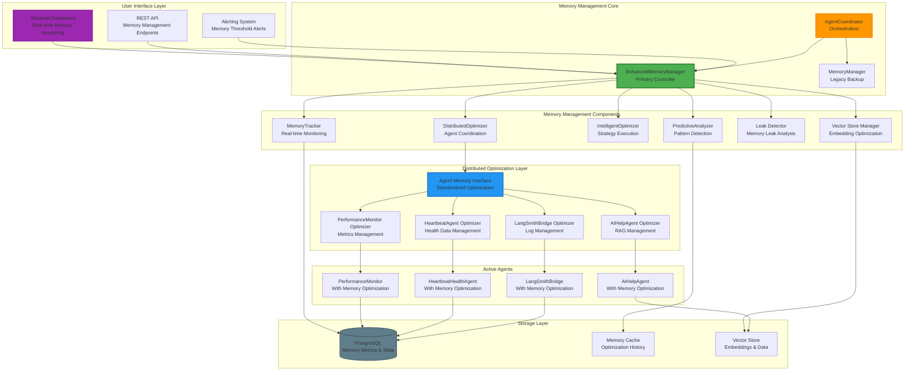
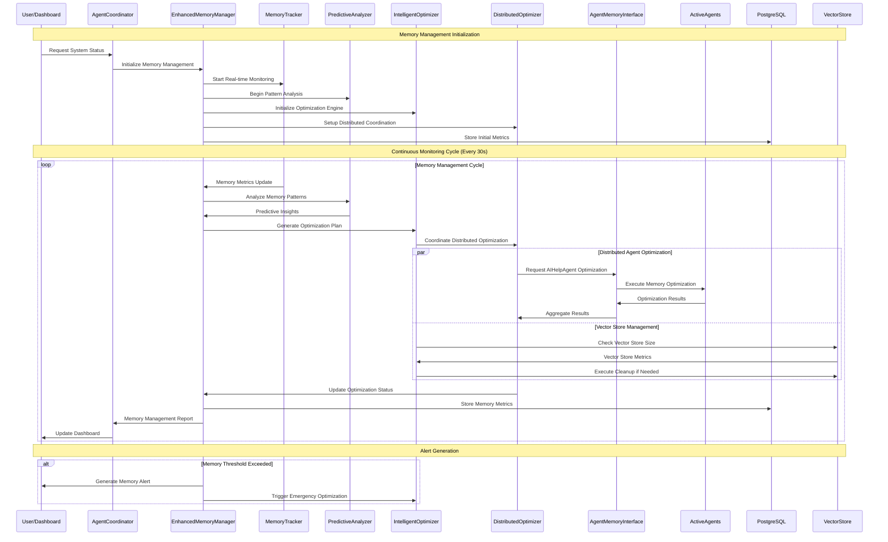
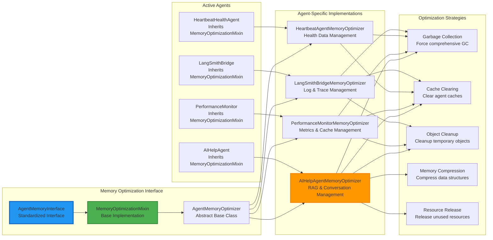
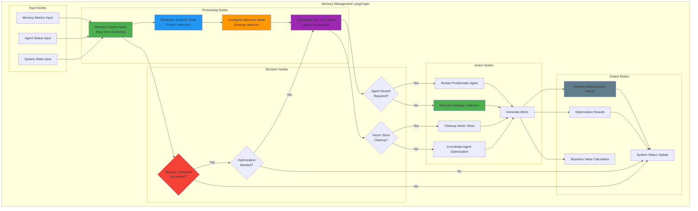
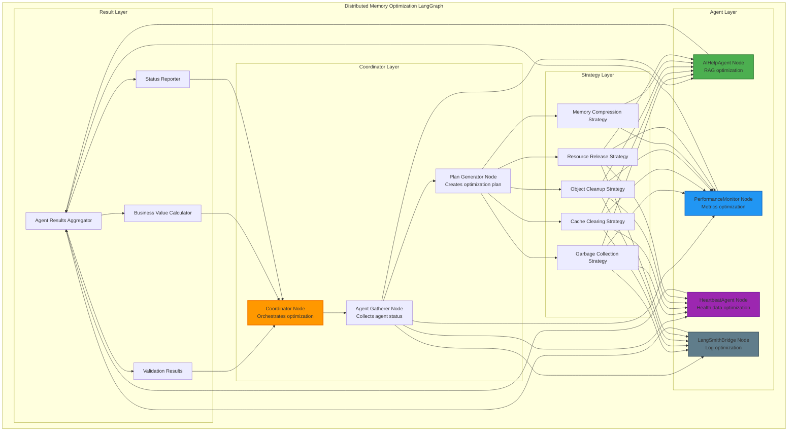
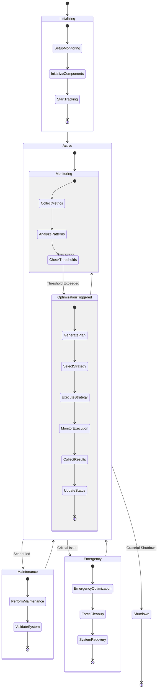
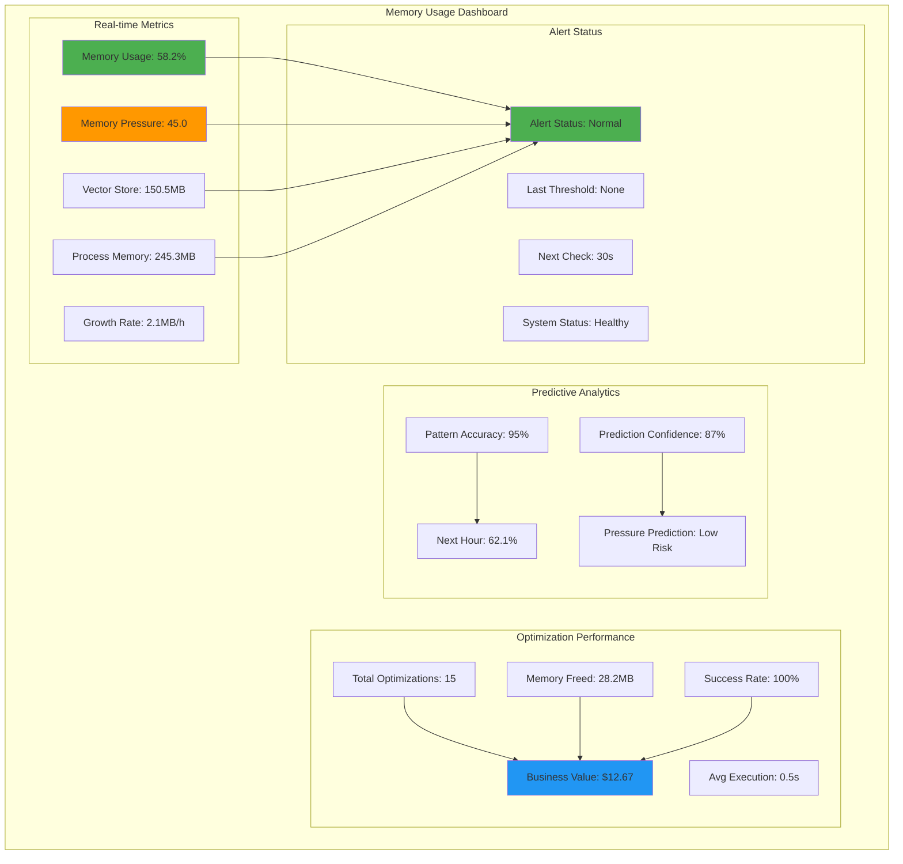
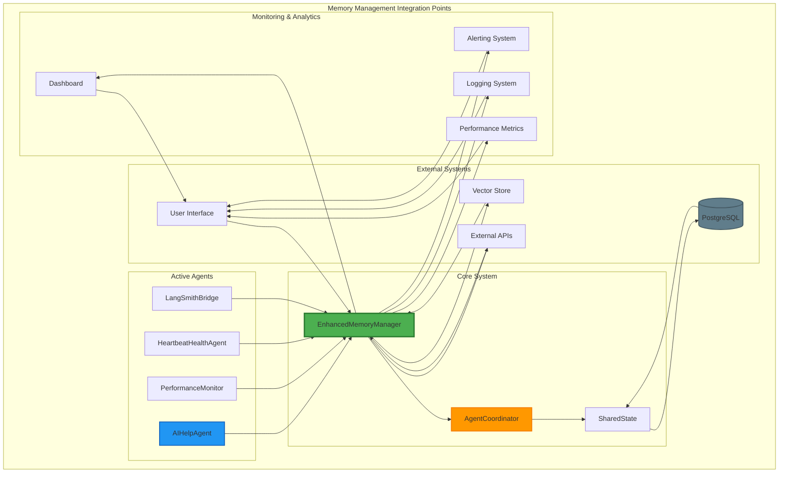
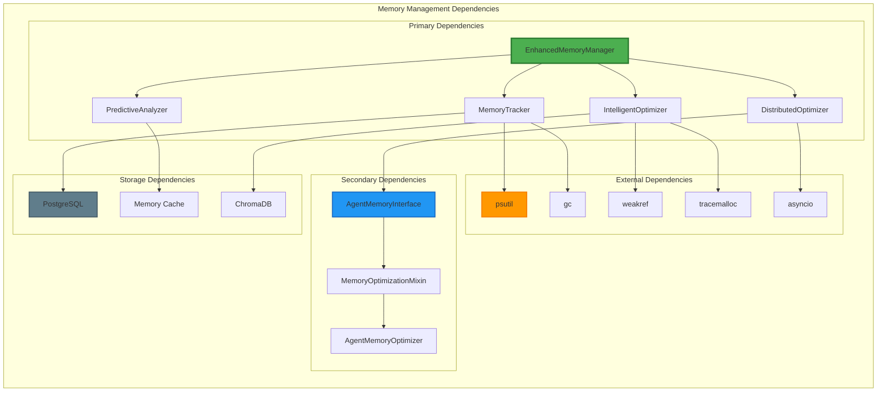

# Memory Management System Visualizations

## 🏗️ System Architecture Diagrams

### 1. Complete Memory Management Ecosystem



### 2. Memory Management Data Flow



### 3. Memory Optimization Workflow

```mermaid
stateDiagram-v2
    [*] --> Monitoring
    
    state Monitoring {
        [*] --> CollectMetrics
        CollectMetrics --> AnalyzePatterns
        AnalyzePatterns --> CheckThresholds
        CheckThresholds --> Monitoring: No Action Needed
        CheckThresholds --> OptimizationNeeded: Threshold Exceeded
    }
    
    state OptimizationNeeded {
        [*] --> GeneratePlan
        GeneratePlan --> SelectStrategy
        SelectStrategy --> ValidateStrategy
        ValidateStrategy --> ExecuteStrategy: Valid
        ValidateStrategy --> SelectStrategy: Invalid
        ExecuteStrategy --> MonitorExecution
        MonitorExecution --> CollectResults
        CollectResults --> UpdateMetrics
        UpdateMetrics --> [*]
    }
    
    OptimizationNeeded --> Monitoring
    Monitoring --> [*]
    
    state "Strategy Types" as ST {
        [*] --> GarbageCollection
        [*] --> VectorStoreCleanup
        [*] --> AgentRestart
        [*] --> MemoryCompression
        [*] --> ResourceRelease
    }
    
    SelectStrategy --> ST
    ST --> ExecuteStrategy
```

### 4. Agent Memory Interface Architecture



## 🔄 LangGraph Visualizations

### 1. Memory Management Agent Graph



### 2. Distributed Memory Optimization Graph



### 3. Memory Management State Machine



## 📊 Performance Monitoring Visualizations

### 1. Memory Usage Dashboard



### 2. Memory Management Workflow Timeline

```mermaid
gantt
    title Memory Management Workflow Timeline
    dateFormat  X
    axisFormat %s
    
    section Initialization
    Setup Monitoring           :done, setup, 0, 5s
    Initialize Components      :done, init, 5s, 10s
    Start Tracking            :done, track, 10s, 15s
    
    section Continuous Monitoring
    Collect Metrics           :active, metrics, 15s, 45s
    Analyze Patterns          :pattern, 45s, 75s
    Check Thresholds          :threshold, 75s, 105s
    
    section Optimization
    Generate Plan             :plan, 105s, 135s
    Execute Strategy          :execute, 135s, 165s
    Monitor Results           :monitor, 165s, 195s
    
    section Reporting
    Update Dashboard          :dashboard, 195s, 225s
    Generate Report           :report, 225s, 255s
    Calculate Business Value  :value, 255s, 285s
```

## 🔧 Integration Points Visualization

### 1. Memory Management Integration Map



### 2. Memory Management Component Dependencies



---

## 📋 Summary

This visualization document provides comprehensive diagrams showing:

1. **System Architecture**: Complete memory management ecosystem with all components and their relationships
2. **Data Flow**: Sequential diagrams showing how data flows through the memory management system
3. **Workflow States**: State machines showing the different states and transitions in memory management
4. **Agent Interface**: Detailed view of how agents implement the standardized memory optimization interface
5. **LangGraph Representations**: Graph-based visualizations showing the memory management as a computational graph
6. **Performance Monitoring**: Real-time dashboard and timeline visualizations
7. **Integration Points**: Maps showing how memory management integrates with other system components
8. **Dependencies**: Component dependency graphs showing internal and external dependencies

These visualizations help understand the sophisticated memory management system's architecture, workflow, and integration points within the AI Help Agent Platform. 