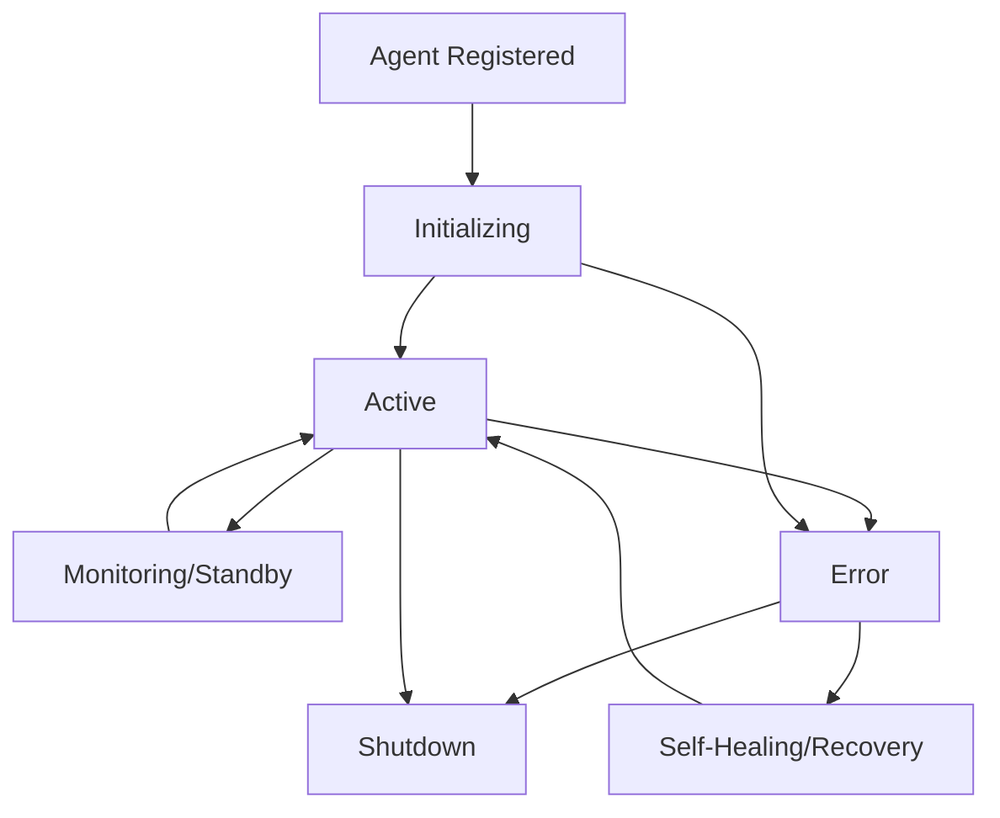
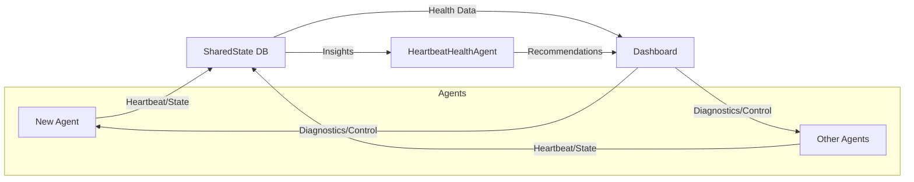

# Guide: Implementing a New Agent

## 1. Overview
This guide provides a step-by-step structure for implementing new agents in the background agent system. It covers required methods, state management, heartbeat integration, error handling, and best practices to ensure robust, monitorable agents.

---

## 2. Visualizing Agent Structure & Integration

### 🟦 **Agent Lifecycle (Mermaid)**


### 🟦 **System Architecture (Mermaid)**


### 🟦 **LangGraph Workflow (Mermaid)**
```mermaid
graph TD
    Start([Start]) --> Init[initialize()]
    Init --> MainLoop[main_loop()]
    MainLoop --> Heartbeat[update_agent_heartbeat]
    Heartbeat --> Work[do_work()]
    Work --> MainLoop
    Work -->|Error| HandleError[handle_error()]
    HandleError --> MainLoop
    MainLoop -->|Shutdown| End[End]
```

---

## 3. LangGraph Integration (Code)

```python
from langgraph.graph import StateGraph
from background_agents.coordination.base_agent import BaseAgent

class MyNewAgent(BaseAgent):
    # ... (see skeleton above)
    pass

graph = StateGraph()
graph.add_node('initialize', MyNewAgent.initialize)
graph.add_node('main_loop', MyNewAgent.main_loop)
graph.add_node('handle_error', MyNewAgent.handle_error)
graph.add_edge('initialize', 'main_loop')
graph.add_edge('main_loop', 'main_loop')
graph.add_edge('main_loop', 'handle_error')
graph.add_edge('handle_error', 'main_loop')
```

---

## 4. Prerequisites
- Python 3.8+
- Familiarity with asyncio and async/await
- Access to the codebase and agent coordinator
- Unique agent name

---

## 5. Agent Implementation Structure
1. **Create a new agent class** in `background_agents/your_category/` (e.g., `my_new_agent.py`).
2. **Inherit from the appropriate base class** (e.g., `BaseAgent`).
3. **Implement required methods:**
   - `async def initialize(self)`
   - `async def main_loop(self)`
   - `async def handle_error(self, error)`
4. **Register the agent** with the coordinator.
5. **Add configuration if needed** (YAML, ENV, etc).

---

## 6. Required Methods & State Transitions
- **initialize()**: Setup resources, dependencies, and update state to 'initializing'.
- **main_loop()**: Main async loop. Update heartbeat **before** each work cycle. Transition to 'active' after successful init.
- **handle_error()**: Log and handle exceptions. Optionally transition to 'error' state.
- **State transitions:**
  - 'register' → 'initializing' → 'active' → 'monitoring'/'standby'/'error'

---

## 7. Heartbeat Integration
- Call `await self.shared_state.update_agent_heartbeat(self.agent_id, {...})` **before** each work cycle.
- Example:
  ```python
  async def main_loop(self):
      while True:
          await self.shared_state.update_agent_heartbeat(self.agent_id, {...})
          await self.do_work()
          await asyncio.sleep(self.work_interval)
  ```

---

## 8. Error Handling
- Use try/except in your main loop and work methods.
- Log all exceptions.
- Optionally update agent state to 'error' and attempt recovery.
- Example:
  ```python
  try:
      await self.do_work()
  except Exception as e:
      self.logger.error(f'Work failed: {e}')
      await self.shared_state.update_agent_state(self.agent_id, 'error')
      await asyncio.sleep(5)
  ```

---

## 9. Registration & Unique Naming
- Ensure each agent has a unique `agent_id` and `agent_name`.
- Register the agent with the coordinator at startup.
- Avoid name collisions to prevent monitoring issues.

---

## 10. Testing & Diagnostics
- Use the dashboard to monitor agent state, heartbeats, and errors.
- Run provided test scripts (e.g., `test_agent_startup.py`, `test_shared_state.py`).
- Check logs for initialization, heartbeat, and error messages.

---

## 11. Example Agent Skeleton
```python
from background_agents.coordination.base_agent import BaseAgent

class MyNewAgent(BaseAgent):
    def __init__(self, agent_id, shared_state, **kwargs):
        super().__init__(agent_id, shared_state, **kwargs)
        self.agent_name = "MyNewAgent"
        self.work_interval = 10  # seconds

    async def initialize(self):
        self.logger.info("Initializing MyNewAgent...")
        await self.shared_state.update_agent_state(self.agent_id, 'initializing')
        # ... setup ...
        await self.shared_state.update_agent_state(self.agent_id, 'active')

    async def main_loop(self):
        while True:
            await self.shared_state.update_agent_heartbeat(self.agent_id, {
                "agent_name": self.agent_name,
                "state": "active",
                "timestamp": datetime.now().isoformat(),
                "metrics": {}
            })
            try:
                await self.do_work()
            except Exception as e:
                await self.handle_error(e)
            await asyncio.sleep(self.work_interval)

    async def do_work(self):
        # Implement agent's main task here
        pass

    async def handle_error(self, error):
        self.logger.error(f"Error: {error}")
        await self.shared_state.update_agent_state(self.agent_id, 'error')
        # Optionally attempt recovery
```

---

## 12. Best Practices & Troubleshooting
- **Update heartbeat before work** to avoid false stale detection.
- **Never block the event loop** (use `await asyncio.sleep()` instead of `time.sleep()`).
- **Log all state transitions and errors** for easier debugging.
- **Test agent startup and shutdown** using provided scripts.
- **Monitor the dashboard** for real-time health and recommendations.
- **If stuck in 'initializing' or 'error',** check logs and ensure state transitions are correct.

---

## 13. Advanced Onboarding & Workspace-Specific Best Practices

### Registration & Coordinator Integration
- Always register your agent with the `AgentCoordinator` using `await coordinator.register_agent(agent)`.
- The coordinator manages agent lifecycle, state, and all writes to `SharedState`.
- Agents should not write directly to `SharedState`—always use coordinator methods for heartbeats and state changes.

### State Transitions & Lifecycle
- Use the provided `AgentState` enum for all state transitions (e.g., `INITIALIZING`, `DEPLOYING`, `MONITORING`, `ACTIVE`, `ERROR`, `SHUTDOWN`).
- Log all state changes using the lifecycle logger for traceability.
- After initialization, transition to `MONITORING` or `ACTIVE` as appropriate.
- On error, transition to `ERROR` and attempt recovery or shutdown.

### Heartbeat & Retry Logic
- Use the built-in `_send_heartbeat` method (or equivalent) with retry and exponential backoff.
- If the coordinator is unavailable, log the error and retry. After repeated failures, transition to `ERROR` state.
- Heartbeats should include metrics and current state.

### Shutdown & Cleanup
- Implement `shutdown()` and `cleanup()` methods to gracefully stop the agent, cancel tasks, and release resources.
- Always set the shutdown event and log shutdown events for auditability.

### Logging & Metrics
- Use the agent-specific logger and lifecycle logger for all major events (init, state change, heartbeat, error, shutdown).
- Log metrics and errors to enable dashboard monitoring and troubleshooting.
- Use structured logging for easier parsing and analysis.

### Dashboard Integration
- Ensure your agent's state, metrics, and errors are visible in the dashboard by following the coordinator protocol.
- Use unique agent names and versions to avoid dashboard confusion.
- Test dashboard integration using the provided test scripts and by monitoring the UI.

### Async & Blocking Gotchas
- Never use `time.sleep()` in async code—always use `await asyncio.sleep()`.
- Avoid blocking I/O or long-running synchronous operations in the main loop.
- Use async file/database/network operations wherever possible.

### Unique Naming & Versioning
- Use a unique `agent_name` and `agent_id` (often `f"{agent_name}__{version}"`) for each agent.
- This ensures correct registration, monitoring, and troubleshooting.

### Testing & Diagnostics
- Use scripts like `test_agent_startup.py` and `add_missing_agents.py` to verify agent registration, startup, and heartbeat.
- Check logs for successful registration, state transitions, and error handling.
- Use the dashboard to confirm agent visibility and health.

### Troubleshooting Checklist
- If your agent is not visible in the dashboard:
  - Check registration with the coordinator.
  - Ensure heartbeats are being sent and received.
  - Verify unique naming/versioning.
  - Check logs for errors during startup or heartbeat.
- If your agent is stuck in `initializing` or `error`:
  - Review state transitions and initialization logic.
  - Check for blocking operations or missing async/await.
  - Use lifecycle logs for detailed event tracing.

---

For more details, see `agents.md`, `heartbeat_agent.md`, and the dashboard Health tab for dynamic, context-aware tips. 
