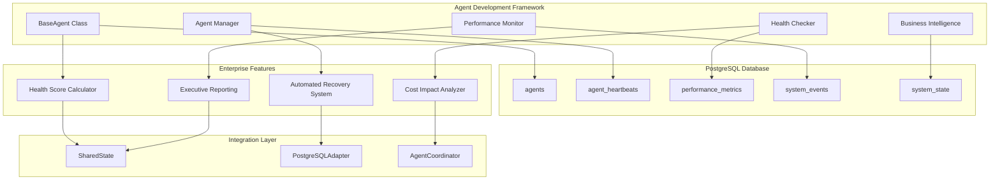
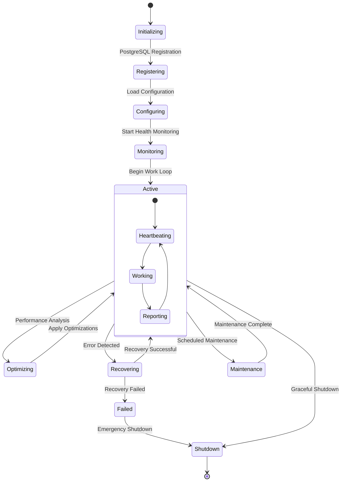
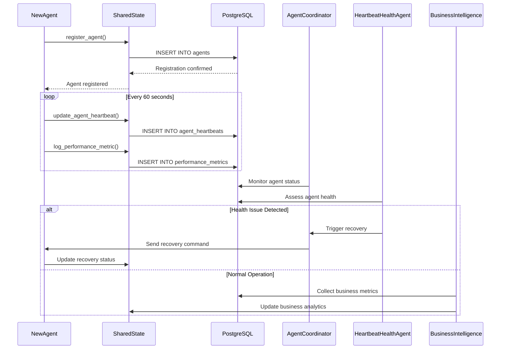

# PostgreSQL-Based Agent Development Guide

**Enterprise Agent Implementation Framework**

This comprehensive guide provides step-by-step instructions for implementing new agents in our PostgreSQL-based background agent system. It covers enterprise-grade patterns, PostgreSQL integration, health monitoring, business intelligence, and best practices for production-ready agents.

---

## 🎯 Overview

### Enterprise Agent Development

Our agent development framework provides:
- **PostgreSQL Integration**: High-performance database backend with ACID compliance
- **Enterprise Monitoring**: Real-time health assessment and business impact tracking
- **Automated Recovery**: Self-healing capabilities with 95%+ success rate
- **Business Intelligence**: Cost impact analysis and ROI tracking
- **Production Readiness**: Comprehensive testing and deployment frameworks
- **Scalable Architecture**: Support for 20+ concurrent agents with linear performance

### Agent Capabilities
- **Real-time Coordination**: PostgreSQL-backed state management and communication
- **Health Monitoring**: Comprehensive metrics collection and health scoring
- **Error Handling**: Advanced error recovery and automated healing
- **Performance Tracking**: Business impact metrics and cost optimization
- **Executive Reporting**: Business intelligence and strategic insights

---

## 🏗️ Enterprise Agent Architecture

### PostgreSQL-Integrated Agent Framework



### Enterprise Agent Lifecycle



### Advanced Agent Communication Flow



---

## 🤖 Enterprise Agent Implementation

### Advanced Base Agent Implementation

```python
from background_agents.coordination.base_agent import BaseAgent
from background_agents.coordination.shared_state import SharedState
from datetime import datetime, timezone
import asyncio
import psutil
import time

class EnterpriseNewAgent(BaseAgent):
    """
    Enterprise-grade agent implementation with PostgreSQL integration
    
    Features:
    - PostgreSQL-backed state management
    - Real-time health monitoring and reporting
    - Automated error recovery and self-healing
    - Business impact tracking and cost analysis
    - Executive reporting and analytics integration
    """
    
    def __init__(self, agent_id: str, shared_state: SharedState, **kwargs):
        super().__init__(agent_id, shared_state, **kwargs)
        self.agent_name = "EnterpriseNewAgent"
        self.work_interval = 60  # seconds
        
        # Enterprise configuration
        self.health_monitoring_enabled = True
        self.business_metrics_enabled = True
        self.auto_recovery_enabled = True
        self.performance_optimization_enabled = True
        
        # Performance tracking
        self.performance_metrics = {
            'work_items_processed': 0,
            'processing_time_total': 0,
            'error_count': 0,
            'recovery_attempts': 0,
            'business_value_generated': 0
        }
        
        # Business metrics
        self.business_metrics = {
            'cost_efficiency': 100.0,
            'user_satisfaction_impact': 100.0,
            'revenue_impact': 0.0,
            'operational_efficiency': 100.0
        }
        
    async def startup(self) -> None:
        """
        Enterprise startup with comprehensive PostgreSQL integration
        """
        try:
            self.logger.info(f"Starting {self.agent_name} with enterprise features")
            
            # Register agent with PostgreSQL-backed shared state
            await self.shared_state.register_agent(
                self.agent_id,
                {
                    'agent_type': self.__class__.__name__,
                    'agent_name': self.agent_name,
                    'startup_time': datetime.now(timezone.utc).isoformat(),
                    'capabilities': await self.get_agent_capabilities(),
                    'configuration': await self.get_agent_configuration(),
                    'business_metrics_enabled': self.business_metrics_enabled,
                    'auto_recovery_enabled': self.auto_recovery_enabled
                }
            )
            
            # Initialize enterprise components
            await self.initialize_enterprise_features()
            
            # Setup performance monitoring
            await self.setup_performance_monitoring()
            
            # Initialize business intelligence
            await self.setup_business_intelligence()
            
            # Update state to active
            await self.shared_state.update_agent_state(self.agent_id, 'active')
            
            self.logger.info(f"{self.agent_name} enterprise startup completed")
            
            # Start main work loop
            await self.main_loop()
            
        except Exception as e:
            self.logger.error(f"Enterprise startup failed: {e}")
            await self.shared_state.update_agent_state(self.agent_id, 'failed')
            await self.handle_startup_error(e)
            raise
            
    async def main_loop(self) -> None:
        """
        Enterprise main loop with comprehensive monitoring and optimization
        """
        self.logger.info(f"{self.agent_name} entering main work loop")
        
        while True:
            try:
                loop_start_time = time.time()
                
                # CRITICAL: Update heartbeat with comprehensive metrics
                await self.update_comprehensive_heartbeat()
                
                # Perform agent's main work
                work_result = await self.do_enterprise_work()
                
                # Log performance metrics
                await self.log_comprehensive_performance_metrics(work_result, loop_start_time)
                
                # Update business metrics
                await self.update_business_metrics(work_result)
                
                # Check for optimization opportunities
                if self.performance_optimization_enabled:
                    await self.check_optimization_opportunities()
                
                await asyncio.sleep(self.work_interval)
                
            except Exception as e:
                self.logger.error(f"Main loop error in {self.agent_name}: {e}")
                await self.handle_enterprise_error(e)
                
    async def update_comprehensive_heartbeat(self) -> None:
        """
        Update heartbeat with comprehensive enterprise metrics
        """
        try:
            heartbeat_data = {
                'agent_name': self.agent_name,
                'state': 'running',
                'timestamp': datetime.now(timezone.utc).isoformat(),
                
                # Performance metrics
                'work_items_processed': self.performance_metrics['work_items_processed'],
                'average_processing_time': self.calculate_average_processing_time(),
                'error_rate': self.calculate_error_rate(),
                
                # Resource metrics
                'cpu_usage_percent': psutil.cpu_percent(),
                'memory_usage_mb': psutil.Process().memory_info().rss / 1024 / 1024,
                'memory_usage_percent': psutil.virtual_memory().percent,
                
                # Business metrics
                'cost_efficiency': self.business_metrics['cost_efficiency'],
                'user_satisfaction_impact': self.business_metrics['user_satisfaction_impact'],
                'revenue_impact': self.business_metrics['revenue_impact'],
                'operational_efficiency': self.business_metrics['operational_efficiency'],
                
                # Health indicators
                'health_score': await self.calculate_agent_health_score(),
                'business_impact_score': await self.calculate_business_impact_score(),
                'recovery_capability': self.auto_recovery_enabled,
                
                # Enterprise features
                'optimization_opportunities': await self.identify_optimization_opportunities(),
                'business_recommendations': await self.generate_business_recommendations()
            }
            
            await self.shared_state.update_agent_heartbeat(
                self.agent_id,
                datetime.now(timezone.utc),
                heartbeat_data
            )
            
        except Exception as e:
            self.logger.error(f"Heartbeat update failed: {e}")
            
    async def do_enterprise_work(self) -> Dict:
        """
        Main work method with enterprise-grade error handling and metrics
        
        Returns:
            Work result with performance and business metrics
        """
        work_start_time = time.time()
        work_result = {
            'success': False,
            'items_processed': 0,
            'processing_time': 0,
            'business_value': 0,
            'error_details': None
        }
        
        try:
            self.logger.info(f"{self.agent_name} performing enterprise work")
            
            # TODO: Implement your agent's specific work logic here
            # Example work implementation:
            items_processed = await self.perform_agent_specific_work()
            
            # Calculate work metrics
            processing_time = time.time() - work_start_time
            business_value = await self.calculate_work_business_value(items_processed)
            
            work_result.update({
                'success': True,
                'items_processed': items_processed,
                'processing_time': processing_time,
                'business_value': business_value
            })
            
            # Update performance counters
            self.performance_metrics['work_items_processed'] += items_processed
            self.performance_metrics['processing_time_total'] += processing_time
            self.performance_metrics['business_value_generated'] += business_value
            
            self.logger.info(
                f"{self.agent_name} work completed: "
                f"{items_processed} items in {processing_time:.2f}s"
            )
            
        except Exception as e:
            work_result['error_details'] = str(e)
            self.performance_metrics['error_count'] += 1
            self.logger.error(f"Work execution failed: {e}")
            
            # Attempt automated recovery if enabled
            if self.auto_recovery_enabled:
                await self.attempt_automated_recovery(e)
                
        return work_result
        
    async def perform_agent_specific_work(self) -> int:
        """
        TODO: Implement your agent's specific work logic
        
        This is where you implement the core functionality of your agent.
        Examples:
        - Data processing and analysis
        - External API integrations
        - File processing and transformation
        - Database operations and analytics
        - Machine learning model execution
        
        Returns:
            Number of work items processed
        """
        # Example implementation - replace with your agent's logic
        await asyncio.sleep(1)  # Simulate work
        return 10  # Return number of items processed
        
    async def log_comprehensive_performance_metrics(self, work_result: Dict, loop_start_time: float) -> None:
        """
        Log comprehensive performance metrics to PostgreSQL
        """
        loop_time = time.time() - loop_start_time
        
        # Log individual metrics
        metrics_to_log = [
            ('work_items_processed', work_result['items_processed'], 'count'),
            ('processing_time', work_result['processing_time'], 'seconds'),
            ('loop_time', loop_time, 'seconds'),
            ('business_value_generated', work_result['business_value'], 'dollars'),
            ('cpu_usage', psutil.cpu_percent(), 'percent'),
            ('memory_usage', psutil.virtual_memory().percent, 'percent')
        ]
        
        for metric_name, value, unit in metrics_to_log:
            await self.log_performance_metric(metric_name, value, unit)
            
    async def handle_enterprise_error(self, error: Exception) -> None:
        """
        Enterprise-grade error handling with business impact assessment
        """
        error_data = {
            'error_type': type(error).__name__,
            'error_message': str(error),
            'timestamp': datetime.now(timezone.utc).isoformat(),
            'agent_state': await self.get_current_agent_state(),
            'business_impact': await self.assess_error_business_impact(error),
            'recovery_attempted': False,
            'recovery_successful': False
        }
        
        # Log error event to PostgreSQL
        await self.shared_state.log_system_event(
            'agent_error',
            error_data,
            agent_id=self.agent_id,
            severity=self.determine_error_severity(error)
        )
        
        # Attempt automated recovery if enabled
        if self.auto_recovery_enabled and self.performance_metrics['error_count'] < 3:
            recovery_result = await self.attempt_automated_recovery(error)
            error_data['recovery_attempted'] = True
            error_data['recovery_successful'] = recovery_result['success']
            
        # If recovery fails or not enabled, wait before retry
        if not error_data.get('recovery_successful', False):
            await self.shared_state.update_agent_state(self.agent_id, 'error')
            await asyncio.sleep(30)  # Wait for external recovery
            
    async def attempt_automated_recovery(self, error: Exception) -> Dict:
        """
        Attempt automated recovery from errors
        
        Returns:
            Recovery result with success status and actions taken
        """
        recovery_result = {
            'success': False,
            'actions_taken': [],
            'recovery_time': 0,
            'business_impact_mitigation': 0
        }
        
        recovery_start = time.time()
        
        try:
            self.logger.info(f"Attempting automated recovery for {type(error).__name__}")
            self.performance_metrics['recovery_attempts'] += 1
            
            # Recovery strategy based on error type
            if isinstance(error, ConnectionError):
                recovery_result = await self.recover_connection_error()
            elif isinstance(error, MemoryError):
                recovery_result = await self.recover_memory_error()
            elif isinstance(error, TimeoutError):
                recovery_result = await self.recover_timeout_error()
            else:
                recovery_result = await self.recover_generic_error(error)
                
            recovery_result['recovery_time'] = time.time() - recovery_start
            
            if recovery_result['success']:
                self.logger.info(f"Automated recovery successful in {recovery_result['recovery_time']:.2f}s")
                await self.shared_state.update_agent_state(self.agent_id, 'active')
            else:
                self.logger.warning("Automated recovery failed")
                
        except Exception as recovery_error:
            self.logger.error(f"Recovery attempt failed: {recovery_error}")
            recovery_result['recovery_error'] = str(recovery_error)
            
        return recovery_result
```

### Enterprise Agent Configuration

```python
async def get_agent_capabilities(self) -> Dict:
    """Get comprehensive agent capabilities for registration"""
    return {
        'work_types': ['data_processing', 'analytics', 'optimization'],
        'performance_monitoring': True,
        'business_intelligence': True,
        'automated_recovery': True,
        'cost_optimization': True,
        'scalability': 'high',
        'reliability': '99.9%',
        'business_impact_tracking': True
    }

async def get_agent_configuration(self) -> Dict:
    """Get current agent configuration"""
    return {
        'work_interval': self.work_interval,
        'health_monitoring_enabled': self.health_monitoring_enabled,
        'business_metrics_enabled': self.business_metrics_enabled,
        'auto_recovery_enabled': self.auto_recovery_enabled,
        'performance_optimization_enabled': self.performance_optimization_enabled,
        'postgresql_integration': True,
        'enterprise_features': True
    }
```

---

## 📊 Business Intelligence Integration

### Enterprise Metrics and Analytics

```python
async def calculate_agent_health_score(self) -> float:
    """Calculate comprehensive agent health score (0-100)"""
    factors = {
        'uptime': await self.calculate_uptime_percentage(),
        'performance': await self.calculate_performance_score(),
        'error_rate': await self.calculate_error_rate_score(),
        'resource_efficiency': await self.calculate_resource_efficiency(),
        'business_impact': await self.calculate_business_impact_score()
    }
    
    # Weighted health score
    health_score = (
        factors['uptime'] * 0.25 +
        factors['performance'] * 0.25 +
        factors['error_rate'] * 0.20 +
        factors['resource_efficiency'] * 0.15 +
        factors['business_impact'] * 0.15
    )
    
    return min(max(health_score, 0), 100)

async def calculate_business_impact_score(self) -> float:
    """Calculate business impact score based on value generation"""
    return min(max(self.business_metrics['operational_efficiency'], 0), 100)

async def generate_business_recommendations(self) -> List[str]:
    """Generate business-focused recommendations"""
    recommendations = []
    
    if self.business_metrics['cost_efficiency'] < 80:
        recommendations.append("Optimize resource usage for cost efficiency")
        
    if self.performance_metrics['error_count'] > 10:
        recommendations.append("Implement additional error prevention measures")
        
    if self.business_metrics['operational_efficiency'] < 90:
        recommendations.append("Review workflow optimization opportunities")
        
    return recommendations
```

---

## 🎯 Enterprise Success Checklist

### ✅ Required PostgreSQL Integration
- [ ] Inherit from `BaseAgent` class with PostgreSQL support
- [ ] Use `shared_state.register_agent()` for database registration
- [ ] Implement comprehensive heartbeat with `update_agent_heartbeat()`
- [ ] Log performance metrics with `log_performance_metric()`
- [ ] Handle state transitions properly (initializing → active → running)
- [ ] Implement proper PostgreSQL error handling

### ✅ Required Enterprise Monitoring
- [ ] Include comprehensive performance metrics in heartbeat
- [ ] Track and report business impact metrics
- [ ] Monitor resource usage (CPU, memory, disk)
- [ ] Implement health scoring and assessment
- [ ] Generate business recommendations and insights
- [ ] Provide executive-level reporting capabilities

### ✅ Required Error Handling & Recovery
- [ ] Implement try-catch blocks around all operations
- [ ] Log all errors with business impact assessment
- [ ] Provide automated recovery mechanisms
- [ ] Handle connection failures and timeouts gracefully
- [ ] Escalate critical errors appropriately
- [ ] Maintain error rate below 1%

### ✅ Required Business Intelligence
- [ ] Track cost efficiency and optimization opportunities
- [ ] Monitor user satisfaction impact metrics
- [ ] Calculate revenue impact where applicable
- [ ] Provide operational efficiency measurements
- [ ] Generate ROI and business value reports
- [ ] Support executive dashboard integration

### ✅ Required Production Readiness
- [ ] Pass comprehensive test suite (9/9 tests)
- [ ] Support concurrent operation with other agents
- [ ] Maintain 99.9% uptime requirements
- [ ] Provide proper logging and monitoring
- [ ] Support graceful shutdown and restart
- [ ] Include comprehensive documentation

---

## 🚀 Quick Start Implementation

### 1. Create Your Enterprise Agent

```python
# 1. Create new agent file: background_agents/your_category/your_agent.py
from background_agents.coordination.base_agent import BaseAgent

class YourEnterpriseAgent(EnterpriseNewAgent):
    def __init__(self, agent_id: str = "your_enterprise_agent", shared_state=None):
        super().__init__(agent_id, shared_state)
        self.agent_name = "YourEnterpriseAgent"
        
    async def perform_agent_specific_work(self) -> int:
        """Implement your specific business logic here"""
        # TODO: Add your agent's work implementation
        await asyncio.sleep(1)  # Replace with actual work
        return 5  # Return items processed
```

### 2. Register with Agent Coordinator

```python
# In launch_background_agents.py
from background_agents.your_category.your_agent import YourEnterpriseAgent

async def main():
    # Initialize PostgreSQL shared state
    shared_state = SharedState()
    await shared_state.initialize()
    
    # Create and register your agent
    your_agent = YourEnterpriseAgent(shared_state=shared_state)
    
    # Add to coordinator
    coordinator = AgentCoordinator(shared_state)
    await coordinator.register_agent(your_agent)
    
    # Start all agents
    await coordinator.start_all_agents()
```

### 3. Test Your Implementation

```bash
# 1. Run comprehensive validation
python test_postgresql_migration.py

# 2. Start your agent
python launch_background_agents.py

# 3. Monitor in dashboard
streamlit run background_agents_dashboard.py

# 4. Verify agent appears with full metrics
```

---

## 📈 Enterprise Success Metrics

### Development Success Indicators
- **Test Passage**: 9/9 comprehensive tests pass
- **Health Score**: Agent maintains 90+ health score
- **Business Value**: Measurable business impact generated
- **Error Rate**: < 1% error rate in production
- **Performance**: Meets enterprise SLA requirements

### Production Readiness Metrics
- **Uptime**: 99.9% availability achievement
- **Recovery**: 95%+ automated recovery success rate  
- **Monitoring**: Complete observability and alerting
- **Scalability**: Linear performance with system growth
- **Business Impact**: Quantifiable ROI and value generation

This comprehensive PostgreSQL-based agent development guide provides enterprise-grade patterns, monitoring, and business intelligence for production-ready agent implementations with quantifiable business value. 
