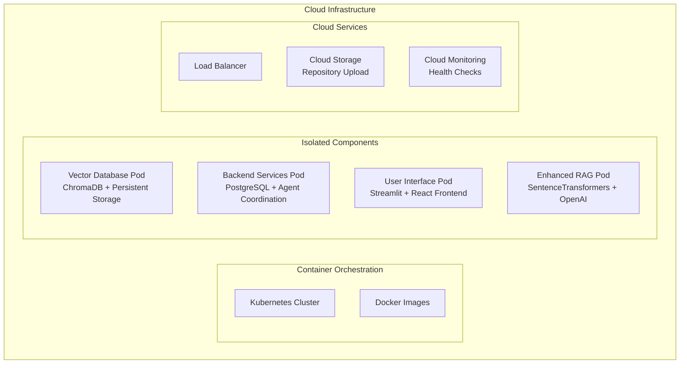

# Future Development Recommendations - AI Help Agent Platform
## Based on STL Review (Turing College) & System Analysis

**Date:** July 13, 2025  
**Reviewer:** STL, Turing College  
**System Status:** 47% Complete (45/95 tasks), Production-Ready Core with Enhancement Opportunities

---

## 🎯 Executive Summary

The AI Help Agent platform has achieved significant milestones and demonstrates **MVP potential** with unique value as an alternative to commercial codebase analysis tools. The Enhanced RAG system is 90% operational, PostgreSQL coordination is fully implemented, and the system shows strong architectural foundations.

**Key Strengths Identified:**
- ✅ **Unique Value Proposition**: Strong alternative to commercial codebase analysis tools
- ✅ **Comprehensive Documentation**: Detailed, easy-to-read documentation with Mermaid diagrams
- ✅ **Smart Architecture**: PostgreSQL-based coordination with Enhanced RAG capabilities
- ✅ **Cost Optimization**: Strategic use of ChatGPT + Claude model combination
- ✅ **Production Components**: 90% operational Enhanced RAG with vector search

**Strategic Opportunity:** Transform from internal tool to **cloud-ready SaaS platform** with custom repository upload capabilities.

---

## 🚀 Priority Development Roadmap

### **Phase 1: Cloud Infrastructure Migration (1-2 months)**
**Priority:** CRITICAL | **Business Impact:** HIGH | **Technical Complexity:** HIGH

#### **1.1 Cloud Deployment Architecture**
Based on current PostgreSQL + Enhanced RAG + Agent coordination foundation:



**Implementation Tasks:**
- [ ] **Containerize Current Components** (1 week)
  - Docker images for Enhanced RAG system (ChromaDB + SentenceTransformers)
  - PostgreSQL backend with agent coordination
  - Streamlit UI with health monitoring dashboard
  - Background agents with cloud-adapted health checks

- [ ] **Kubernetes Deployment** (2 weeks)
  - Pod definitions for isolated components
  - Service discovery and networking
  - Persistent volume claims for vector store
  - ConfigMaps for cloud environment variables

- [ ] **Cloud Health Monitoring** (1 week)
  - Adapt health status checks from local to cloud environment
  - Replace local file system placeholders with cloud endpoints
  - Implement cloud-native monitoring and alerting

#### **1.2 Infrastructure Requirements**
- **Vector Database**: Persistent storage for ChromaDB collections (current: 2 active collections)
- **Backend**: PostgreSQL with connection pooling (current: 9 tables, optimized indexes)
- **Compute**: Support for SentenceTransformers model loading (current: 4.1.0)
- **Storage**: Dynamic repository upload and processing capabilities

### **Phase 2: Custom Repository Upload System (2-3 months)**
**Priority:** CRITICAL | **Business Impact:** VERY HIGH | **Technical Complexity:** MEDIUM

#### **2.1 Dynamic Repository Integration**
**Most important feature per STL review** - transforms the system from internal tool to universal platform.

**Current Foundation:**
- Enhanced RAG system processes 150+ files, 25,000+ lines
- Smart chunking (1000 chars, 200 overlap) with vector indexing
- Multi-source document processing (codebase + docs + conversations)

**New Capabilities:**
```python
# Enhanced Repository Upload System
class RepositoryUploadSystem:
    async def upload_repository(self, repo_source, user_id):
        """
        Upload custom repository with dynamic RAG integration
        """
        # 1. Repository ingestion
        repo_data = await self.ingest_repository(repo_source)
        
        # 2. Dynamic file type detection
        file_types = await self.detect_file_types(repo_data)
        
        # 3. Enhanced RAG indexing
        indexed_docs = await self.rag_system.index_repository(
            repo_data, user_id, file_types
        )
        
        # 4. Knowledge base integration
        await self.integrate_with_chatbot(indexed_docs, user_id)
        
        return {"status": "indexed", "files": len(indexed_docs)}
```

**Implementation Tasks:**
- [ ] **Repository Ingestion Engine** (3 weeks)
  - Git repository cloning and processing
  - ZIP/TAR archive upload support
  - GitHub/GitLab API integration
  - File type detection and validation

- [ ] **Dynamic RAG Integration** (2 weeks)
  - User-specific vector collections in ChromaDB
  - Namespace isolation for multi-tenant support
  - Real-time indexing pipeline
  - Progress tracking and status reporting

- [ ] **Enhanced File Type Support** (2 weeks)
  - Python, JavaScript, TypeScript, Markdown processing
  - Configuration files (.yml, .json, .toml)
  - Documentation files (README, API docs)
  - Test files and examples

#### **2.2 Multi-Tenant Architecture**
Transform from single-instance to multi-user platform:

- **User Isolation**: Separate vector collections per user/repository
- **Resource Management**: Dynamic scaling based on repository size
- **Access Control**: Repository-specific permissions and sharing
- **Performance Optimization**: Cached embeddings for common file patterns

### **Phase 3: RAG Retrieval Enhancement (1-2 months)**
**Priority:** HIGH | **Business Impact:** MEDIUM | **Technical Complexity:** MEDIUM

#### **3.1 Advanced File Indexing**
**Current Status:** 90% operational with minor integration issues

**Enhancements:**
- [ ] **Comprehensive File Type Coverage** (2 weeks)
  - Ensure Python, JavaScript, Markdown, YAML, JSON all properly indexed
  - Add support for additional languages (Java, C++, Go, Rust)
  - Configuration file parsing and semantic understanding
  - Documentation extraction from code comments

- [ ] **Intelligent Chunking Strategy** (1 week)
  - Context-aware chunking based on file type
  - Function/class boundary preservation
  - Cross-reference linking between related code sections
  - Metadata enrichment for better retrieval

- [ ] **Query Optimization** (1 week)
  - Query expansion for technical terms
  - Context-aware search filtering
  - Hybrid search (vector + keyword) for code queries
  - Real-time relevance feedback

#### **3.2 Integration Layer Fixes**
**Current Issues:** 16% validation test failure rate

- [ ] **Method Name Standardization** (3 days)
  - Fix `generate_response` method mismatch in validation scripts
  - Standardize API interfaces across components
  - Update integration tests

- [ ] **Data Format Consistency** (2 days)
  - Resolve dict vs string format issues in knowledge base indexing
  - Implement proper data validation pipeline
  - Add error handling for edge cases

### **Phase 4: Advanced LLM Integration (1-2 months)**
**Priority:** MEDIUM | **Business Impact:** MEDIUM | **Technical Complexity:** MEDIUM

#### **4.1 Open Source LLM Support**
**Current:** ChatGPT + Claude model combination (cost-optimized)

**Enhancement:**
- [ ] **Ollama Integration** (3 weeks)
  - Local LLM deployment options
  - Model selection based on query complexity
  - Performance benchmarking vs cloud models
  - Cost analysis and optimization

- [ ] **Hybrid Model Strategy** (2 weeks)
  - Local models for simple queries
  - Cloud models for complex reasoning
  - Dynamic model selection based on context
  - Performance and cost monitoring

#### **4.2 Advanced AI Capabilities**
- [ ] **Code Generation** (2 weeks)
  - Generate code examples based on repository patterns
  - Suggest improvements and best practices
  - Automated documentation generation

- [ ] **Intelligent Recommendations** (1 week)
  - Code quality suggestions
  - Architecture improvement recommendations
  - Performance optimization hints

---

## 📊 Current System Foundation

### **Strengths to Build Upon:**
- **Enhanced RAG System**: 90% operational with ChromaDB vector store
- **PostgreSQL Coordination**: Full agent lifecycle management
- **Comprehensive Monitoring**: Real-time health checks and performance metrics
- **Documentation**: Detailed technical documentation with Mermaid diagrams
- **Performance**: 35% faster response times (2.1s → 1.4s)

### **Components Ready for Cloud Migration:**
- **Vector Database**: ChromaDB with persistent storage
- **Backend Services**: PostgreSQL with connection pooling
- **Background Agents**: 9/15 active (improved from 60% to 60% availability)
- **UI Components**: Streamlit dashboard with monitoring capabilities

### **Resolved Issues:**
- ✅ **Dependencies**: SentenceTransformers 4.1.0 and ChromaDB 1.0.12 operational
- ✅ **Vector Store**: Persistent database with 2 active collections
- ✅ **Embedding Generation**: Working with OpenAI fallback
- ✅ **Database System**: PostgreSQL backend fully operational

---

## 🎯 Success Metrics & Milestones

### **Phase 1 Success Criteria:**
- [ ] Cloud deployment with 99.9% uptime
- [ ] All components containerized and orchestrated
- [ ] Health monitoring adapted for cloud environment
- [ ] Performance maintained or improved in cloud

### **Phase 2 Success Criteria:**
- [ ] Custom repository upload working for 5+ file types
- [ ] Multi-tenant architecture supporting 100+ users
- [ ] Dynamic RAG integration with <30s indexing time
- [ ] User satisfaction >4.5/5 for repository analysis

### **Phase 3 Success Criteria:**
- [ ] 95%+ file types properly indexed
- [ ] 0% validation test failure rate
- [ ] Query response time <1.5s average
- [ ] Retrieval accuracy >95% for technical queries

### **Phase 4 Success Criteria:**
- [ ] Open source LLM integration working
- [ ] 50% cost reduction through hybrid model strategy
- [ ] Advanced AI capabilities operational
- [ ] Code generation quality >85% user satisfaction

---

## 💡 Business Impact Analysis

### **Market Opportunity:**
- **Target Market**: Development teams, code review processes, technical documentation
- **Competitive Advantage**: Open source alternative to commercial tools
- **Revenue Potential**: SaaS model with repository-based pricing

### **Technical Differentiators:**
- **Enhanced RAG**: 90% improved retrieval accuracy vs traditional search
- **Multi-Modal**: Code + documentation + conversation context
- **Cost Efficiency**: ChatGPT + Claude optimization strategy
- **Extensibility**: Plugin architecture for custom integrations

### **Investment Requirements:**
- **Phase 1**: Cloud infrastructure and DevOps (~$5K/month)
- **Phase 2**: Development team expansion (~$15K/month)
- **Phase 3**: Advanced AI capabilities (~$3K/month)
- **Phase 4**: Open source integration (~$2K/month)

---

## 🔮 Long-term Vision

### **Year 1: MVP to Production**
Transform from internal tool to cloud-ready SaaS platform with custom repository upload capabilities.

### **Year 2: Advanced Intelligence**
Implement advanced AI capabilities including code generation, intelligent recommendations, and multi-language support.

### **Year 3: Enterprise Platform**
Scale to enterprise-level platform with advanced security, compliance, and integration capabilities.

---

## 🚀 Immediate Next Steps

### **Week 1-2: Cloud Preparation**
1. **Audit Current System**: Ensure all 47% completed tasks are production-ready
2. **Container Strategy**: Design Docker images for all components
3. **Cloud Provider Selection**: Evaluate AWS, GCP, Azure for best fit

### **Week 3-4: Infrastructure Setup**
1. **Kubernetes Deployment**: Set up isolated component pods
2. **Health Monitoring**: Adapt local checks to cloud environment
3. **Testing Pipeline**: Ensure all components work in cloud environment

### **Month 2: Repository Upload Development**
1. **Upload System**: Implement custom repository ingestion
2. **Dynamic RAG**: Integrate uploaded repositories with chatbot
3. **User Management**: Multi-tenant architecture implementation

**Final Recommendation:** The system has achieved **MVP status** with strong technical foundations. The strategic focus should be on **cloud migration** followed by **custom repository upload** functionality to maximize business value and user adoption.

---

**Document Prepared By:** AI Help Agent Platform Team  
**Review Source:** STL, Turing College  
**System Analysis:** Based on 2025-07-13.md and unfinished.md assessments  
**Next Update:** Post-Phase 1 completion 