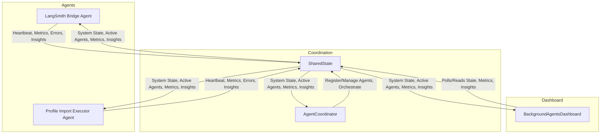
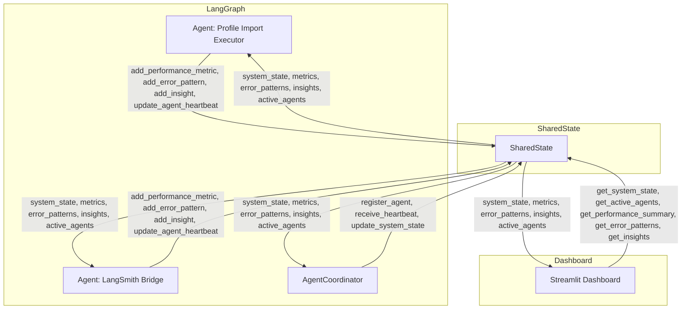
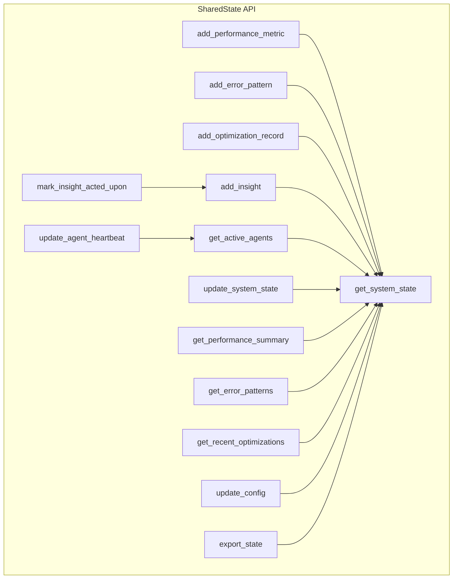
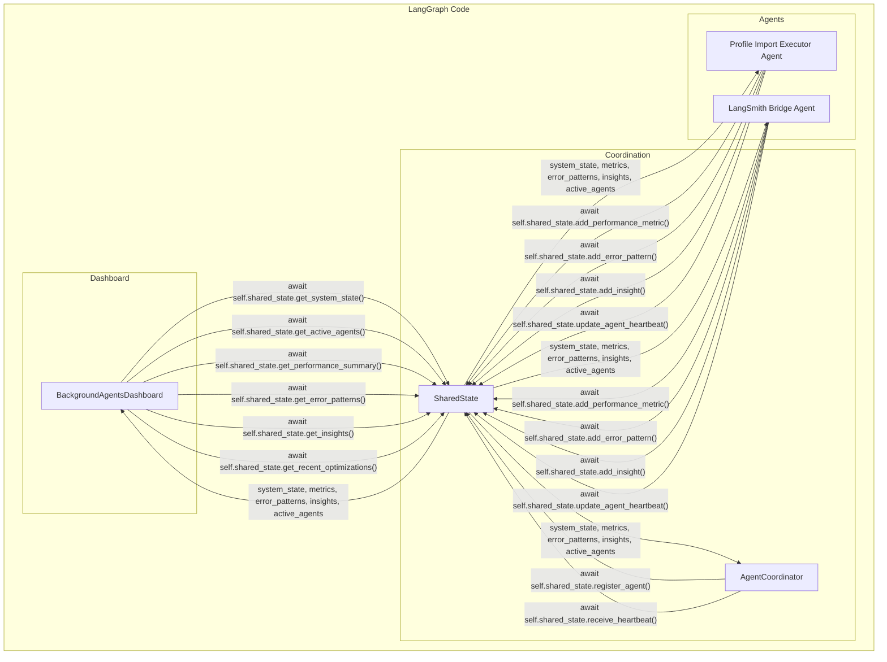

# Shared State in Background Agents System

## What is Shared State?

**Shared State** is a centralized, thread-safe, and (optionally) persistent data structure that enables all background agents, the coordinator, and the dashboard to communicate, synchronize, and optimize their workflows. It acts as the "single source of truth" for system health, agent status, performance metrics, error patterns, optimization history, and business insights.

---

## Why is Shared State Important?

- **Coordination:** Enables multiple agents to work together, avoid duplication, and share progress.
- **Monitoring:** Provides real-time system health, agent heartbeats, and performance analytics to the dashboard.
- **Optimization:** Stores metrics and insights for automated and manual optimization cycles.
- **Resilience:** Allows for recovery, error detection, and robust business logic.
- **Traceability:** Centralizes all signals, traces, and business events for auditing and debugging.

---

## How is Shared State Used in This Application?

- **Agents** (e.g., Profile Import Executor, LangSmith Bridge) write metrics, errors, heartbeats, and insights to shared state.
- **AgentCoordinator** registers agents, orchestrates optimization, and manages system state via shared state.
- **Dashboard** reads from shared state to display real-time metrics, agent status, error patterns, and insights.
- **All components** interact with shared state using a well-defined async API.

---

## Key Files and Their Roles

| File/Module                                      | Purpose                                                                 |
|--------------------------------------------------|-------------------------------------------------------------------------|
| `background_agents/coordination/shared_state.py` | Core implementation of SharedState, metrics, errors, insights, etc.     |
| `background_agents/coordination/agent_coordinator.py` | Orchestrates agents, uses shared state for registration, heartbeats, etc. |
| `background_agents/coordination/base_agent.py`   | Base class for all agents, interacts with shared state for lifecycle.   |
| `background_agents/monitoring/langgraph_executor.py` | Profile Import Executor Agent, writes metrics/insights to shared state. |
| `background_agents/monitoring/langsmith_bridge.py` | LangSmith Bridge Agent, writes metrics/insights to shared state.        |
| `background_agents_dashboard.py`                 | Streamlit dashboard, reads all state/metrics/insights from shared state.|
| `src/components/state.py`                        | (If used) Defines workflow state objects, may interact with shared state.|

---

## Shared State API Overview

```
class SharedState:
    async def add_performance_metric(self, metric: PerformanceMetric) -> None
    async def add_error_pattern(self, error_type: str, error_message: str, source_agent: str) -> str
    async def add_optimization_record(self, record: OptimizationRecord) -> None
    async def add_insight(self, insight_type: str, content: Dict, source_agent: str, priority: str = "medium") -> None
    async def update_agent_heartbeat(self, agent_id: str, heartbeat_data: Dict) -> None
    async def get_active_agents(self, max_age_minutes: int = 5) -> List[Dict]
    async def get_system_state(self) -> Dict
    async def update_system_state(self, updates: Dict) -> None
    async def get_performance_summary(self, hours: int = 1) -> Dict
    async def get_error_patterns(self, error_type: str = None, min_frequency: int = 1, time_window_hours: int = 24) -> List
    async def get_recent_optimizations(self, optimization_type: str = None, hours: int = 24, success_only: bool = False) -> List
    async def mark_insight_acted_upon(self, insight_id: str) -> bool
    async def update_config(self, updates: Dict) -> None
    async def export_state(self) -> Dict
```

---

## System Architecture (Mermaid)

### High-Level Data Flow


### LangGraph-Oriented Code/Data Flow


### SharedState API Relationships


### LangGraph Code Integration


---

## Best Practices for Using Shared State

- **Always use async methods** to interact with shared state for thread/process safety.
- **Use a persistent backend** (file, SQLite, Redis) for multi-process or distributed deployments.
- **Register agents** with the coordinator and update heartbeats regularly.
- **Poll shared state** in the dashboard for real-time updates.
- **Use insights and error patterns** for optimization and monitoring.
- **Export state** regularly for backup and analysis.

---

## Example: LangGraph-Oriented Shared State Usage

```python
# Agent: Write metrics and heartbeat
await self.shared_state.add_performance_metric(metric)
await self.shared_state.update_agent_heartbeat(self.agent_id, heartbeat_data)

# Coordinator: Register agent and receive heartbeat
await self.shared_state.register_agent(agent)
await self.shared_state.receive_heartbeat(agent_id, heartbeat_data)

# Dashboard: Poll for system state and metrics
system_state = await self.shared_state.get_system_state()
active_agents = await self.shared_state.get_active_agents()
performance = await self.shared_state.get_performance_summary(hours=1)
error_patterns = await self.shared_state.get_error_patterns()
insights = await self.shared_state.get_insights()
```

---

## Summary

- **Shared State** is the backbone of coordination, monitoring, and optimization in the background agents system.
- All agents, the coordinator, and the dashboard interact with shared state for robust, real-time, and resilient operation.
- Refer to this file (`shared_state.md`) for all design, integration, and troubleshooting related to shared state. 